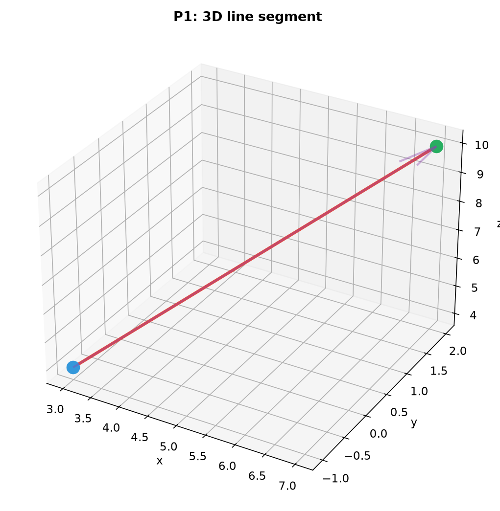
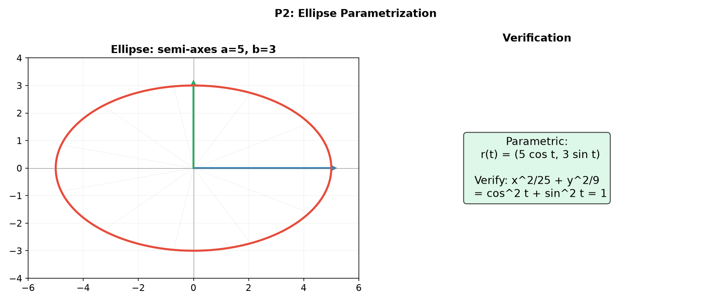
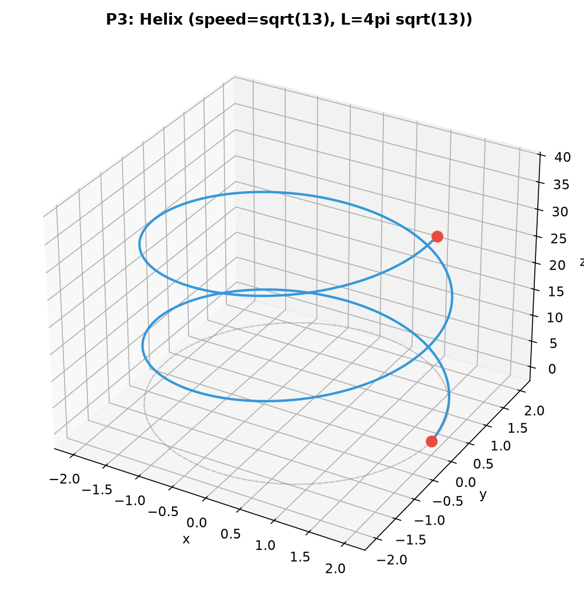
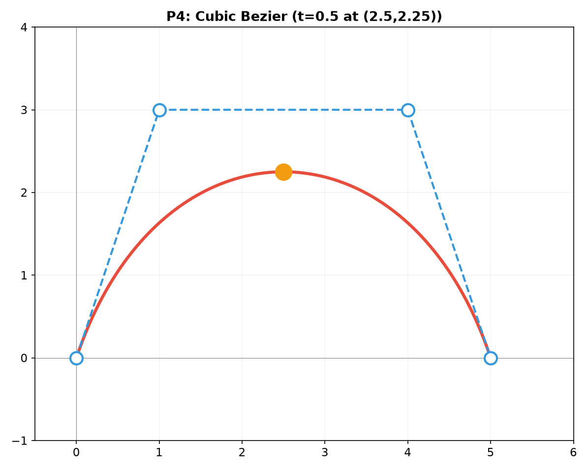
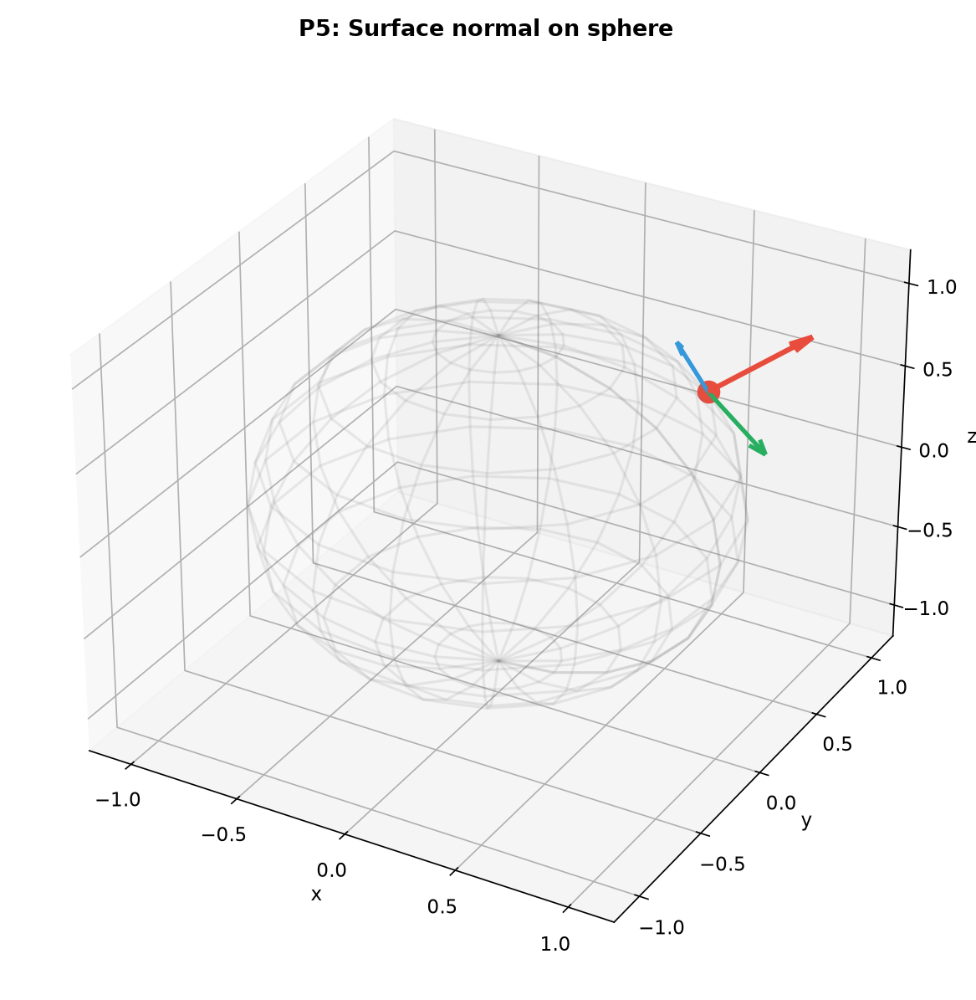
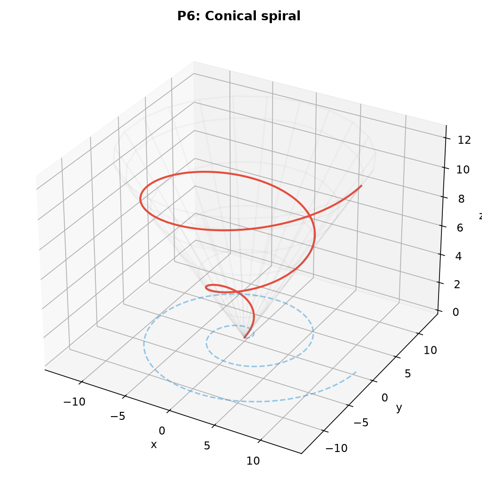
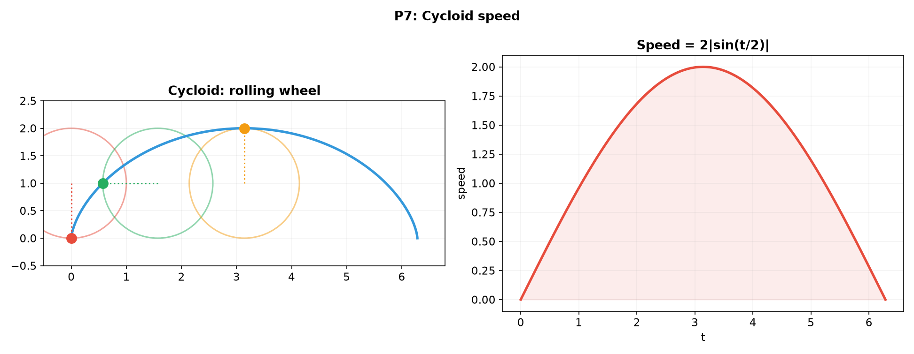
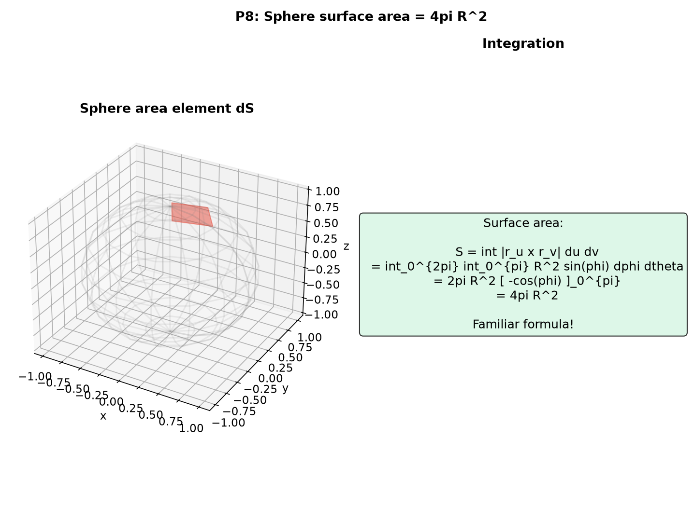
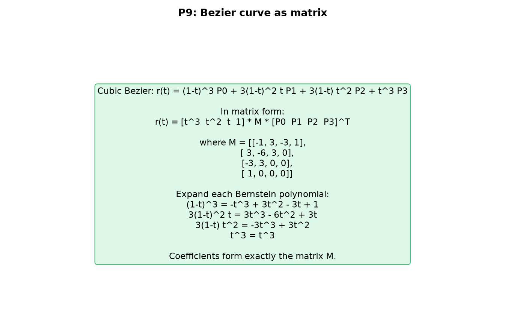

# Solutions — 12C2: Parametric Curves and Surfaces — Drawing with Equations

---

## Practice 1

**Parametrize the line segment from $(3, -1, 4)$ to $(7, 2, 10)$.**

$\vec{r}(t) = \vec{p}_1 + t(\vec{p}_2 - \vec{p}_1) = (3, -1, 4) + t(4, 3, 6)$.
$\vec{r}(t) = (3 + 4t,\; -1 + 3t,\; 4 + 6t)$, $t \in [0, 1]$.

> **Answer**: $\vec{r}(t) = (3+4t,\; -1+3t,\; 4+6t)$, $t \in [0, 1]$

---

## Practice 2

**An ellipse has semi-major axis 5 along the $x$-direction and semi-minor axis 3 along the $y$-direction. Write its parametric equation and verify that $\frac{x^2}{25} + \frac{y^2}{9} = 1$.**

$\vec{r}(t) = (5\cos t,\; 3\sin t)$, $t \in [0, 2\pi]$.

Verification: $\frac{x^2}{25} + \frac{y^2}{9} = \frac{(5\cos t)^2}{25} + \frac{(3\sin t)^2}{9} = \frac{25\cos^2 t}{25} + \frac{9\sin^2 t}{9} = \cos^2 t + \sin^2 t = 1$. ✓

> **Answer**: $\vec{r}(t) = (5\cos t,\; 3\sin t)$, $t \in [0, 2\pi]$

---

## Practice 3

**Find the arc length of the helix $\vec{r}(t) = (2\cos t,\; 2\sin t,\; 3t)$ for $t \in [0, 4\pi]$.**

$\vec{r}{\,}'(t) = (-2\sin t,\; 2\cos t,\; 3)$.
Speed: $|\vec{r}{\,}'(t)| = \sqrt{(-2\sin t)^2 + (2\cos t)^2 + 3^2} = \sqrt{4(\sin^2 t + \cos^2 t) + 9} = \sqrt{4 + 9} = \sqrt{13}$.

Arc length: $L = \int_0^{4\pi} \sqrt{13} \, dt = 4\pi\sqrt{13}$.

> **Answer**: $L = 4\pi\sqrt{13}$

---

## Practice 4

**A cubic Bézier curve has control points $\vec{P}_0 = (0, 0)$, $\vec{P}_1 = (1, 3)$, $\vec{P}_2 = (4, 3)$, $\vec{P}_3 = (5, 0)$. Where is the curve at $t = 0.5$?**

$\vec{r}(t) = (1-t)^3\vec{P}_0 + 3(1-t)^2 t\vec{P}_1 + 3(1-t)t^2\vec{P}_2 + t^3\vec{P}_3$.

At $t = 0.5$: $(1-t)^3 = 0.125$, $3(1-t)^2 t = 3 \cdot 0.25 \cdot 0.5 = 0.375$, $3(1-t)t^2 = 3 \cdot 0.5 \cdot 0.25 = 0.375$, $t^3 = 0.125$.

$x$-coordinate: $0.125(0) + 0.375(1) + 0.375(4) + 0.125(5) = 0 + 0.375 + 1.5 + 0.625 = 2.5$.
$y$-coordinate: $0.125(0) + 0.375(3) + 0.375(3) + 0.125(0) = 0 + 1.125 + 1.125 + 0 = 2.25$.

$\vec{r}(0.5) = (2.5, 2.25)$.

> **Answer**: $(2.5, 2.25)$

---

## Practice 5

**Find the normal vector to the sphere $\vec{r}(\theta, \phi) = (R\sin\phi\cos\theta,\; R\sin\phi\sin\theta,\; R\cos\phi)$ at the point where $\theta = \pi/4$, $\phi = \pi/3$. Verify it points radially outward.**

Tangent vectors:
$\vec{r}_\theta = (-R\sin\phi\sin\theta,\; R\sin\phi\cos\theta,\; 0)$.
$\vec{r}_\phi = (R\cos\phi\cos\theta,\; R\cos\phi\sin\theta,\; -R\sin\phi)$.

At $\theta = \pi/4$, $\phi = \pi/3$:
$\sin\phi = \sqrt3/2$, $\cos\phi = 1/2$, $\sin\theta = \cos\theta = \sqrt2/2$.

$\vec{r}_\theta = \left(-R\cdot\frac{\sqrt3}{2}\cdot\frac{\sqrt2}{2},\; R\cdot\frac{\sqrt3}{2}\cdot\frac{\sqrt2}{2},\; 0\right) = \left(-\frac{R\sqrt6}{4},\; \frac{R\sqrt6}{4},\; 0\right)$.
$\vec{r}_\phi = \left(R\cdot\frac12\cdot\frac{\sqrt2}{2},\; R\cdot\frac12\cdot\frac{\sqrt2}{2},\; -R\cdot\frac{\sqrt3}{2}\right) = \left(\frac{R\sqrt2}{4},\; \frac{R\sqrt2}{4},\; -\frac{R\sqrt3}{2}\right)$.

$\vec{n} = \vec{r}_\theta \times \vec{r}_\phi$:
$\vec{n}_x = \frac{R\sqrt6}{4} \cdot \left(-\frac{R\sqrt3}{2}\right) - 0 \cdot \frac{R\sqrt2}{4} = -\frac{3R^2\sqrt2}{8}$.
$\vec{n}_y = 0 \cdot \frac{R\sqrt2}{4} - \left(-\frac{R\sqrt6}{4}\right) \cdot \left(-\frac{R\sqrt3}{2}\right) = -\frac{3R^2\sqrt2}{8}$.
$\vec{n}_z = \left(-\frac{R\sqrt6}{4}\right) \cdot \frac{R\sqrt2}{4} - \frac{R\sqrt6}{4} \cdot \frac{R\sqrt2}{4} = -\frac{R^2\sqrt{12}}{16} - \frac{R^2\sqrt{12}}{16} = -\frac{2R^2\sqrt{12}}{16} = -\frac{R^2\sqrt3}{4}$.

Using the general formula: $\vec{n} = R^2\sin\phi \cdot (\sin\phi\cos\theta,\; \sin\phi\sin\theta,\; \cos\phi)$.
At our point: $\vec{n} = R^2\cdot\frac{\sqrt3}{2}\left(\frac{\sqrt3}{2}\cdot\frac{\sqrt2}{2},\; \frac{\sqrt3}{2}\cdot\frac{\sqrt2}{2},\; \frac12\right) = \frac{R^2\sqrt3}{2}\left(\frac{\sqrt6}{4},\; \frac{\sqrt6}{4},\; \frac12\right)$.

This is a positive scalar times the position vector, confirming the normal points radially outward ✓.

> **Answer**: $\vec{n} \propto (\sin\phi\cos\theta,\; \sin\phi\sin\theta,\; \cos\phi)$ — radially outward

---

## Practice 6: Real Battle

**A curve is given by $\vec{r}(t) = (t\cos t,\; t\sin t,\; t)$ for $t \in [0, 4\pi]$. This is a conical spiral. Find its arc length.**

$\vec{r}{\,}'(t) = (\cos t - t\sin t,\; \sin t + t\cos t,\; 1)$.

$|\vec{r}{\,}'(t)|^2 = (\cos t - t\sin t)^2 + (\sin t + t\cos t)^2 + 1^2$.
$= \cos^2 t - 2t\cos t\sin t + t^2\sin^2 t + \sin^2 t + 2t\sin t\cos t + t^2\cos^2 t + 1$.
$= (\cos^2 t + \sin^2 t) + t^2(\sin^2 t + \cos^2 t) + 1$.
$= 1 + t^2 + 1 = t^2 + 2$.

$|\vec{r}{\,}'(t)| = \sqrt{t^2 + 2}$.

Arc length: $L = \int_0^{4\pi} \sqrt{t^2 + 2} \, dt$.

Using $\int \sqrt{t^2 + a^2} \, dt = \frac{t}{2}\sqrt{t^2 + a^2} + \frac{a^2}{2}\ln\left|t + \sqrt{t^2 + a^2}\right| + C$ with $a = \sqrt2$:

$L = \left[\frac{t}{2}\sqrt{t^2 + 2} + \ln\left|t + \sqrt{t^2 + 2}\right|\right]_0^{4\pi}$ (since $a^2/2 = 1$).

$= \frac{4\pi}{2}\sqrt{16\pi^2 + 2} + \ln(4\pi + \sqrt{16\pi^2+2}) - \left(0 + \ln(\sqrt2)\right)$.
$= 2\pi\sqrt{16\pi^2 + 2} + \ln\left(\frac{4\pi + \sqrt{16\pi^2+2}}{\sqrt2}\right)$.

> **Answer**: $L = 2\pi\sqrt{16\pi^2+2} + \ln\left(\frac{4\pi + \sqrt{16\pi^2+2}}{\sqrt2}\right)$

---

## Practice 7: Cycloid Speed (🔗 9B)

**For the cycloid $\vec{r}(t) = (R(t - \sin t),\; R(1 - \cos t))$, find the speed at $t = \pi/2$ and $t = \pi$. Explain why the speed is zero at $t = 0$.**

$\vec{r}{\,}'(t) = (R(1 - \cos t),\; R\sin t)$.
Speed: $|\vec{r}{\,}'(t)| = R\sqrt{(1-\cos t)^2 + \sin^2 t} = R\sqrt{2 - 2\cos t} = 2R|\sin(t/2)|$.

At $t = \pi/2$: speed $= 2R|\sin(\pi/4)| = 2R \cdot \frac{\sqrt2}{2} = R\sqrt2$.
At $t = \pi$: speed $= 2R|\sin(\pi/2)| = 2R \cdot 1 = 2R$.
At $t = 0$: speed $= 2R|\sin 0| = 0$. The point on the rim is instantaneously at rest when it touches the ground — it's the point of contact with no relative motion (no slipping).

> **Answer**: Speed at $t=\pi/2$: $R\sqrt2$, at $t=\pi$: $2R$, zero at $t=0$ due to no-slip contact

---

## Practice 8: Surface Area of a Sphere (🔗 9C)

**Use the parametric form of the sphere to compute its surface area.**

$\vec{r}(\theta, \phi) = (R\sin\phi\cos\theta,\; R\sin\phi\sin\theta,\; R\cos\phi)$, $\theta \in [0, 2\pi]$, $\phi \in [0, \pi]$.

$\vec{r}_\theta = (-R\sin\phi\sin\theta,\; R\sin\phi\cos\theta,\; 0)$.
$\vec{r}_\phi = (R\cos\phi\cos\theta,\; R\cos\phi\sin\theta,\; -R\sin\phi)$.

$\vec{r}_\theta \times \vec{r}_\phi = \begin{vmatrix} \hat{i} & \hat{j} & \hat{k} \\ -R\sin\phi\sin\theta & R\sin\phi\cos\theta & 0 \\ R\cos\phi\cos\theta & R\cos\phi\sin\theta & -R\sin\phi \end{vmatrix}$.

$\vec{n}_x = (R\sin\phi\cos\theta)(-R\sin\phi) - 0 \cdot (R\cos\phi\sin\theta) = -R^2\sin^2\phi\cos\theta$.
$\vec{n}_y = 0 \cdot (R\cos\phi\cos\theta) - (-R\sin\phi\sin\theta)(-R\sin\phi) = -R^2\sin^2\phi\sin\theta$.
$\vec{n}_z = (-R\sin\phi\sin\theta)(R\cos\phi\sin\theta) - (R\sin\phi\cos\theta)(R\cos\phi\cos\theta)$
$= -R^2\sin\phi\cos\phi(\sin^2\theta + \cos^2\theta) = -R^2\sin\phi\cos\phi$.

$|\vec{r}_\theta \times \vec{r}_\phi| = R^2\sqrt{\sin^4\phi(\cos^2\theta+\sin^2\theta) + \sin^2\phi\cos^2\phi}$
$= R^2\sqrt{\sin^4\phi + \sin^2\phi\cos^2\phi} = R^2\sqrt{\sin^2\phi(\sin^2\phi + \cos^2\phi)} = R^2|\sin\phi|$.

Since $\phi \in [0, \pi]$, $\sin\phi \ge 0$, so $|\vec{r}_\theta \times \vec{r}_\phi| = R^2\sin\phi$.

Surface area: $S = \int_0^{2\pi} \int_0^{\pi} R^2\sin\phi \, d\phi \, d\theta = R^2 \cdot 2\pi \cdot [-\cos\phi]_0^{\pi} = 2\pi R^2 \cdot (1+1) = 4\pi R^2$. ✓

> **Answer**: $S = 4\pi R^2$

---

## Practice 9: Bézier Curve as a Matrix (🔗 12C1)

**Show that the cubic Bézier basis can be written in matrix form.**

The cubic Bézier: $\vec{r}(t) = (1-t)^3\vec{P}_0 + 3(1-t)^2 t\vec{P}_1 + 3(1-t)t^2\vec{P}_2 + t^3\vec{P}_3$.

Expand each Bernstein polynomial:
$(1-t)^3 = -t^3 + 3t^2 - 3t + 1$.
$3(1-t)^2 t = 3(t - 2t^2 + t^3) = 3t^3 - 6t^2 + 3t$.
$3(1-t)t^2 = 3(t^2 - t^3) = -3t^3 + 3t^2$.
$t^3 = t^3$.

Group by powers of $t$:
$\vec{r}(t) = t^3(-\vec{P}_0 + 3\vec{P}_1 - 3\vec{P}_2 + \vec{P}_3) + t^2(3\vec{P}_0 - 6\vec{P}_1 + 3\vec{P}_2) + t(-3\vec{P}_0 + 3\vec{P}_1) + 1(\vec{P}_0)$.

In matrix form:
$\vec{r}(t) = \begin{pmatrix} t^3 & t^2 & t & 1 \end{pmatrix}
\begin{pmatrix} -1 & 3 & -3 & 1 \\ 3 & -6 & 3 & 0 \\ -3 & 3 & 0 & 0 \\ 1 & 0 & 0 & 0 \end{pmatrix}
\begin{pmatrix} \vec{P}_0 \\ \vec{P}_1 \\ \vec{P}_2 \\ \vec{P}_3 \end{pmatrix}$. ✓

> **Answer**: Verified — the matrix matches the expanded Bernstein basis

---

## Basic Drills

### D1. A line segment goes from $(1, 2)$ to $(4, 6)$. Write the parametric form $\vec{r}(t)$ for $t \in [0, 1]$.

$\vec{r}(t) = (1, 2) + t(3, 4) = (1+3t,\; 2+4t)$, $t \in [0, 1]$.

> **Answer**: $\vec{r}(t) = (1+3t,\; 2+4t)$

---

### D2. Parametrize a circle with center $(2, -3)$ and radius 4.

$\vec{r}(t) = (2 + 4\cos t,\; -3 + 4\sin t)$, $t \in [0, 2\pi]$.

> **Answer**: $\vec{r}(t) = (2+4\cos t,\; -3+4\sin t)$

---

### D3. Find the speed $|\vec{r}{\,}'(t)|$ for $\vec{r}(t) = (3t, 4t)$. What is the arc length from $t=0$ to $t=5$?

$\vec{r}{\,}'(t) = (3, 4)$. Speed $= \sqrt{3^2+4^2} = 5$.
Arc length $= \int_0^5 5 \, dt = 25$.

> **Answer**: Speed $= 5$, arc length $= 25$

---

### D4. Write the quadratic Bézier curve for $\vec{P}_0 = (0, 0)$, $\vec{P}_1 = (2, 4)$, $\vec{P}_2 = (6, 0)$.

$\vec{r}(t) = (1-t)^2(0,0) + 2(1-t)t(2,4) + t^2(6,0)$
$= (4t(1-t) + 6t^2,\; 8t(1-t))$
$= (4t - 4t^2 + 6t^2,\; 8t - 8t^2)$
$= (4t + 2t^2,\; 8t - 8t^2)$.

> **Answer**: $\vec{r}(t) = (4t+2t^2,\; 8t-8t^2)$

---

### D5. For the cylinder $\vec{r}(\theta, z) = (3\cos\theta,\; 3\sin\theta,\; z)$, compute the tangent vectors $\vec{r}_\theta$ and $\vec{r}_z$.

$\vec{r}_\theta = (-3\sin\theta,\; 3\cos\theta,\; 0)$.
$\vec{r}_z = (0,\; 0,\; 1)$.

> **Answer**: $\vec{r}_\theta = (-3\sin\theta, 3\cos\theta, 0)$, $\vec{r}_z = (0, 0, 1)$

---

### D6. A point moves as $\vec{r}(t) = (e^t\cos t,\; e^t\sin t)$ — a logarithmic spiral. Find the speed at $t = 0$.

$\vec{r}{\,}'(t) = (e^t\cos t - e^t\sin t,\; e^t\sin t + e^t\cos t) = e^t(\cos t - \sin t,\; \sin t + \cos t)$.
$|\vec{r}{\,}'(t)| = e^t\sqrt{(\cos t - \sin t)^2 + (\sin t + \cos t)^2} = e^t\sqrt{2(\cos^2 t + \sin^2 t)} = e^t\sqrt{2}$.
At $t = 0$: speed $= e^0\sqrt2 = \sqrt2$.

> **Answer**: $\sqrt2$

---

### D7. Parametrize an ellipse with center $(1, -2)$, semi-major axis 6 along $x$, and semi-minor axis 4 along $y$.

$\vec{r}(t) = (1 + 6\cos t,\; -2 + 4\sin t)$, $t \in [0, 2\pi]$.

> **Answer**: $\vec{r}(t) = (1+6\cos t,\; -2+4\sin t)$

---

### D8. Find the speed of the point moving on $\vec{r}(t) = (t^2,\; t^3)$ at $t = 2$.

$\vec{r}{\,}'(t) = (2t,\; 3t^2)$. At $t=2$: $\vec{r}{\,}'(2) = (4,\; 12)$.
Speed $= \sqrt{4^2 + 12^2} = \sqrt{16 + 144} = \sqrt{160} = 4\sqrt{10}$.

> **Answer**: $4\sqrt{10}$

---

### D9. Write the linear Bézier (straight line) from $(3, 1, 8)$ to $(7, 5, 2)$.

$\vec{r}(t) = (1-t)(3,1,8) + t(7,5,2) = (3+4t,\; 1+4t,\; 8-6t)$, $t \in [0, 1]$.

> **Answer**: $\vec{r}(t) = (3+4t,\; 1+4t,\; 8-6t)$

---

### D10. A curve is given by $\vec{r}(t) = (5\cos t,\; 5\sin t,\; 0)$. What shape is it? What is the speed?

It's a circle of radius 5 in the $xy$-plane.
$\vec{r}{\,}'(t) = (-5\sin t,\; 5\cos t,\; 0)$. Speed $= \sqrt{25\sin^2 t + 25\cos^2 t} = 5$.

> **Answer**: Circle of radius 5, speed $= 5$

---

### D11. (🔗 9B) Parametrize the parabola $y = x^2$ as a parametric curve. Eliminate $t$ to verify.

$\vec{r}(t) = (t,\; t^2)$, $t \in \mathbb{R}$.
Eliminate $t$: $x = t$, $y = t^2 \implies y = x^2$. ✓

> **Answer**: $\vec{r}(t) = (t, t^2)$

---

### D12. Find the speed of the conical spiral $\vec{r}(t) = (t\cos t,\; t\sin t,\; t)$ at $t = \pi$.

$\vec{r}{\,}'(t) = (\cos t - t\sin t,\; \sin t + t\cos t,\; 1)$.
$|\vec{r}{\,}'(t)| = \sqrt{t^2 + 2}$.
At $t = \pi$: speed $= \sqrt{\pi^2 + 2}$.

> **Answer**: $\sqrt{\pi^2 + 2}$

---

## Advanced Drills

### A1. Find the arc length of the parabola $\vec{r}(t) = (t,\; t^2)$ from $t = 0$ to $t = 1$.

$\vec{r}{\,}'(t) = (1,\; 2t)$. Speed $= \sqrt{1 + 4t^2}$.

$L = \int_0^1 \sqrt{1 + 4t^2} \, dt$.

Let $2t = \tan\theta$, then $2\,dt = \sec^2\theta\,d\theta$, $dt = \frac12\sec^2\theta\,d\theta$.
$\sqrt{1+4t^2} = \sqrt{1+\tan^2\theta} = \sec\theta$.

$L = \int_0^{\arctan 2} \sec\theta \cdot \frac12 \sec^2\theta \, d\theta = \frac12 \int_0^{\arctan 2} \sec^3\theta \, d\theta$.

$\int \sec^3\theta \, d\theta = \frac12(\sec\theta\tan\theta + \ln|\sec\theta + \tan\theta|) + C$.

At $\theta = \arctan 2$: $\tan\theta = 2$, $\sec\theta = \sqrt{1+4} = \sqrt5$.

$L = \frac12 \cdot \frac12[\sec\theta\tan\theta + \ln(\sec\theta+\tan\theta)]_0^{\arctan 2}$
$= \frac14[(\sqrt5 \cdot 2 + \ln(\sqrt5+2)) - (1\cdot 0 + \ln(1+0))]$
$= \frac14(2\sqrt5 + \ln(\sqrt5+2))$.

> **Answer**: $L = \frac14(2\sqrt5 + \ln(\sqrt5+2))$

---

### A2. A curve is given in polar form $r = 1 + \cos\theta$ (cardioid). Write its parametric form and find the arc length from $\theta = 0$ to $\theta = 2\pi$.

Parametric: $x(\theta) = (1+\cos\theta)\cos\theta$, $y(\theta) = (1+\cos\theta)\sin\theta$, $\theta \in [0, 2\pi]$.

$x' = -\sin\theta\cos\theta - (1+\cos\theta)\sin\theta = -\sin\theta(2\cos\theta + 1)$.
$y' = -\sin\theta\sin\theta + (1+\cos\theta)\cos\theta = -\sin^2\theta + \cos\theta + \cos^2\theta = \cos\theta + \cos 2\theta$.

Using polar arc length formula: $L = \int_0^{2\pi} \sqrt{(r')^2 + r^2} \, d\theta$.
$r' = -\sin\theta$.
$(r')^2 + r^2 = \sin^2\theta + (1+\cos\theta)^2 = \sin^2\theta + 1 + 2\cos\theta + \cos^2\theta = 2 + 2\cos\theta = 4\cos^2(\theta/2)$.

$L = \int_0^{2\pi} 2|\cos(\theta/2)| \, d\theta = 4\int_0^{\pi} |\cos u| \, du$ (with $u = \theta/2$).
$= 4 \cdot 2 \int_0^{\pi/2} \cos u \, du = 8[\sin u]_0^{\pi/2} = 8$.

> **Answer**: $L = 8$

---

### A3. Compute the surface area of a torus with major radius $R = 4$ and minor radius $r = 1$.

Parametric torus: $\vec{r}(\theta, \phi) = ((R + r\cos\phi)\cos\theta,\; (R + r\cos\phi)\sin\theta,\; r\sin\phi)$.

$\vec{r}_\theta = (-(R+r\cos\phi)\sin\theta,\; (R+r\cos\phi)\cos\theta,\; 0)$.
$\vec{r}_\phi = (-r\sin\phi\cos\theta,\; -r\sin\phi\sin\theta,\; r\cos\phi)$.

$|\vec{r}_\theta \times \vec{r}_\phi| = r(R + r\cos\phi)$.

Surface area: $S = \int_0^{2\pi} \int_0^{2\pi} r(R + r\cos\phi) \, d\phi \, d\theta$
$= r\int_0^{2\pi} [R\phi + r\sin\phi]_0^{2\pi} \, d\theta = r\int_0^{2\pi} 2\pi R \, d\theta = r \cdot 2\pi R \cdot 2\pi = 4\pi^2 R r$.

With $R=4$, $r=1$: $S = 4\pi^2 \cdot 4 \cdot 1 = 16\pi^2$.

> **Answer**: $S = 16\pi^2$

---

### A4. Find the point on the cubic Bézier curve from Practice 4 where the tangent vector is horizontal.

From Practice 4: $\vec{P}_0=(0,0)$, $\vec{P}_1=(1,3)$, $\vec{P}_2=(4,3)$, $\vec{P}_3=(5,0)$.

$\vec{r}(t) = (1-t)^3(0,0) + 3(1-t)^2 t(1,3) + 3(1-t)t^2(4,3) + t^3(5,0)$.
$x(t) = 3t(1-t)^2 + 12t^2(1-t) + 5t^3$.
$y(t) = 9t(1-t)^2 + 9t^2(1-t)$.

Tangent is horizontal when $y'(t) = 0$.
$y(t) = 9t(1-2t+t^2) + 9t^2(1-t) = 9t - 18t^2 + 9t^3 + 9t^2 - 9t^3 = 9t - 9t^2 = 9t(1-t)$.
$y'(t) = 9 - 18t = 9(1-2t) = 0 \implies t = \frac12$.

At $t = \frac12$: $x = 3(0.5)(0.25) + 12(0.25)(0.5) + 5(0.125) = 0.375 + 1.5 + 0.625 = 2.5$.
$y = 9(0.5)(0.25) + 9(0.25)(0.5) = 1.125 + 1.125 = 2.25$.

Point: $(2.5, 2.25)$.

> **Answer**: $(2.5, 2.25)$ at $t = 0.5$

---

### A5. A curve is defined implicitly by $x^2 + y^2 + z^2 = 1$ and $x + y + z = 0$ — the intersection of a sphere and a plane (a great circle). Parametrize this curve.

The intersection is a circle (great circle of the unit sphere). We need orthonormal vectors in the plane $x+y+z=0$.

The plane normal is $\vec{n} = (1,1,1)$. Find two orthonormal vectors in the plane.

One vector in the plane: $\vec{u} = (1,-1,0)/\sqrt2$ (perpendicular to $\vec{n}$).
Another: $\vec{v} = \vec{n} \times \vec{u} = (1,1,1) \times (1,-1,0)/\sqrt2 = (1,1,-2)/\sqrt6$.

Parametric form: $\vec{r}(t) = \cos t \cdot \vec{u} + \sin t \cdot \vec{v}$.
$\vec{r}(t) = \left(\frac{\cos t}{\sqrt2} + \frac{\sin t}{\sqrt6},\; -\frac{\cos t}{\sqrt2} + \frac{\sin t}{\sqrt6},\; -\frac{2\sin t}{\sqrt6}\right)$, $t \in [0, 2\pi]$.

> **Answer**: $\vec{r}(t) = \cos t \cdot \frac{(1,-1,0)}{\sqrt2} + \sin t \cdot \frac{(1,1,-2)}{\sqrt6}$

---

### A6. Derive the formula for the surface area of a sphere of radius $R$ using the parametric form.

See Practice 8 above. $|\vec{r}_\theta \times \vec{r}_\phi| = R^2\sin\phi$.
$S = \int_0^{2\pi}\int_0^{\pi} R^2\sin\phi \, d\phi\,d\theta = 2\pi R^2[-\cos\phi]_0^{\pi} = 2\pi R^2(1+1) = 4\pi R^2$.

> **Answer**: $S = 4\pi R^2$

---

### A7. Find the arc length of one arch of the cycloid: $\vec{r}(t) = (t - \sin t,\; 1 - \cos t)$ for $t \in [0, 2\pi]$.

$\vec{r}{\,}'(t) = (1 - \cos t,\; \sin t)$.
Speed $= \sqrt{(1-\cos t)^2 + \sin^2 t} = \sqrt{2 - 2\cos t} = \sqrt{4\sin^2(t/2)} = 2|\sin(t/2)|$.

For $t \in [0, 2\pi]$, $\sin(t/2) \ge 0$, so speed $= 2\sin(t/2)$.

$L = \int_0^{2\pi} 2\sin(t/2) \, dt = 2[-2\cos(t/2)]_0^{2\pi} = -4[\cos\pi - \cos 0] = -4(-1-1) = 8$.

> **Answer**: $L = 8$ (for a cycloid with $R=1$; for general $R$, $L = 8R$)

---

### A8. A parametric surface is given by $\vec{r}(u, v) = (u\cos v,\; u\sin v,\; u^2)$ for $u \in [0, 2]$, $v \in [0, 2\pi]$. Compute $|\vec{r}_u \times \vec{r}_v|$.

$\vec{r}_u = (\cos v,\; \sin v,\; 2u)$.
$\vec{r}_v = (-u\sin v,\; u\cos v,\; 0)$.

$\vec{r}_u \times \vec{r}_v = \begin{vmatrix} \hat{i} & \hat{j} & \hat{k} \\ \cos v & \sin v & 2u \\ -u\sin v & u\cos v & 0 \end{vmatrix}$.
$= \hat{i}(\sin v \cdot 0 - 2u \cdot u\cos v) - \hat{j}(\cos v \cdot 0 - 2u \cdot (-u\sin v)) + \hat{k}(\cos v \cdot u\cos v - \sin v \cdot (-u\sin v))$.
$= \hat{i}(-2u^2\cos v) - \hat{j}(2u^2\sin v) + \hat{k}(u\cos^2 v + u\sin^2 v)$.
$= (-2u^2\cos v,\; -2u^2\sin v,\; u)$.

$|\vec{r}_u \times \vec{r}_v| = \sqrt{4u^4(\cos^2 v + \sin^2 v) + u^2} = \sqrt{4u^4 + u^2} = u\sqrt{4u^2 + 1}$.

> **Answer**: $|\vec{r}_u \times \vec{r}_v| = u\sqrt{4u^2 + 1}$

---

### A9. For the helix $\vec{r}(t) = (R\cos t,\; R\sin t,\; ct)$, compute the curvature $\kappa = \frac{|\vec{r}{\,}' \times \vec{r}{\,}''|}{|\vec{r}{\,}'|^3}$.

$\vec{r}{\,}'(t) = (-R\sin t,\; R\cos t,\; c)$.
$\vec{r}{\,}''(t) = (-R\cos t,\; -R\sin t,\; 0)$.

$\vec{r}{\,}' \times \vec{r}{\,}'' = \begin{vmatrix} \hat{i} & \hat{j} & \hat{k} \\ -R\sin t & R\cos t & c \\ -R\cos t & -R\sin t & 0 \end{vmatrix}$
$= \hat{i}(R\cos t \cdot 0 - c(-R\sin t)) - \hat{j}(-R\sin t \cdot 0 - c(-R\cos t)) + \hat{k}(-R\sin t(-R\sin t) - R\cos t(-R\cos t))$.
$= \hat{i}(cR\sin t) - \hat{j}(cR\cos t) + \hat{k}(R^2\sin^2 t + R^2\cos^2 t)$.
$= (cR\sin t,\; -cR\cos t,\; R^2)$.

$|\vec{r}{\,}' \times \vec{r}{\,}''| = \sqrt{c^2R^2(\sin^2 t + \cos^2 t) + R^4} = \sqrt{R^2(c^2 + R^2)} = R\sqrt{c^2 + R^2}$.

$|\vec{r}{\,}'| = \sqrt{R^2\sin^2 t + R^2\cos^2 t + c^2} = \sqrt{R^2 + c^2}$.

$\kappa = \frac{R\sqrt{R^2 + c^2}}{(\sqrt{R^2 + c^2})^3} = \frac{R}{R^2 + c^2}$.

The curvature is constant — the helix has uniform bending.

> **Answer**: $\kappa = \frac{R}{R^2 + c^2}$

---

### A10. Two lines are given parametrically: $\vec{r}_1(t) = (1, 2, 3) + t(1, 0, -1)$ and $\vec{r}_2(s) = (4, 1, 2) + s(2, 1, 1)$. Determine if they intersect.

Set $\vec{r}_1(t) = \vec{r}_2(s)$:
$1 + t = 4 + 2s$ ... (1)
$2 + 0t = 1 + s$ ... (2)
$3 - t = 2 + s$ ... (3)

From (2): $s = 1$.
From (1): $1 + t = 4 + 2 \implies t = 5$.
From (3): $3 - 5 = 2 + 1 \implies -2 = 3$ — contradiction.

The lines do not intersect.

> **Answer**: No intersection (contradiction in $t=5$, $s=1$ gives $-2 \neq 3$)

---

### A11. (🔗 9C, 12C1) The torus surface has parameters $(\theta, \phi)$. Compute the tangent vectors and their cross product.

$\vec{r}(\theta, \phi) = ((R + r\cos\phi)\cos\theta,\; (R + r\cos\phi)\sin\theta,\; r\sin\phi)$.
$\vec{r}_\theta = (-(R+r\cos\phi)\sin\theta,\; (R+r\cos\phi)\cos\theta,\; 0)$.
$\vec{r}_\phi = (-r\sin\phi\cos\theta,\; -r\sin\phi\sin\theta,\; r\cos\phi)$.

$\vec{r}_\theta \times \vec{r}_\phi = \begin{vmatrix} \hat{i} & \hat{j} & \hat{k} \\ -(R+r\cos\phi)\sin\theta & (R+r\cos\phi)\cos\theta & 0 \\ -r\sin\phi\cos\theta & -r\sin\phi\sin\theta & r\cos\phi \end{vmatrix}$.

$\vec{n}_x = (R+r\cos\phi)\cos\theta \cdot r\cos\phi - 0 \cdot (-r\sin\phi\sin\theta) = r(R+r\cos\phi)\cos\phi\cos\theta$.
$\vec{n}_y = 0 \cdot (-r\sin\phi\cos\theta) - (-(R+r\cos\phi)\sin\theta) \cdot r\cos\phi = r(R+r\cos\phi)\cos\phi\sin\theta$.
$\vec{n}_z = -(R+r\cos\phi)\sin\theta \cdot (-r\sin\phi\sin\theta) - (R+r\cos\phi)\cos\theta \cdot (-r\sin\phi\cos\theta)$.
$= (R+r\cos\phi)r\sin\phi(\sin^2\theta + \cos^2\theta) = r(R+r\cos\phi)\sin\phi$.

$|\vec{r}_\theta \times \vec{r}_\phi| = r(R+r\cos\phi)\sqrt{\cos^2\phi(\cos^2\theta+\sin^2\theta) + \sin^2\phi}$
$= r(R+r\cos\phi)\sqrt{\cos^2\phi + \sin^2\phi} = r(R+r\cos\phi)$.

This is the area element for the torus.

> **Answer**: $|\vec{r}_\theta \times \vec{r}_\phi| = r(R+r\cos\phi)$

---

### A12. (🔗 9C) The intersection of the sphere $x^2+y^2+z^2=4$ and the plane $z=1$ is a circle. Parametrize this circle in 3D.

Substitute $z=1$: $x^2 + y^2 + 1 = 4 \implies x^2 + y^2 = 3$.
This is a circle of radius $\sqrt3$ in the plane $z=1$.

Parametric: $\vec{r}(t) = (\sqrt3\cos t,\; \sqrt3\sin t,\; 1)$, $t \in [0, 2\pi]$.

> **Answer**: $\vec{r}(t) = (\sqrt3\cos t,\; \sqrt3\sin t,\; 1)$, $t \in [0, 2\pi]$
