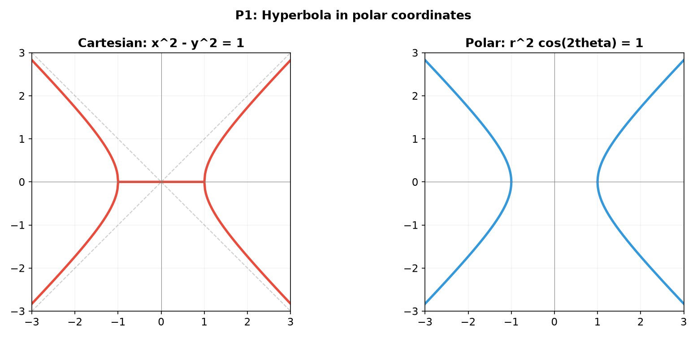
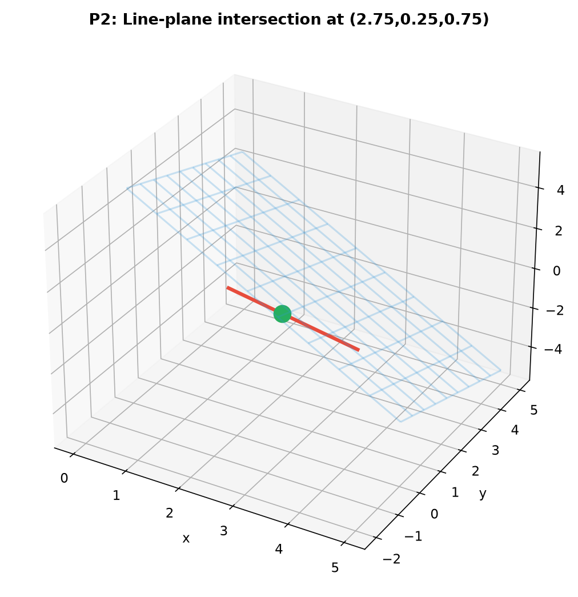
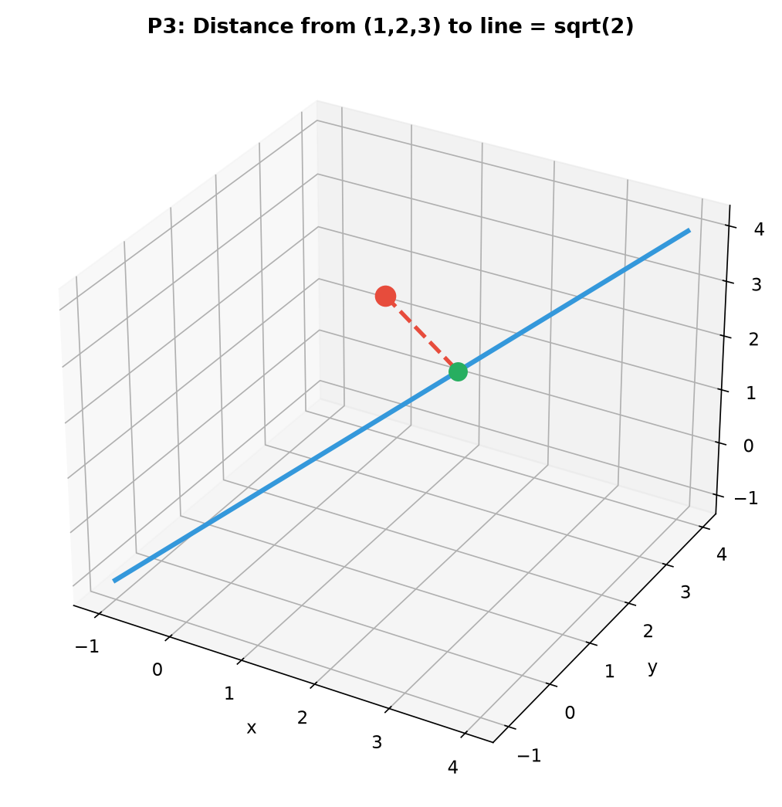
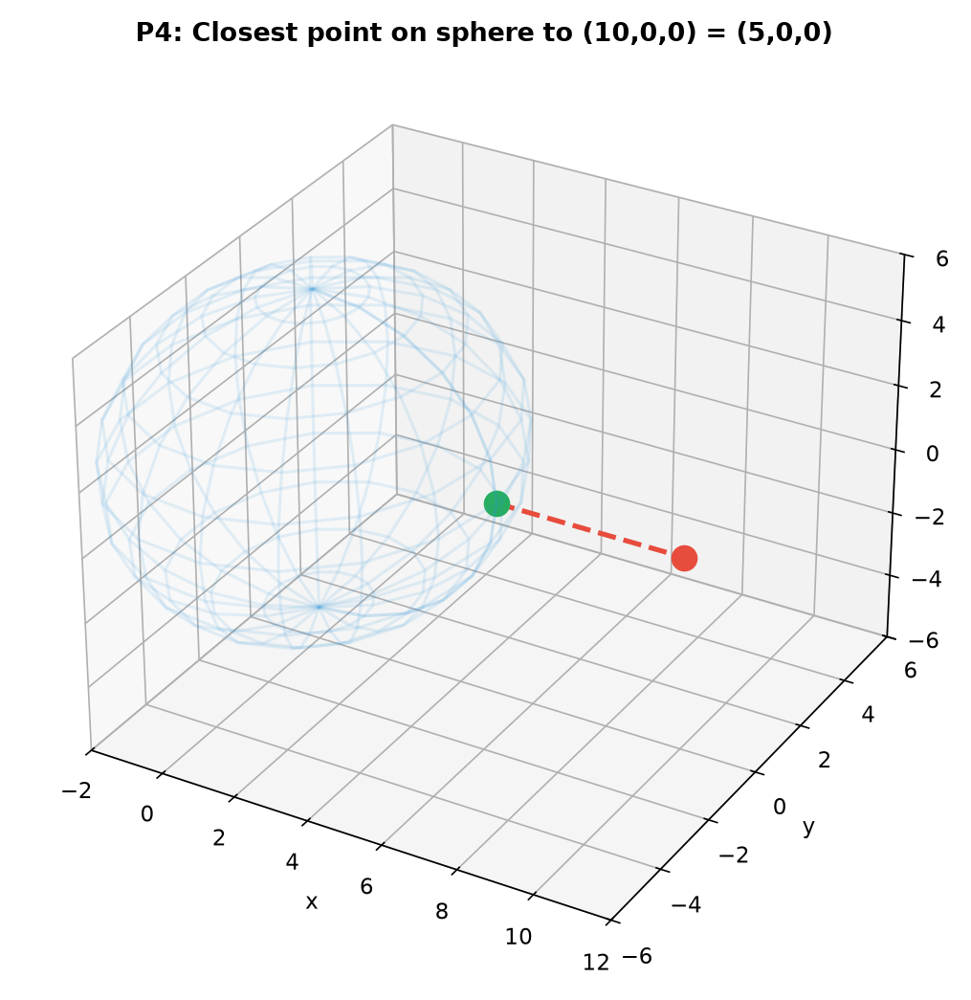
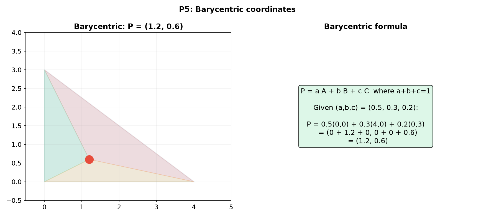
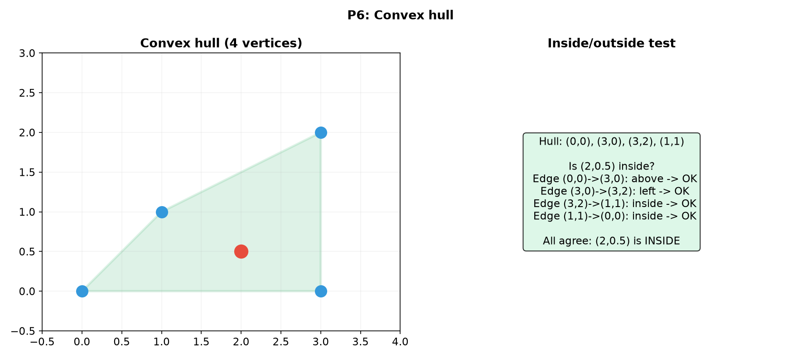
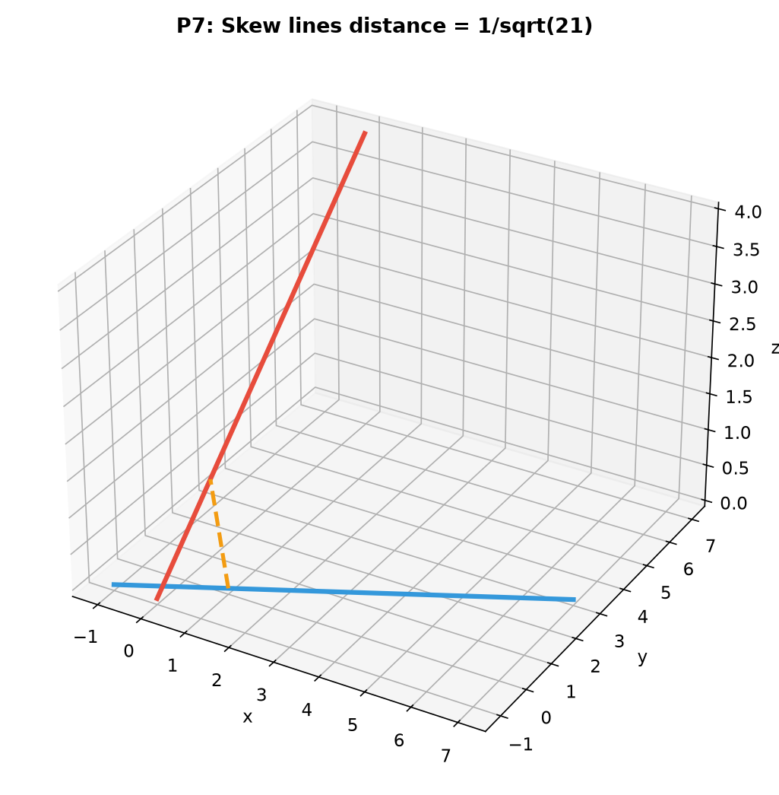
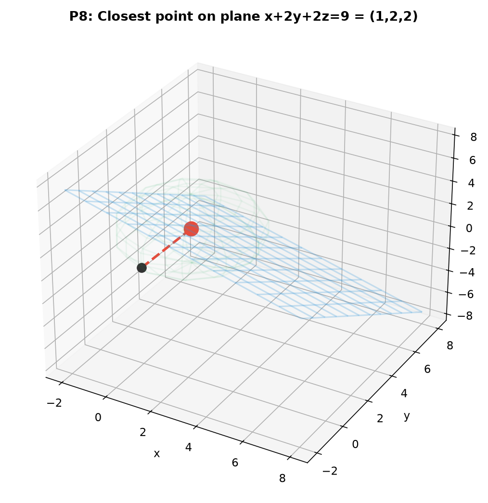
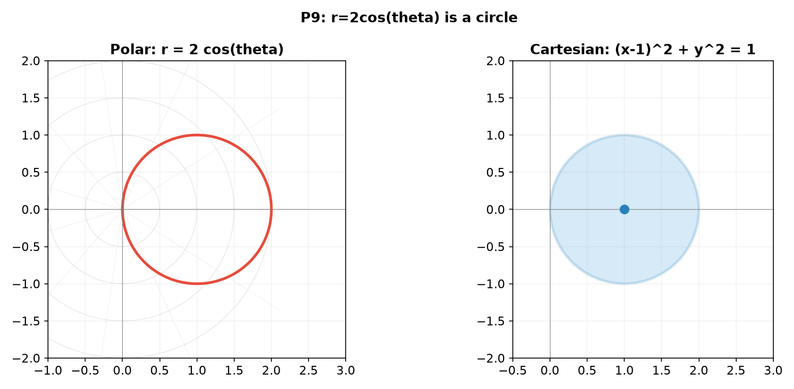

# Solutions — 12C3: Coordinate Systems and Geometric Optimization

---

## Practice 1

**Convert the Cartesian equation $x^2 - y^2 = 1$ (a hyperbola) to polar coordinates.**

$x = r\cos\theta$, $y = r\sin\theta$.
$(r\cos\theta)^2 - (r\sin\theta)^2 = 1 \implies r^2(\cos^2\theta - \sin^2\theta) = 1 \implies r^2\cos 2\theta = 1$.

$r^2 = \frac{1}{\cos 2\theta} = \sec 2\theta$.

So $r = \pm\sqrt{\sec 2\theta}$, with the domain restricted to where $\cos 2\theta > 0$.
In polar form: $r^2\cos 2\theta = 1$.

> **Answer**: $r^2\cos 2\theta = 1$ (or $r = \sqrt{\sec 2\theta}$)

---

## Practice 2

**Find the intersection of the line $\vec{r}(t) = (2, 1, 0) + t(1, -1, 1)$ with the plane $3x + y + 2z = 10$.**

Plug the line into the plane:
$x = 2 + t$, $y = 1 - t$, $z = 0 + t$.
$3(2+t) + (1-t) + 2(t) = 10$.
$6 + 3t + 1 - t + 2t = 10 \implies 7 + 4t = 10 \implies 4t = 3 \implies t = \frac34$.

Intersection point: $(2 + \frac34,\; 1 - \frac34,\; \frac34) = \left(\frac{11}{4},\; \frac14,\; \frac34\right)$.

> **Answer**: $\left(\frac{11}{4}, \frac14, \frac34\right)$

---

## Practice 3

**Find the distance from the point $(1, 2, 3)$ to the line through $(0, 0, 0)$ with direction $(1, 1, 1)$.**

Using the cross product formula: $d = \frac{|\vec{v} \times \vec{d}|}{|\vec{d}|}$, where $\vec{v} = \vec{p} - \vec{q}$.

$\vec{v} = (1, 2, 3) - (0, 0, 0) = (1, 2, 3)$.
$\vec{d} = (1, 1, 1)$.

$\vec{v} \times \vec{d} = \begin{vmatrix} \hat{i} & \hat{j} & \hat{k} \\ 1 & 2 & 3 \\ 1 & 1 & 1 \end{vmatrix}$
$= \hat{i}(2\cdot 1 - 3\cdot 1) - \hat{j}(1\cdot 1 - 3\cdot 1) + \hat{k}(1\cdot 1 - 2\cdot 1)$
$= \hat{i}(2-3) - \hat{j}(1-3) + \hat{k}(1-2)$
$= (-1,\; 2,\; -1)$.

$|\vec{v} \times \vec{d}| = \sqrt{(-1)^2 + 2^2 + (-1)^2} = \sqrt{1+4+1} = \sqrt6$.
$|\vec{d}| = \sqrt{1+1+1} = \sqrt3$.

$d = \frac{\sqrt6}{\sqrt3} = \sqrt2$.

> **Answer**: $\sqrt2$

---

## Practice 4

**Find the point on the sphere $x^2 + y^2 + z^2 = 25$ that is closest to the point $(10, 0, 0)$.**

The closest point on the sphere to an external point lies along the line from the center to that point.

The line from the origin to $(10, 0, 0)$ is the $x$-axis. Along this line, the point on the sphere is where $x = 5$ (the sphere has radius 5).

So the closest point is $(5, 0, 0)$.

Alternatively, using Lagrange multipliers: minimize $f = (x-10)^2 + y^2 + z^2$ subject to $g = x^2 + y^2 + z^2 - 25 = 0$.

$\nabla f = \lambda \nabla g \implies (2(x-10), 2y, 2z) = \lambda(2x, 2y, 2z)$.
From $y$: $2y = 2\lambda y \implies y(\lambda - 1) = 0 \implies y = 0$ or $\lambda = 1$.
From $z$: similarly $z = 0$ or $\lambda = 1$.

If $\lambda = 1$, then $2(x-10) = 2x \implies x-10 = x \implies -10 = 0$, impossible.
So $y = z = 0$. Then $x^2 = 25 \implies x = \pm 5$.

The distances: $(5,0,0)$ is at distance $|5-10| = 5$ from $(10,0,0)$.
$(-5,0,0)$ is at distance $|-5-10| = 15$.
The closest is $(5, 0, 0)$.

> **Answer**: $(5, 0, 0)$

---

## Practice 5

**A point inside triangle $ABC$ has barycentric coordinates $(0.5, 0.3, 0.2)$. If $A = (0, 0)$, $B = (4, 0)$, $C = (0, 3)$, find the Cartesian coordinates of the point.**

$\vec{p} = \alpha A + \beta B + \gamma C = 0.5(0,0) + 0.3(4,0) + 0.2(0,3)$.
$= (0 + 1.2 + 0,\; 0 + 0 + 0.6) = (1.2, 0.6)$.

Check: $\alpha + \beta + \gamma = 0.5 + 0.3 + 0.2 = 1$ ✓.

> **Answer**: $(1.2, 0.6)$

---

## Practice 6: Real Battle

**You have four points in the plane: $(0, 0)$, $(3, 0)$, $(3, 2)$, $(1, 1)$. Determine which points are vertices of the convex hull. Also, is the point $(2, 0.5)$ inside or outside the convex hull?**

**Convex hull**: Plot the points.
- $(0,0)$ — leftmost-bottom point — hull vertex.
- $(3,0)$ — rightmost-bottom — hull vertex.
- $(3,2)$ — rightmost-top — hull vertex.
- $(1,1)$ — is this inside the hull or on it?

The convex hull of the other three points is the triangle $(0,0)-(3,0)-(3,2)$. Check if $(1,1)$ is inside this triangle using barycentric coordinates.

Using the area method:
Area of triangle $T$ with vertices $(0,0)$, $(3,0)$, $(3,2)$:
Area$(T) = \frac12 \cdot 3 \cdot 2 = 3$.

Area of sub-triangle $(1,1)-(3,0)-(3,2)$:
$\frac12|(3-1,0-1) \times (3-1,2-1)| = \frac12|(2,-1) \times (2,1)| = \frac12|2\cdot1 - (-1)\cdot2| = \frac12|2+2| = 2$.

Area of sub-triangle $(0,0)-(1,1)-(3,2)$:
$\frac12|(1,1) \times (3,2)| = \frac12|1\cdot2 - 1\cdot3| = \frac12|2-3| = \frac12$.

Area of sub-triangle $(0,0)-(3,0)-(1,1)$:
$\frac12|(3,0) \times (1,1)| = \frac12|3\cdot1 - 0\cdot1| = \frac32 = 1.5$.

Sum of sub-areas: $2 + 0.5 + 1.5 = 4 \neq 3$.
So $(1,1)$ is **outside** the triangle. Let me reconsider...

Actually, let me redo this. The convex hull vertices are $(0,0)$, $(3,0)$, $(3,2)$, and $(1,1)$ — all four points are hull vertices! The hull is a quadrilateral.

Let me verify: Is $(3,0)-(3,2)-(1,1)-(0,0)$ a convex quadrilateral?
The cross product of consecutive edges:
Edge $(0,0)\to(3,0)$: $(3,0)$. Edge $(3,0)\to(3,2)$: $(0,2)$. Cross: $3\cdot2 - 0\cdot0 = 6 > 0$.
Edge $(3,0)\to(3,2)$: $(0,2)$. Edge $(3,2)\to(1,1)$: $(-2,-1)$. Cross: $0(-1) - 2(-2) = 4 > 0$.
Edge $(3,2)\to(1,1)$: $(-2,-1)$. Edge $(1,1)\to(0,0)$: $(-1,-1)$. Cross: $(-2)(-1) - (-1)(-1) = 2-1 = 1 > 0$.
Edge $(1,1)\to(0,0)$: $(-1,-1)$. Edge $(0,0)\to(3,0)$: $(3,0)$. Cross: $(-1)(0) - (-1)(3) = 3 > 0$.

All cross products are positive → the quadrilateral is convex. All four points are hull vertices.

Actually wait — let me check if $(1,1)$ lies on the line segment from $(0,0)$ to any other point, which would make it not a vertex.

Looking more carefully, $(1,1)$ lies on the line from $(0,0)$ to $(3,2)$? No, the line from $(0,0)$ to $(3,2)$ has equation $y = \frac23 x$. At $x=1$, $y = 2/3 \neq 1$. So $(1,1)$ is not on that edge.

Let me reconsider. The convex hull of these points — which points are extreme?

Using Graham scan: The lowest point (by y, then x) is $(0,0)$. Sort others by polar angle from $(0,0)$:
- $(3,0)$ at angle $0$
- $(3,2)$ at angle $\arctan(2/3) \approx 33.7^\circ$
- $(1,1)$ at angle $45^\circ$

So the order is $(0,0)$, $(3,0)$, $(3,2)$, $(1,1)$.

But wait — is $(1,1)$ actually a hull vertex? Let me check if it's to the left of the line from $(3,0)$ to $(0,0)$... no, that's a boundary edge.

Let me check if $(1,1)$ is inside the triangle $(0,0)-(3,0)-(3,2)$.

Area of triangle $(0,0)-(3,0)-(3,2)$ = $\frac12 \cdot 3 \cdot 2 = 3$.

Barycentric method: $\vec{p} = (1,1)$.
Area of $(1,1)-(3,0)-(3,2)$: $\frac12|(2,-1) \times (2,1)| = \frac12|2\cdot1 - (-1)\cdot2| = \frac12|2+2| = 2$.
Area of $(0,0)-(1,1)-(3,2)$: $\frac12|(1,1) \times (3,2)| = \frac12|1\cdot2-1\cdot3| = \frac12|2-3| = \frac12$.
Area of $(0,0)-(3,0)-(1,1)$: $\frac12|(3,0) \times (1,1)| = \frac12|3\cdot1-0\cdot1| = \frac32$.

Sum = $2 + 0.5 + 1.5 = 4 \neq 3$. So $(1,1)$ is **outside** the triangle.

Since it's outside, it must be a hull vertex. The hull is the quadrilateral $(0,0)-(3,0)-(3,2)-(1,1)$.

**Is $(2, 0.5)$ inside?**
Check if $(2,0.5)$ is inside the quadrilateral. Use the winding method.

The quadrilateral has vertices in order: $(0,0)$, $(3,0)$, $(3,2)$, $(1,1)$.

Check if $(2,0.5)$ is to the same side of all edges:
Edge $(0,0)\to(3,0)$: line $y=0$. $(2,0.5)$ is above → inside side.
Edge $(3,0)\to(3,2)$: line $x=3$. $(2,0.5)$ is left → inside side.
Edge $(3,2)\to(1,1)$: vector $(-2,-1)$, normal $(1,-2)$. Equation: $1(x-3) + (-2)(y-2) = 0 \implies x-3-2y+4=0 \implies x-2y+1=0$.
At $(3,2)$: $3-4+1=0$. At $(2,0.5)$: $2-1+1=2 > 0$. Check inside: point $(0,0)$ gives $0-0+1=1>0$. Both are on the same side ✓.
Edge $(1,1)\to(0,0)$: vector $(-1,-1)$, normal $(1,-1)$. Equation: $1(x-1) + (-1)(y-1) = 0 \implies x-1-y+1=0 \implies x-y=0$.
At $(2,0.5)$: $2-0.5=1.5>0$. At $(3,0)$ (inside): $3-0=3>0$. Same side ✓.

So $(2,0.5)$ is inside the convex hull.

> **Answer**: All four points are hull vertices (convex quadrilateral). $(2, 0.5)$ is inside.

---

## Practice 7: Distance Between Skew Lines (🔗 9C)

**Find the distance between the lines $\vec{r}_1(t) = (1, 0, 0) + t(2, 1, 0)$ and $\vec{r}_2(s) = (0, 1, 1) + s(0, 2, 1)$.**

$\vec{p}_1 = (1, 0, 0)$, $\vec{d}_1 = (2, 1, 0)$.
$\vec{p}_2 = (0, 1, 1)$, $\vec{d}_2 = (0, 2, 1)$.

$\vec{v} = \vec{p}_2 - \vec{p}_1 = (-1, 1, 1)$.
$\vec{n} = \vec{d}_1 \times \vec{d}_2 = \begin{vmatrix} \hat{i} & \hat{j} & \hat{k} \\ 2 & 1 & 0 \\ 0 & 2 & 1 \end{vmatrix}$
$= \hat{i}(1\cdot1 - 0\cdot2) - \hat{j}(2\cdot1 - 0\cdot0) + \hat{k}(2\cdot2 - 1\cdot0)$
$= \hat{i}(1) - \hat{j}(2) + \hat{k}(4) = (1, -2, 4)$.

$|\vec{n}| = \sqrt{1 + 4 + 16} = \sqrt{21}$.
$|\vec{v} \cdot \vec{n}| = |(-1)(1) + 1(-2) + 1(4)| = |-1 - 2 + 4| = |1| = 1$.

$d = \frac{|\vec{v} \cdot \vec{n}|}{|\vec{n}|} = \frac{1}{\sqrt{21}}$.

> **Answer**: $d = \frac{1}{\sqrt{21}}$

---

## Practice 8: Optimization with Lagrange Multipliers (🔗 9C)

**Find the point on the plane $x + 2y + 2z = 9$ that is closest to the origin. Use both the geometric formula and Lagrange multipliers.**

**Geometric formula**: Distance from origin to plane $ax + by + cz = d$ is $\frac{|d|}{\sqrt{a^2+b^2+c^2}} = \frac{9}{\sqrt{1+4+4}} = \frac{9}{3} = 3$.

The closest point is along the normal: $\vec{p} = \frac{d}{a^2+b^2+c^2}(a,b,c) = \frac{9}{9}(1,2,2) = (1, 2, 2)$.

**Lagrange multipliers**: Minimize $f = x^2 + y^2 + z^2$ subject to $g = x + 2y + 2z - 9 = 0$.

$\nabla f = \lambda \nabla g \implies (2x, 2y, 2z) = \lambda(1, 2, 2)$.
So $x = \lambda/2$, $y = \lambda$, $z = \lambda$.

Substitute into constraint: $\lambda/2 + 2\lambda + 2\lambda = 9 \implies \lambda/2 + 4\lambda = 9 \implies \frac{9}{2}\lambda = 9 \implies \lambda = 2$.

Thus $x = 1$, $y = 2$, $z = 2$.
Distance $= \sqrt{1^2+2^2+2^2} = \sqrt9 = 3$. ✓

> **Answer**: $(1, 2, 2)$, distance $= 3$

---

## Practice 9: Coordinate Choice (🔗 9B)

**The polar curve $r = 2\cos\theta$ is a circle. Convert to Cartesian and find its center and radius. What is the arc length for $\theta \in [-\pi/2, \pi/2]$?**

Convert: $r = 2\cos\theta \implies r^2 = 2r\cos\theta \implies x^2 + y^2 = 2x$.
$x^2 - 2x + y^2 = 0 \implies (x-1)^2 + y^2 = 1$.

This is a circle of radius $1$ centered at $(1, 0)$.

Arc length: the curve is traced for $\theta \in [-\pi/2, \pi/2]$ (the full circle).
$L = \int_{-\pi/2}^{\pi/2} \sqrt{(r')^2 + r^2} \, d\theta$.
$r' = -2\sin\theta$.
$(r')^2 + r^2 = 4\sin^2\theta + 4\cos^2\theta = 4$.
$L = \int_{-\pi/2}^{\pi/2} 2 \, d\theta = 2 \cdot \pi = 2\pi$.

So the arc length is $2\pi$, which equals the circumference of a circle of radius 1. ✓

> **Answer**: Circle center $(1, 0)$, radius $1$, arc length $= 2\pi$

---

## Basic Algebra Drill — Coordinate Systems (12 Problems)

### D1. Convert the polar point $(r=4, \theta=60^\circ)$ to Cartesian coordinates.

$x = 4\cos60^\circ = 4 \cdot \frac12 = 2$.
$y = 4\sin60^\circ = 4 \cdot \frac{\sqrt3}{2} = 2\sqrt3$.

> **Answer**: $(2, 2\sqrt3)$

---

### D2. Convert the Cartesian point $(-3, -3)$ to polar coordinates.

$r = \sqrt{(-3)^2 + (-3)^2} = \sqrt{18} = 3\sqrt2$.
$\theta = \arctan(-3/-3) = \arctan(1)$. Both negative → Q3 → $\theta = \pi + \pi/4 = 5\pi/4$ (or $-3\pi/4$).

> **Answer**: $(r, \theta) = (3\sqrt2, 5\pi/4)$

---

### D3. Write the cylindrical coordinates $(r, \theta, z)$ of the point $(x, y, z) = (1, 1, 5)$.

$r = \sqrt{1^2 + 1^2} = \sqrt2$.
$\theta = \arctan(1/1) = \pi/4$ (Q1).
$z = 5$.

> **Answer**: $(\sqrt2, \pi/4, 5)$

---

### D4. Write the spherical coordinates $(\rho, \phi, \theta)$ of the point $(x, y, z) = (0, 0, 7)$.

$\rho = \sqrt{0^2 + 0^2 + 7^2} = 7$.
$\phi = \arccos(7/7) = \arccos(1) = 0$ (north pole).
$\theta$ is undefined/arbitrary (any value works at the pole).

> **Answer**: $(7, 0, \text{any})$

---

### D5. Compute the distance between $(1, 2, 3)$ and $(4, 6, 15)$ in 3D.

$d = \sqrt{(4-1)^2 + (6-2)^2 + (15-3)^2} = \sqrt{9 + 16 + 144} = \sqrt{169} = 13$.

> **Answer**: $13$

---

### D6. Find the distance from the point $(3, 4)$ to the line $3x + 4y = 10$ in 2D.

$d = \frac{|3\cdot3 + 4\cdot4 - 10|}{\sqrt{3^2+4^2}} = \frac{|9+16-10|}{5} = \frac{15}{5} = 3$.

> **Answer**: $3$

---

### D7. Convert the Cartesian point $(2, -2, 1)$ to cylindrical coordinates.

$r = \sqrt{2^2 + (-2)^2} = \sqrt{8} = 2\sqrt2$.
$\theta = \arctan(-2/2) = \arctan(-1)$. $x > 0$, $y < 0$ → Q4 → $\theta = -\pi/4$.
$z = 1$.

> **Answer**: $(2\sqrt2, -\pi/4, 1)$

---

### D8. Convert the cylindrical point $(r=3, \theta=\pi/3, z=4)$ to Cartesian.

$x = 3\cos(\pi/3) = 3 \cdot \frac12 = \frac32$.
$y = 3\sin(\pi/3) = 3 \cdot \frac{\sqrt3}{2} = \frac{3\sqrt3}{2}$.
$z = 4$.

> **Answer**: $(3/2, 3\sqrt3/2, 4)$

---

### D9. Find the distance from the point $(1, -1, 2)$ to the plane $x + 2y + 2z = 6$.

$d = \frac{|1 + 2(-1) + 2(2) - 6|}{\sqrt{1^2 + 2^2 + 2^2}} = \frac{|1 - 2 + 4 - 6|}{3} = \frac{|-3|}{3} = 1$.

> **Answer**: $1$

---

### D10. Write the Cartesian equation of the sphere $\rho = 5$ in spherical coordinates.

$\rho = 5 \implies \sqrt{x^2 + y^2 + z^2} = 5 \implies x^2 + y^2 + z^2 = 25$.

> **Answer**: $x^2 + y^2 + z^2 = 25$

---

### D11. (🔗 9C) Find the cylindrical coordinates of the point $(x, y, z) = (3, 4, -2)$.

$r = \sqrt{3^2 + 4^2} = 5$.
$\theta = \arctan(4/3)$ (Q1).
$z = -2$.

> **Answer**: $(5, \arctan(4/3), -2)$

---

### D12. (🔗 9B) Convert the polar equation $r = 4\cos\theta$ to Cartesian and identify the curve.

$r = 4\cos\theta \implies r^2 = 4r\cos\theta \implies x^2 + y^2 = 4x$.
$x^2 - 4x + y^2 = 0 \implies (x-2)^2 + y^2 = 4$.
A circle of radius $2$ centered at $(2, 0)$.

> **Answer**: Circle $(x-2)^2 + y^2 = 4$, center $(2, 0)$, radius $2$

---

## Advanced Algebra Drill — Coordinate Systems (12 Problems)

### A1. Find the equation of a torus in Cartesian coordinates by eliminating the parameters from $\vec{r}(\theta, \phi)$.

$\vec{r}(\theta, \phi) = ((R + r\cos\phi)\cos\theta,\; (R + r\cos\phi)\sin\theta,\; r\sin\phi)$.

$x = (R + r\cos\phi)\cos\theta$, $y = (R + r\cos\phi)\sin\theta$, $z = r\sin\phi$.

$x^2 + y^2 = (R + r\cos\phi)^2$.
So $\sqrt{x^2 + y^2} = R + r\cos\phi \implies \cos\phi = \frac{\sqrt{x^2+y^2} - R}{r}$.
Also $z = r\sin\phi \implies \sin\phi = \frac{z}{r}$.

Since $\cos^2\phi + \sin^2\phi = 1$:
$\left(\frac{\sqrt{x^2+y^2} - R}{r}\right)^2 + \left(\frac{z}{r}\right)^2 = 1$.

$(\sqrt{x^2+y^2} - R)^2 + z^2 = r^2$.

> **Answer**: $(\sqrt{x^2+y^2} - R)^2 + z^2 = r^2$

---

### A2. Find the distance between two skew lines: $\vec{r}_1(t) = (0, 0, 0) + t(1, 0, 0)$ and $\vec{r}_2(s) = (0, 1, 1) + s(0, 0, 1)$.

$\vec{p}_1 = (0,0,0)$, $\vec{d}_1 = (1,0,0)$.
$\vec{p}_2 = (0,1,1)$, $\vec{d}_2 = (0,0,1)$.

$\vec{v} = (0,1,1) - (0,0,0) = (0,1,1)$.
$\vec{n} = \vec{d}_1 \times \vec{d}_2 = (1,0,0) \times (0,0,1) = (0,-1,0)$.
$|\vec{n}| = 1$.
$|\vec{v} \cdot \vec{n}| = |0\cdot0 + 1(-1) + 1\cdot0| = 1$.

$d = \frac{1}{1} = 1$.

> **Answer**: $d = 1$

---

### A3. Find the center and radius of the circle that is the intersection of the sphere $x^2 + y^2 + z^2 = 25$ and the plane $x + y + z = 3$.

The plane's normal vector is $(1,1,1)$. The distance from origin to the plane is $\frac{|3|}{\sqrt{1+1+1}} = \frac{3}{\sqrt3} = \sqrt3$.

The sphere radius is $5$. By the Pythagorean theorem, the intersection circle has radius $\sqrt{5^2 - (\sqrt3)^2} = \sqrt{25-3} = \sqrt{22}$.

The center of the circle is at the foot of the perpendicular from origin to the plane:
$\vec{c} = \frac{3}{1+1+1}(1,1,1) = (1,1,1)$.

> **Answer**: Center $(1,1,1)$, radius $\sqrt{22}$

---

### A4. Use Lagrange multipliers to find the point on the plane $2x + 3y + z = 6$ closest to the origin. Verify using the geometric formula.

Minimize $f = x^2 + y^2 + z^2$ subject to $g = 2x + 3y + z - 6 = 0$.

$\nabla f = \lambda \nabla g \implies (2x, 2y, 2z) = \lambda(2, 3, 1)$.
$x = \lambda$, $y = \frac{3}{2}\lambda$, $z = \frac12\lambda$.

Substitute into constraint: $2\lambda + 3(\frac{3}{2}\lambda) + \frac12\lambda = 6$.
$2\lambda + \frac{9}{2}\lambda + \frac12\lambda = 6 \implies \frac{4+9+1}{2}\lambda = 6 \implies \frac{14}{2}\lambda = 6 \implies 7\lambda = 6 \implies \lambda = \frac{6}{7}$.

$x = \frac{6}{7}$, $y = \frac{9}{7}$, $z = \frac{3}{7}$.

Geometric formula: $d = \frac{|6|}{\sqrt{4+9+1}} = \frac{6}{\sqrt{14}}$.
Closest point: $\frac{6}{14}(2,3,1) = \frac{3}{7}(2,3,1) = (\frac{6}{7}, \frac{9}{7}, \frac{3}{7})$. ✓

> **Answer**: $(\frac{6}{7}, \frac{9}{7}, \frac{3}{7})$

---

### A5. A triangle has vertices $A(0,0)$, $B(6,0)$, $C(0,4)$. Find the barycentric coordinates of its centroid.

The centroid is the average of the three vertices: $\frac{A+B+C}{3} = \frac{(0,0)+(6,0)+(0,4)}{3} = (2, \frac43)$.

Barycentric coordinates of the centroid are always $(\frac13, \frac13, \frac13)$ since it's the arithmetic mean.

Verification: $\frac13(0,0) + \frac13(6,0) + \frac13(0,4) = (2, \frac43)$ ✓.

> **Answer**: $(\frac13, \frac13, \frac13)$

---

### A6. The polar curve $r = 2\cos\theta$ is a circle. Find its center and radius by converting to Cartesian. Also find the arc length.

$x^2 + y^2 = 2x \implies (x-1)^2 + y^2 = 1$.
Center $(1,0)$, radius $1$.

Arc length for $\theta \in [-\pi/2, \pi/2]$:
$L = \int_{-\pi/2}^{\pi/2} \sqrt{(-2\sin\theta)^2 + (2\cos\theta)^2} \, d\theta = \int_{-\pi/2}^{\pi/2} 2 \, d\theta = 2\pi$.

> **Answer**: Center $(1,0)$, radius $1$, arc length $= 2\pi$

---

### A7. Find the shortest distance from the point $(3, 0, 0)$ to the line of intersection of the planes $x + y + z = 1$ and $x - y + z = 0$.

The line direction is the cross product of the normals:
$\vec{d} = (1,1,1) \times (1,-1,1) = \begin{vmatrix} \hat{i} & \hat{j} & \hat{k} \\ 1 & 1 & 1 \\ 1 & -1 & 1 \end{vmatrix} = (1\cdot1-1(-1),\; 1\cdot1-1\cdot1,\; 1(-1)-1\cdot1) = (2, 0, -2)$.

So $\vec{d} = (2, 0, -2) \parallel (1, 0, -1)$.

Find a point on the line: set $y = 0$, then $x+z=1$ and $x+z=0$ — inconsistency. Set $z = 0$:
$x + y = 1$ and $x - y = 0 \implies x = y = \frac12$.
So $\vec{q} = (\frac12, \frac12, 0)$ is on the line.

$\vec{v} = (3,0,0) - (\frac12, \frac12, 0) = (\frac52, -\frac12, 0)$.

$d = \frac{|\vec{v} \times \vec{d}|}{|\vec{d}|}$.
$\vec{v} \times \vec{d} = (\frac52, -\frac12, 0) \times (1, 0, -1)$
$= ((-\frac12)(-1) - 0\cdot0,\; 0\cdot1 - \frac52(-1),\; \frac52\cdot0 - (-\frac12)\cdot1)$
$= (\frac12,\; \frac52,\; \frac12)$.

$|\vec{v} \times \vec{d}| = \sqrt{(\frac12)^2 + (\frac52)^2 + (\frac12)^2} = \sqrt{\frac14 + \frac{25}{4} + \frac14} = \sqrt{\frac{27}{4}} = \frac{3\sqrt3}{2}$.
$|\vec{d}| = \sqrt{1+0+1} = \sqrt2$.

$d = \frac{3\sqrt3/2}{\sqrt2} = \frac{3\sqrt6}{4}$.

> **Answer**: $d = \frac{3\sqrt6}{4}$

---

### A8. Determine if the point $(2, 2, 2)$ lies inside or outside the tetrahedron with vertices $(0,0,0)$, $(4,0,0)$, $(0,4,0)$, $(0,0,4)$ using barycentric coordinates in 3D.

We need to express $(2,2,2)$ as $\alpha A + \beta B + \gamma C + \delta D$ with $\alpha+\beta+\gamma+\delta=1$ and $\alpha,\beta,\gamma,\delta \ge 0$.

$(2,2,2) = \alpha(0,0,0) + \beta(4,0,0) + \gamma(0,4,0) + \delta(0,0,4)$.
This gives: $4\beta = 2$, $4\gamma = 2$, $4\delta = 2 \implies \beta = \gamma = \delta = \frac12$.
Then $\alpha = 1 - (\frac12 + \frac12 + \frac12) = 1 - \frac32 = -\frac12$.

Since $\alpha < 0$, the point is **outside** the tetrahedron.

> **Answer**: Outside ($\alpha = -\frac12 < 0$)

---

### A9. Find the maximum and minimum distances from the origin to the curve $x^2 + 4y^2 = 4$ (an ellipse) using Lagrange multipliers.

Maximize/minimize $f = x^2 + y^2$ subject to $g = x^2 + 4y^2 - 4 = 0$.

$\nabla f = \lambda \nabla g \implies (2x, 2y) = \lambda(2x, 8y)$.

Case 1: $x = 0$. Then $4y^2 = 4 \implies y = \pm 1$. Distance $= 1$.
Case 2: $y = 0$. Then $x^2 = 4 \implies x = \pm 2$. Distance $= 2$.
Case 3: $x \neq 0$, $y \neq 0$. Then $2x = 2\lambda x \implies \lambda = 1$. And $2y = 8\lambda y = 8y \implies 2y = 8y \implies y = 0$. Contradiction. No solutions here.

Minimum distance: $1$ (at $(0, \pm 1)$).
Maximum distance: $2$ (at $(\pm 2, 0)$).

> **Answer**: Min $= 1$ at $(0,\pm1)$, Max $= 2$ at $(\pm2,0)$

---

### A10. Three points in the plane: $(0, 0)$, $(5, 0)$, $(2, 4)$. Find the point inside the triangle that minimizes the sum of squared distances to the three vertices.

Minimize $f(x,y) = (x-0)^2 + (y-0)^2 + (x-5)^2 + (y-0)^2 + (x-2)^2 + (y-4)^2$.
$= x^2 + y^2 + (x^2 - 10x + 25) + y^2 + (x^2 - 4x + 4) + (y^2 - 8y + 16)$.
$= 3x^2 + 3y^2 - 14x - 8y + 45$.

Set partial derivatives to zero:
$\frac{\partial f}{\partial x} = 6x - 14 = 0 \implies x = \frac{7}{3}$.
$\frac{\partial f}{\partial y} = 6y - 8 = 0 \implies y = \frac{4}{3}$.

This is the centroid: $\frac{(0,0)+(5,0)+(2,4)}{3} = \left(\frac{7}{3}, \frac{4}{3}\right)$. ✓

> **Answer**: $(\frac73, \frac43)$ — the centroid

---

### A11. (🔗 9C, 12C2) Find the distance between two skew lines: the $x$-axis and the line through $(0, 1, 1)$ parallel to $(1, 1, 0)$.

$x$-axis: $\vec{r}_1(t) = (t, 0, 0)$, direction $\vec{d}_1 = (1, 0, 0)$.
Line 2: $\vec{r}_2(s) = (0, 1, 1) + s(1, 1, 0)$, direction $\vec{d}_2 = (1, 1, 0)$.

$\vec{v} = (0, 1, 1) - (0, 0, 0) = (0, 1, 1)$.
$\vec{n} = \vec{d}_1 \times \vec{d}_2 = (1,0,0) \times (1,1,0) = (0\cdot0 - 0\cdot1,\; 0\cdot1 - 1\cdot0,\; 1\cdot1 - 0\cdot1) = (0, 0, 1)$.
$|\vec{n}| = 1$.
$|\vec{v} \cdot \vec{n}| = |0\cdot0 + 1\cdot0 + 1\cdot1| = 1$.

$d = \frac{1}{1} = 1$.

> **Answer**: $d = 1$

---

### A12. (🔗 12C1) A point $(x, y)$ is rotated by $90^\circ$, then the result is converted to polar coordinates. If the original point is $(3, 1)$, what are $(r, \theta)$ after the rotation? Solve two ways.

**Method 1: Rotate then convert.**
Rotation by $90^\circ$ CCW: $R_{90} = \begin{pmatrix} 0 & -1 \\ 1 & 0 \end{pmatrix}$.
$R_{90}(3, 1) = (-1, 3)$.
$r = \sqrt{(-1)^2 + 3^2} = \sqrt{10}$.
$\theta = \arctan(3/(-1))$ — Q2 → $\theta = \pi - \arctan(3) \approx \pi - 1.249 = 1.893$ rad.

**Method 2: Use the relationship between rotation and angle addition.**
Original point $(3, 1)$ has $r = \sqrt{10}$, $\theta_0 = \arctan(1/3) \approx 0.322$ rad.
Rotation by $90^\circ$ adds $\pi/2$ to the angle.
New $\theta = \theta_0 + \pi/2 \approx 0.322 + 1.571 = 1.893$ rad.
$r$ stays the same: $r = \sqrt{10}$.

Both methods give the same result ✓.

> **Answer**: $(r, \theta) = (\sqrt{10},\; \arctan(1/3) + \pi/2)$
