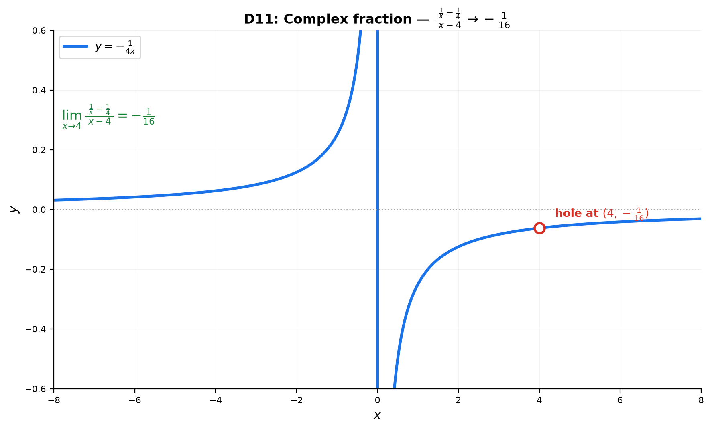

# Solutions — 13A: Algebraic Limits — The $\frac{0}{0}$ Toolkit
## Basic Drills

### D1. $\displaystyle \lim_{x\to 3}(2x^2-5x+1)$ — direct substitution.

$2(9) - 5(3) + 1 = 18 - 15 + 1 = 4$.

> **Answer**: $4$

---

### D2. $\displaystyle \lim_{x\to -1}\frac{x^2-1}{x+1}$ — factor and cancel.

$\frac{(x-1)(x+1)}{x+1} = x-1 \xrightarrow{x\to -1} -2$.

> **Answer**: $-2$

---

### D3. $\displaystyle \lim_{x\to 4}\frac{\sqrt{x}-2}{x-4}$ — factor the denominator.

$x-4 = (\sqrt{x}-2)(\sqrt{x}+2)$, so $\frac{\sqrt{x}-2}{(\sqrt{x}-2)(\sqrt{x}+2)} = \frac{1}{\sqrt{x}+2} \to \frac{1}{2+2} = \frac14$.

> **Answer**: $\frac14$

---

### D4. $\displaystyle \lim_{x\to 0}\frac{\sin 4x}{x}$ — match the argument.

$\frac{\sin 4x}{x} = 4 \cdot \frac{\sin 4x}{4x} \to 4 \cdot 1 = 4$.

> **Answer**: $4$

---

### D5. $\displaystyle \lim_{x\to 0}\frac{e^{5x}-1}{x}$ — standard exponential limit.

$\frac{e^{5x}-1}{x} = 5 \cdot \frac{e^{5x}-1}{5x} \to 5 \cdot 1 = 5$.

> **Answer**: $5$

---

### D6. $\displaystyle \lim_{x\to 0}\frac{\ln(1+3x)}{x}$ — standard log limit.

$\frac{\ln(1+3x)}{x} = 3 \cdot \frac{\ln(1+3x)}{3x} \to 3 \cdot 1 = 3$.

> **Answer**: $3$

---

### D7. $\displaystyle \lim_{x\to 1}\frac{x^2+x-2}{x-1}$ — factor the numerator.

$x^2+x-2 = (x-1)(x+2)$, so $\frac{(x-1)(x+2)}{x-1} = x+2 \to 3$.

> **Answer**: $3$

---

### D8. $\displaystyle \lim_{x\to 0}\frac{\sqrt{x+1}-1}{x}$ — conjugate.

$\frac{(\sqrt{x+1}-1)(\sqrt{x+1}+1)}{x(\sqrt{x+1}+1)} = \frac{x}{x(\sqrt{x+1}+1)} = \frac{1}{\sqrt{x+1}+1} \to \frac{1}{1+1} = \frac12$.

> **Answer**: $\frac12$

---

### D9. $\displaystyle \lim_{x\to 0^+}\frac{|x|}{x}$ — one-sided, watch the sign.

For $x\to 0^+$, $|x| = x$, so $\frac{|x|}{x} = \frac{x}{x} = 1$.

> **Answer**: $1$

---

### D10. $\displaystyle \lim_{x\to 0}\frac{\tan 2x}{x}$ — use $\tan = \sin/\cos$.

$\frac{\tan 2x}{x} = \frac{\sin 2x}{x\cos 2x} = 2 \cdot \frac{\sin 2x}{2x} \cdot \frac{1}{\cos 2x} \to 2 \cdot 1 \cdot 1 = 2$.

> **Answer**: $2$

---

### D11. $\displaystyle \lim_{x\to 4}\frac{\ \frac{1}{x}-\frac{1}{4}\ }{x-4}$ — combine the numerator first (→ Example 11).

① Plug in $x=4$: $\frac{0}{0}$.

② Combine the numerator over $4x$: $\frac{1}{x}-\frac{1}{4} = \frac{4-x}{4x} = \frac{-(x-4)}{4x}$.

③ Divide by $x-4$ and cancel:
$\frac{\frac{-(x-4)}{4x}}{x-4} = \frac{-(x-4)}{4x(x-4)} = -\frac{1}{4x}$.

④ Plug in $x=4$: $-\frac{1}{4\cdot4} = -\frac{1}{16}$.

> **Answer**: $-\frac{1}{16}$ (matches the general pattern $-\frac{1}{a^2}$ with $a=4$)

---

### D12. $\displaystyle \lim_{x\to 0}\frac{\ \frac{1}{x+1}-1\ }{x}$ — combine, then cancel the $x$ (→ Example 11).

① Plug in $x=0$: $\frac{0}{0}$.

② Combine the numerator: $\frac{1}{x+1}-1 = \frac{1-(x+1)}{x+1} = \frac{-x}{x+1}$.

③ Divide by $x$: $\frac{-x}{x+1}\cdot\frac{1}{x} = -\frac{1}{x+1}$.

④ Plug in $x=0$: $-\frac{1}{0+1} = -1$.

> **Answer**: $-1$

---

## Advanced Drills

### A1. $\displaystyle \lim_{x\to 2}\frac{x^4-16}{x-2}$ — difference of squares twice.

$x^4-16 = (x^2-4)(x^2+4) = (x-2)(x+2)(x^2+4)$.

Cancel: $(x+2)(x^2+4) \to (4)(4+4) = 4 \cdot 8 = 32$.

> **Answer**: $32$

---

### A2. $\displaystyle \lim_{x\to 0}\frac{\sqrt{2x+4}-2}{x}$ — conjugate.

$\frac{(\sqrt{2x+4}-2)(\sqrt{2x+4}+2)}{x(\sqrt{2x+4}+2)} = \frac{2x}{x(\sqrt{2x+4}+2)} = \frac{2}{\sqrt{2x+4}+2} \to \frac{2}{2+2} = \frac12$.

> **Answer**: $\frac12$

---

### A3. $\displaystyle \lim_{x\to 0}\frac{\sin 3x - \sin x}{x}$ — sum-to-product.

$\sin 3x - \sin x = 2\cos\left(\frac{3x+x}{2}\right)\sin\left(\frac{3x-x}{2}\right) = 2\cos 2x \sin x$.

So $\frac{\sin 3x - \sin x}{x} = 2\cos 2x \cdot \frac{\sin x}{x} \to 2 \cdot 1 \cdot 1 = 2$.

> **Answer**: $2$

---

### A4. $\displaystyle \lim_{x\to 0}\frac{2^x - 1}{3^x - 1}$ — write $a^x = e^{x\ln a}$.

$2^x - 1 = e^{x\ln 2} - 1$, $3^x - 1 = e^{x\ln 3} - 1$.

$\frac{e^{x\ln 2}-1}{e^{x\ln 3}-1} = \frac{e^{x\ln 2}-1}{x\ln 2} \cdot \frac{x\ln 3}{e^{x\ln 3}-1} \cdot \frac{\ln 2}{\ln 3} \to 1 \cdot 1 \cdot \frac{\ln 2}{\ln 3}$.

> **Answer**: $\frac{\ln 2}{\ln 3}$

---

### A5. $\displaystyle \lim_{x\to 0}\frac{1-\cos 2x}{x^2}$ — half-angle identity.

$1 - \cos 2x = 2\sin^2 x$.

$\frac{2\sin^2 x}{x^2} = 2\left(\frac{\sin x}{x}\right)^2 \to 2 \cdot 1 = 2$.

> **Answer**: $2$

---

### A6. $\displaystyle \lim_{x\to 0}\frac{\sqrt{1+x}-\sqrt{1-x}}{x}$ — conjugate the numerator.

$\frac{(\sqrt{1+x}-\sqrt{1-x})(\sqrt{1+x}+\sqrt{1-x})}{x(\sqrt{1+x}+\sqrt{1-x})} = \frac{(1+x)-(1-x)}{x(\sqrt{1+x}+\sqrt{1-x})} = \frac{2x}{x(\sqrt{1+x}+\sqrt{1-x})}$.

$= \frac{2}{\sqrt{1+x}+\sqrt{1-x}} \to \frac{2}{1+1} = 1$.

> **Answer**: $1$

---

### A7. $\displaystyle \lim_{x\to 3}\frac{\frac{1}{x}-\frac{1}{3}}{x-3}$ — combine the fractions first.

$\frac{1}{x} - \frac{1}{3} = \frac{3-x}{3x} = \frac{-(x-3)}{3x}$.

$\frac{-(x-3)}{3x(x-3)} = -\frac{1}{3x} \to -\frac{1}{9}$.

> **Answer**: $-\frac{1}{9}$

---

### A8. $\displaystyle \lim_{x\to 0}\frac{\sin x^2}{x}$ — the sine's argument is $x^2$.

$\frac{\sin x^2}{x} = \frac{\sin x^2}{x^2} \cdot x \to 1 \cdot 0 = 0$.

> **Answer**: $0$

---

### A9. $\displaystyle \lim_{x\to 1}\frac{\sqrt[3]{x}-1}{x-1}$ — substitute $t = \sqrt[3]{x}$.

Let $t = \sqrt[3]{x}$, so $x = t^3$ and as $x\to 1$, $t\to 1$:

$\frac{t-1}{t^3-1} = \frac{t-1}{(t-1)(t^2+t+1)} = \frac{1}{t^2+t+1} \to \frac{1}{1+1+1} = \frac13$.

> **Answer**: $\frac13$

---

### A10. $f(x) = \begin{cases} \frac{x^2-1}{x-1}, & x \neq 1 \\ k, & x=1 \end{cases}$. Find $k$ so $f$ is continuous at $x=1$.

For continuity at $x=1$ we need $\lim_{x\to 1}f(x) = f(1) = k$.

$\lim_{x\to 1}\frac{x^2-1}{x-1} = \lim_{x\to 1}\frac{(x-1)(x+1)}{x-1} = \lim_{x\to 1}(x+1) = 2$.

Set $k = 2$.

> **Answer**: $k = 2$

---

### A11. $\displaystyle \lim_{x\to 3}\frac{\ \frac{x}{x-2}-3\ }{x-3}$ — a fraction minus a constant; combine first (→ Example 11).

① Plug in $x=3$: numerator $\frac{3}{1}-3 = 0$, denominator $0$ → $\frac{0}{0}$.

② Combine the numerator over $x-2$:
$\frac{x}{x-2}-3 = \frac{x-3(x-2)}{x-2} = \frac{x-3x+6}{x-2} = \frac{6-2x}{x-2} = \frac{-2(x-3)}{x-2}$.

③ Divide by $x-3$ and cancel:
$\frac{\frac{-2(x-3)}{x-2}}{x-3} = \frac{-2(x-3)}{(x-2)(x-3)} = -\frac{2}{x-2}$.

④ Plug in $x=3$: $-\frac{2}{3-2} = -2$.

> **Answer**: $-2$
