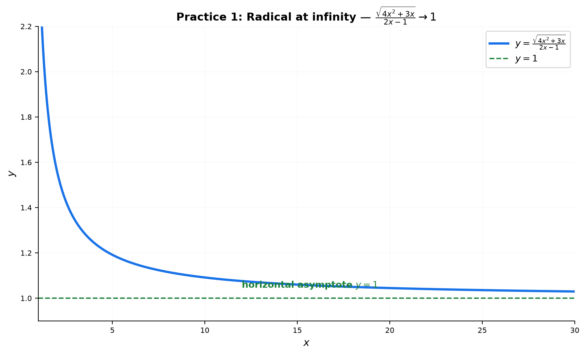
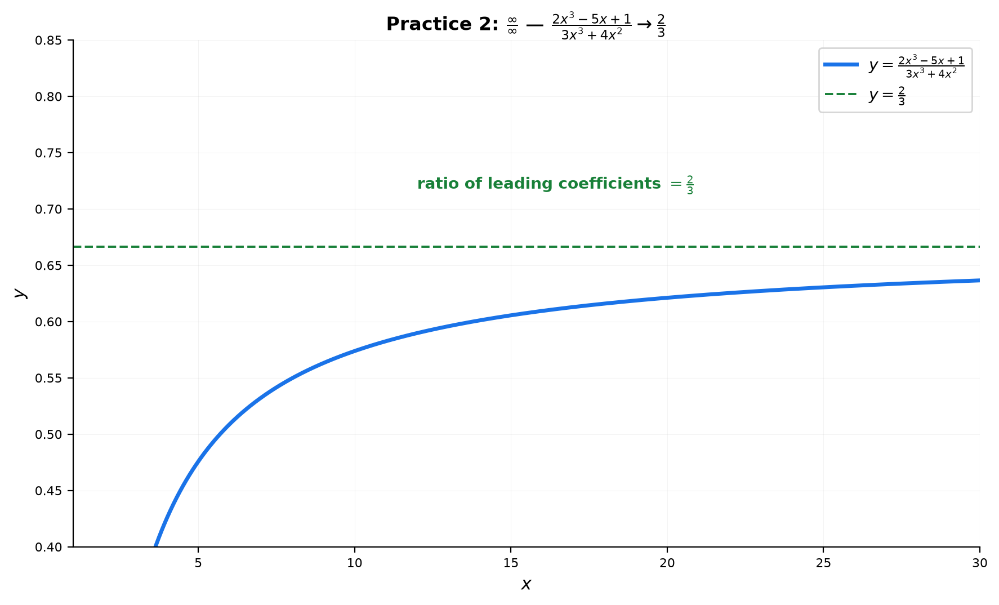
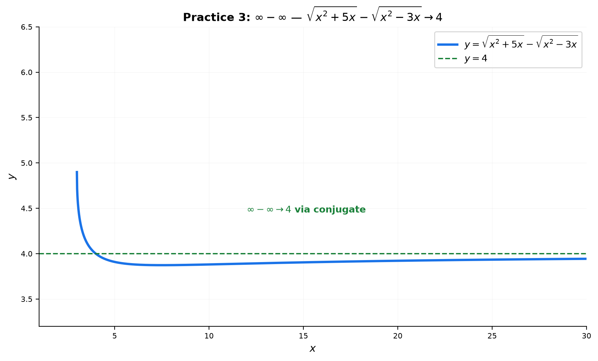
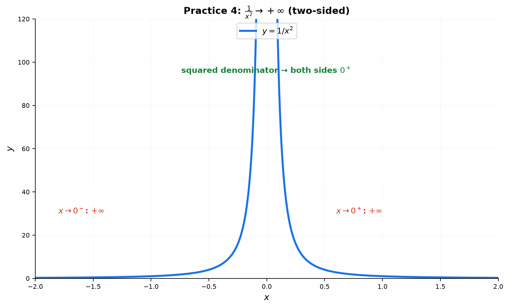
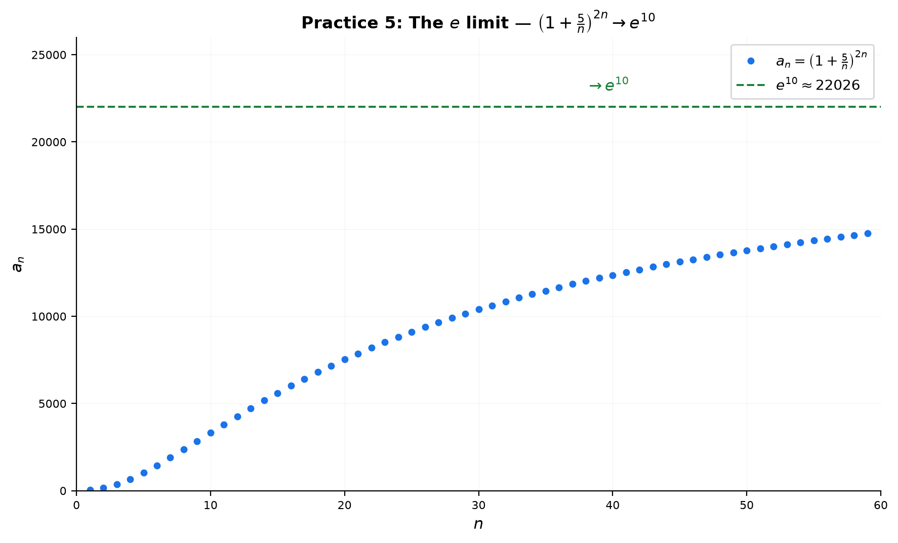
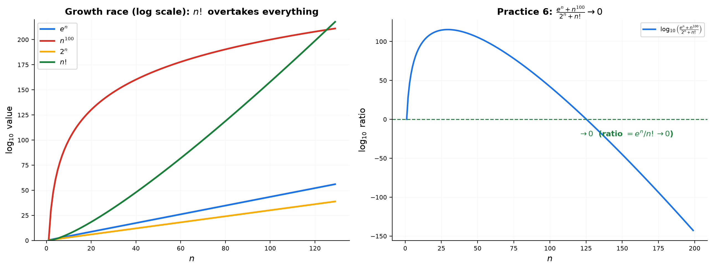

# Solutions — 13B: Limits at Infinity — Growth, Dominance, and the Number $e$

---

## Practice 1

**Evaluate $\displaystyle \lim_{x\to\infty}\frac{\sqrt{4x^2+3x}}{2x-1}$. Factor out $x$ from the radical; watch the $\sqrt{x^2}=|x|$ issue.**

① $\frac{\infty}{\infty}$ form. Factor the largest power of $x$ out of the radical:
$\sqrt{4x^2+3x} = \sqrt{x^2\left(4+\frac{3}{x}\right)} = |x|\sqrt{4+\frac{3}{x}}$.

② Since $x\to +\infty$, we have $x>0$, so $|x| = x$:
$\frac{\sqrt{4x^2+3x}}{2x-1} = \frac{x\sqrt{4+\frac{3}{x}}}{x\left(2-\frac{1}{x}\right)} = \frac{\sqrt{4+\frac{3}{x}}}{2-\frac{1}{x}}$.

③ As $x\to\infty$: $\frac{3}{x}\to 0$, $\frac{1}{x}\to 0$:
$\frac{\sqrt{4+0}}{2-0} = \frac{2}{2} = 1$.

> **Answer**: $1$

---

## Practice 2

**Evaluate $\displaystyle \lim_{x\to\infty}\frac{2x^3-5x+1}{3x^3+4x^2}$. Divide by the highest power.**

① $\frac{\infty}{\infty}$. Highest power is $x^3$. Divide numerator and denominator by $x^3$:

$\frac{2 - \frac{5}{x^2} + \frac{1}{x^3}}{3 + \frac{4}{x}}$.

② As $x\to\infty$: $\frac{5}{x^2}\to 0$, $\frac{1}{x^3}\to 0$, $\frac{4}{x}\to 0$.

③ → $\frac{2 - 0 + 0}{3 + 0} = \frac{2}{3}$.

> **Answer**: $\frac{2}{3}$

---

## Practice 3

**Evaluate $\displaystyle \lim_{x\to\infty}\left(\sqrt{x^2+5x}-\sqrt{x^2-3x}\right)$. $\infty-\infty$ → rationalize.**

① $\infty-\infty$ form. Multiply by the conjugate:

$\frac{(\sqrt{x^2+5x}-\sqrt{x^2-3x})(\sqrt{x^2+5x}+\sqrt{x^2-3x})}{\sqrt{x^2+5x}+\sqrt{x^2-3x}} = \frac{(x^2+5x)-(x^2-3x)}{\sqrt{x^2+5x}+\sqrt{x^2-3x}} = \frac{8x}{\sqrt{x^2+5x}+\sqrt{x^2-3x}}$.

② Divide numerator and denominator by $x$ (with $x>0$, $|x|=x$):

$\frac{8}{\sqrt{1+\frac{5}{x}}+\sqrt{1-\frac{3}{x}}}$.

③ As $x\to\infty$: $\to \frac{8}{\sqrt{1}+\sqrt{1}} = \frac{8}{2} = 4$.

> **Answer**: $4$

---

## Practice 4

**Evaluate $\displaystyle \lim_{x\to 0}\frac{1}{x^2}$. Is the two-sided limit $+\infty$? Explain.**

① Denominator: $x^2 \to 0$. Since $x^2 \geq 0$ for all $x\neq 0$, the denominator approaches $0$ **from the positive side** on BOTH sides of $0$ (a square is never negative).

② $\frac{1}{x^2} \to \frac{1}{0^+} = +\infty$ from the left and from the right.

③ Both one-sided limits are $+\infty$ and agree.

→ Yes, the two-sided limit is $+\infty$.

> **Answer**: $\displaystyle \lim_{x\to 0}\frac{1}{x^2} = +\infty$ (squared denominator → always $0^+$)

---

## Practice 5

**Evaluate $\displaystyle \lim_{n\to\infty}\left(1+\frac{5}{n}\right)^{2n}$. Rewrite using the $e^k$ rule.**

① The base is $1 + \frac{5}{n}$, so the exponent must be built around $\frac{n}{5}$:

$\left(1+\frac{5}{n}\right)^{2n} = \left[\left(1+\frac{5}{n}\right)^{n/5}\right]^{5 \cdot 2} = \left[\left(1+\frac{5}{n}\right)^{n/5}\right]^{10}$.

② As $n\to\infty$: $\left(1+\frac{5}{n}\right)^{n/5} \to e$. So the whole thing $\to e^{10}$.

> **Answer**: $e^{10}$

---

## Practice 6: Real Battle

**Evaluate $\displaystyle \lim_{x\to\infty}\frac{e^x + x^{100}}{2^x + x!}$ using the growth hierarchy.**

① Identify the dominant terms. Hierarchy: $x! \gg e^x \gg 2^x \gg x^{100}$.

② Numerator: $e^x + x^{100} \sim e^x$ (exponential beats the polynomial).
Denominator: $2^x + x! \sim x!$ (factorial beats the exponential).

③ So the fraction behaves like $\frac{e^x}{x!}$.

④ From the hierarchy (or the standard limit $\frac{a^n}{n!}\to 0$), $\frac{e^x}{x!}\to 0$.

> **Answer**: $0$

---

## Basic Drills

### D1. $\displaystyle \lim_{x\to\infty}\frac{5x^2-3}{2x^2+1}$ — divide by $x^2$.

$\frac{5-\frac{3}{x^2}}{2+\frac{1}{x^2}} \to \frac{5}{2}$.

> **Answer**: $\frac{5}{2}$

---

### D2. $\displaystyle \lim_{x\to\infty}\frac{x+1}{x^3-2}$ — compare degrees.

Deg(num)$=1$ < Deg(den)$=3$ → $0$.

> **Answer**: $0$

---

### D3. $\displaystyle \lim_{x\to\infty}\frac{2x^3}{x^2+4}$ — leading term dominates.

Deg(num)$=3$ > Deg(den)$=2$ → $\frac{2x^3}{x^2} = 2x \to +\infty$.

> **Answer**: $+\infty$

---

### D4. $\displaystyle \lim_{x\to-\infty}\frac{4x^2}{2x^2-5}$ — even powers.

Divide by $x^2$: $\frac{4}{2} = 2$ (same as $x\to+\infty$, since $x^2>0$).

> **Answer**: $2$

---

### D5. $\displaystyle \lim_{x\to 0^+}\frac{1}{x^3}$ — sign of the denominator.

For $x\to 0^+$, $x^3\to 0^+$ (positive). $\frac{1}{0^+} = +\infty$.

> **Answer**: $+\infty$

---

### D6. $\displaystyle \lim_{x\to 0}\frac{1}{x^4}$ — even denominator.

$x^4\to 0^+$ from both sides → $\frac{1}{0^+} = +\infty$.

> **Answer**: $+\infty$

---

### D7. $\displaystyle \lim_{x\to\infty}\left(\sqrt{x^2+2x}-x\right)$ — conjugate.

$\frac{2x}{\sqrt{x^2+2x}+x} = \frac{2}{\sqrt{1+\frac{2}{x}}+1} \to \frac{2}{1+1} = 1$.

> **Answer**: $1$

---

### D8. $\displaystyle \lim_{n\to\infty}\left(1+\frac{2}{n}\right)^n$ — standard $e$ limit.

$\left[\left(1+\frac{2}{n}\right)^{n/2}\right]^2 \to e^2$.

> **Answer**: $e^2$

---

### D9. $\displaystyle \lim_{x\to\infty}\frac{\ln x}{x^{0.5}}$ — growth hierarchy.

Log beats any positive power, in the "loses" direction: $\frac{\ln x}{x^{0.5}}\to 0$.

> **Answer**: $0$

---

### D10. $\displaystyle \lim_{n\to\infty}n^{1/n}$ — standard limit.

$n^{1/n}\to 1$.

> **Answer**: $1$

---

## Advanced Drills

### A1. $\displaystyle \lim_{x\to-\infty}\frac{\sqrt{9x^2+2}}{3x+1}$ — handle $\sqrt{x^2}=|x|$ carefully.

$\sqrt{9x^2+2} = |x|\sqrt{9+\frac{2}{x^2}}$. For $x\to-\infty$, $|x| = -x$:

$\frac{-x\sqrt{9+\frac{2}{x^2}}}{x\left(3+\frac{1}{x}\right)} = \frac{-\sqrt{9+\frac{2}{x^2}}}{3+\frac{1}{x}} \to \frac{-\sqrt{9}}{3} = \frac{-3}{3} = -1$.

> **Answer**: $-1$

---

### A2. $\displaystyle \lim_{x\to\infty}\frac{\sqrt{x^2+1}+\sqrt{x^2-1}}{x}$ — factor $x$ from both radicals.

$\frac{x\sqrt{1+\frac{1}{x^2}} + x\sqrt{1-\frac{1}{x^2}}}{x} = \sqrt{1+\frac{1}{x^2}} + \sqrt{1-\frac{1}{x^2}} \to 1+1 = 2$.

> **Answer**: $2$

---

### A3. $\displaystyle \lim_{x\to 2}\frac{x^2-3x+2}{x^2-4}$ — $\frac{0}{0}$, factor and cancel.

$\frac{(x-1)(x-2)}{(x-2)(x+2)} = \frac{x-1}{x+2} \to \frac{1}{4}$.

> **Answer**: $\frac14$

---

### A4. $\displaystyle \lim_{x\to\infty}\left(\frac{x+2}{x-1}\right)^{3x}$ — write as a $1^\infty$ form.

$\frac{x+2}{x-1} = 1 + \frac{3}{x-1}$.

$\left(1+\frac{3}{x-1}\right)^{3x} = \left[\left(1+\frac{3}{x-1}\right)^{x-1}\right]^{\frac{3x}{x-1}}$.

The inner bracket $\to e^3$ (form $\left(1+\frac{3}{m}\right)^m$ with $m = x-1$), and $\frac{3x}{x-1}\to 3$.

So the limit is $(e^3)^3 = e^9$.

> **Answer**: $e^9$

---

### A5. $\displaystyle \lim_{x\to 0^+}\frac{\ln(\sin x)}{\ln x}$ — which dominates?

Both go to $-\infty$. Use $\sin x \sim x$ near $0$:

$\frac{\ln(\sin x)}{\ln x} = \frac{\ln x + \ln\left(\frac{\sin x}{x}\right)}{\ln x} = 1 + \frac{\ln\left(\frac{\sin x}{x}\right)}{\ln x}$.

Now $\frac{\sin x}{x}\to 1$, so $\ln\left(\frac{\sin x}{x}\right)\to 0$, while the denominator $\ln x \to -\infty$.

The second term $\to \frac{0}{-\infty} = 0$. Limit $= 1$.

> **Answer**: $1$

---

### A6. $\displaystyle \lim_{x\to\infty}\frac{3^x + 2^x}{5^x - 4^x}$ — factor out the dominant term.

$\frac{3^x\left(1+\left(\frac{2}{3}\right)^x\right)}{5^x\left(1-\left(\frac{4}{5}\right)^x\right)} = \left(\frac{3}{5}\right)^x \cdot \frac{1+\left(\frac{2}{3}\right)^x}{1-\left(\frac{4}{5}\right)^x}$.

$\left(\frac{3}{5}\right)^x\to 0$ (base $<1$), and the fraction $\to \frac{1+0}{1-0} = 1$. → $0\cdot 1 = 0$.

> **Answer**: $0$

---

### A7. $\displaystyle \lim_{x\to\infty}\left(\sqrt[3]{x^3+x^2}-x\right)$ — rationalize with $a^3-b^3$.

Use $a^3-b^3 = (a-b)(a^2+ab+b^2)$ with $a = \sqrt[3]{x^3+x^2}$, $b = x$:

$a - b = \frac{a^3-b^3}{a^2+ab+b^2} = \frac{x^2}{(x^3+x^2)^{2/3} + x(x^3+x^2)^{1/3} + x^2}$.

Divide numerator and denominator by $x^2$:

$\frac{1}{\left(1+\frac{1}{x}\right)^{2/3} + \left(1+\frac{1}{x}\right)^{1/3} + 1} \to \frac{1}{1+1+1} = \frac13$.

> **Answer**: $\frac13$

---

### A8. $\displaystyle \lim_{x\to 1}\frac{\sqrt{x+3}-2}{\sqrt{x}-1}$ — conjugate both.

Numerator: $\sqrt{x+3}-2 = \frac{x-1}{\sqrt{x+3}+2}$.
Denominator: $\sqrt{x}-1 = \frac{x-1}{\sqrt{x}+1}$.

Ratio: $\frac{\sqrt{x}+1}{\sqrt{x+3}+2} \to \frac{1+1}{\sqrt{4}+2} = \frac{2}{4} = \frac12$.

> **Answer**: $\frac12$

---

### A9. $\displaystyle \lim_{n\to\infty}\left(\frac{n^2+1}{n^2}\right)^{n^2}$ — rewrite as a $1^\infty$ form.

$\frac{n^2+1}{n^2} = 1+\frac{1}{n^2}$, so the limit is $\lim_{n\to\infty}\left(1+\frac{1}{n^2}\right)^{n^2} = e$.

> **Answer**: $e$

---

### A10. $\displaystyle \lim_{x\to 0}\frac{1-\cos x}{x\sin x}$ — combine two standard limits.

$\frac{1-\cos x}{x\sin x} = \frac{1-\cos x}{x^2} \cdot \frac{x}{\sin x} \to \frac12 \cdot 1 = \frac12$.

> **Answer**: $\frac12$
