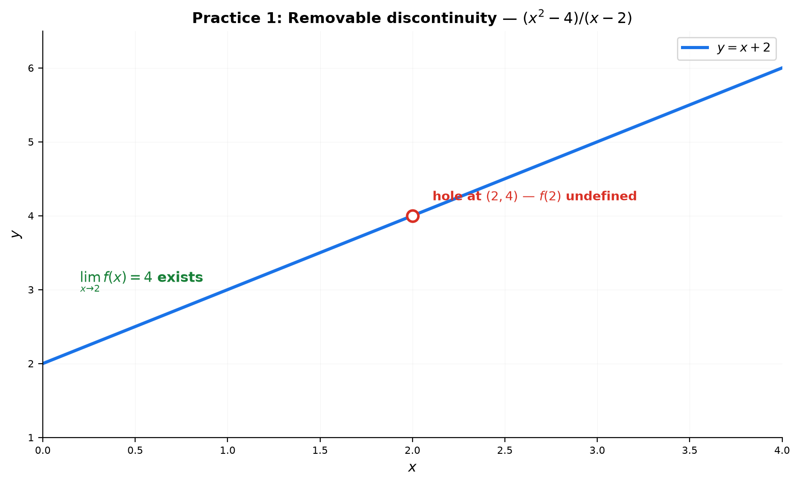
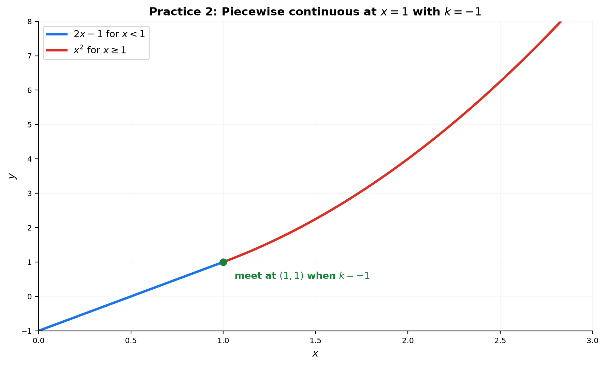
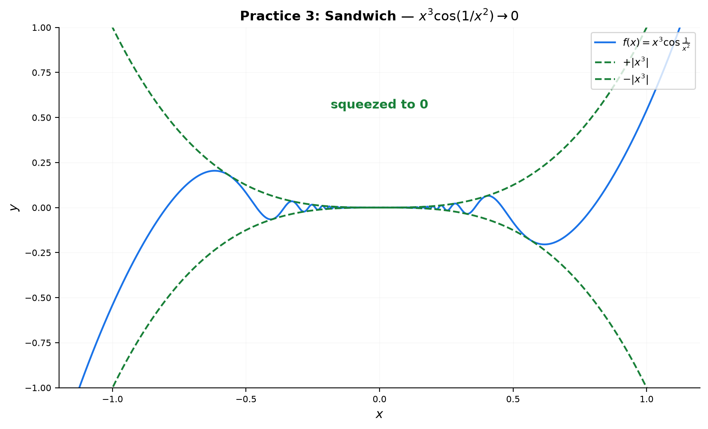
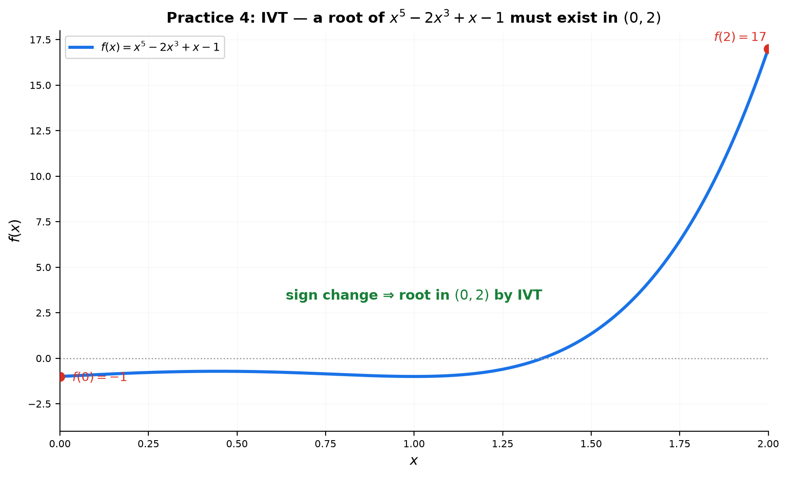
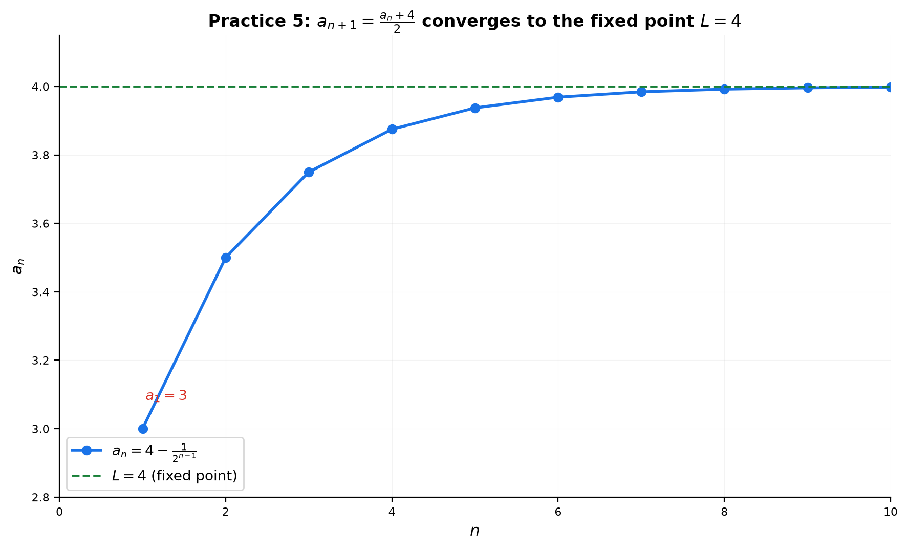
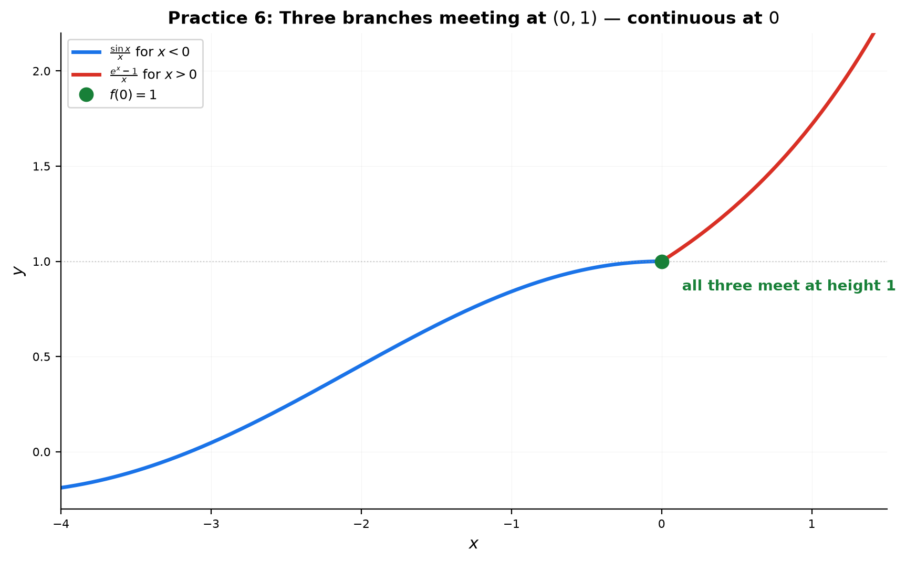

# Solutions — 13C: Continuity, Theorems, and Sequences

---

## Practice 1

**Is $f(x) = \frac{x^2-4}{x-2}$ continuous at $x=2$? If not, classify the discontinuity and state the limit.**

① **Condition 1 — is $f(2)$ defined?** No: $\frac{4-4}{0} = \frac{0}{0}$ is undefined. Already fails.

② **Does the limit exist?** Yes:
$\lim_{x\to 2}\frac{x^2-4}{x-2} = \lim_{x\to 2}\frac{(x-2)(x+2)}{x-2} = \lim_{x\to 2}(x+2) = 4$.

③ **Is the limit equal to $f(2)$?** $f(2)$ doesn't even exist, so condition 3 fails too.

**Classification**: The limit exists (4) but the function value is missing. This is a **removable discontinuity (hole)** at $(2,4)$. Redefining $f(2) = 4$ would make it continuous.

> **Answer**: Not continuous. Removable discontinuity (hole). $\lim_{x\to 2}f(x) = 4$.

---

## Practice 2

**Find $k$ so that $f(x) = \begin{cases} 2x+k, & x<1 \\ x^2, & x\geq1 \end{cases}$ is continuous everywhere.**

The only possible trouble spot is the boundary $x=1$ (each branch is continuous on its own piece).

① Left limit: $\lim_{x\to 1^-}(2x+k) = 2+k$.
② Right limit and value: $\lim_{x\to 1^+}x^2 = 1$ and $f(1) = 1^2 = 1$.
③ For continuity, all three must agree: $2+k = 1$ → $k = -1$.

> **Answer**: $k = -1$

---

## Practice 3

**Use the Sandwich Theorem: $\displaystyle \lim_{x\to 0}x^3\cos\frac{1}{x^2}$.**

① $\cos\frac{1}{x^2}$ oscillates between $-1$ and $1$, so:
$-1 \leq \cos\frac{1}{x^2} \leq 1$ for all $x \neq 0$.

② Multiply through by $|x^3| \geq 0$ (cleaner than $x^3$, whose sign flips):
$-|x^3| \leq x^3\cos\frac{1}{x^2} \leq |x^3|$.

③ Both bounds go to $0$: $\lim_{x\to 0}(-|x^3|) = 0$ and $\lim_{x\to 0}|x^3| = 0$.

④ By the Sandwich Theorem, the middle function is squeezed to $0$.

> **Answer**: $0$

---

## Practice 4

**Use IVT to prove $x^5 - 2x^3 + x - 1 = 0$ has a root in $[0,2]$.**

Let $f(x) = x^5 - 2x^3 + x - 1$.

① Endpoint values:
$f(0) = 0 - 0 + 0 - 1 = -1$ (negative).
$f(2) = 32 - 16 + 2 - 1 = 17$ (positive).

② $f$ is a polynomial, so it is continuous everywhere, in particular on $[0,2]$.

③ Since $f(0) < 0 < f(2)$, the Intermediate Value Theorem guarantees some $c\in(0,2)$ with $f(c) = 0$.

> **Answer**: A root exists in $(0,2)$ — proven without solving the quintic.

---

## Practice 5

**A sequence is defined by $a_1=3$, $a_{n+1} = \frac{a_n + 4}{2}$. Show it converges and find the limit.**

① **Find the candidate limit.** If $a_n \to L$, then $a_{n+1} \to L$ too, so $L = f(L)$:
$L = \frac{L+4}{2}$ → $2L = L+4$ → $L = 4$.

② **Show convergence by tracking the distance to 4:**
$a_{n+1} - 4 = \frac{a_n+4}{2} - 4 = \frac{a_n - 4}{2}$.

So the error halves each step: $a_n - 4 = \frac{a_1 - 4}{2^{n-1}} = \frac{3-4}{2^{n-1}} = -\frac{1}{2^{n-1}}$.

③ Therefore $a_n = 4 - \frac{1}{2^{n-1}} \to 4$ as $n\to\infty$. Convergence proved.

First few terms: $a_1=3$, $a_2=3.5$, $a_3=3.75$, $a_4=3.875$ — climbing toward 4.

> **Answer**: Converges to $4$

---

## Practice 6: Real Battle

**$f(x) = \begin{cases} \frac{\sin x}{x}, & x<0 \\ 1, & x=0 \\ \frac{e^x-1}{x}, & x>0 \end{cases}$. Determine if $f$ is continuous at $x=0$.**

① **Left limit** ($x\to 0^-$, use $\frac{\sin x}{x}$ branch):
$\lim_{x\to 0^-}\frac{\sin x}{x} = 1$ (classic limit, holds from both sides).

② **Right limit** ($x\to 0^+$, use $\frac{e^x-1}{x}$ branch):
$\lim_{x\to 0^+}\frac{e^x-1}{x} = 1$ (standard exponential limit).

③ **Function value**: $f(0) = 1$ (given explicitly).

④ Compare: left $= 1$, right $= 1$, $f(0) = 1$. All three agree.

→ **$f$ is continuous at $x=0$.**

> **Answer**: Continuous at $x=0$ (left = right = $f(0) = 1$)

---

## Basic Drills

### D1. Identify the type of discontinuity of $f(x)=\frac{1}{x-3}$ at $x=3$.

Denominator → $0$ but numerator $=1\neq 0$: $\frac{1}{0^+} = +\infty$, $\frac{1}{0^-} = -\infty$.

> **Answer**: Infinite discontinuity (vertical asymptote at $x=3$)

---

### D2. Identify the type of discontinuity of $f(x)=\frac{x^2-1}{x-1}$ at $x=1$.

$f(1)$ undefined, but $\lim_{x\to 1}\frac{(x-1)(x+1)}{x-1} = 2$ exists.

> **Answer**: Removable (hole at $(1,2)$)

---

### D3. Identify the type of discontinuity of $f(x)=\lfloor x\rfloor$ at $x=2$.

$\lim_{x\to 2^-}\lfloor x\rfloor = 1$, $\lim_{x\to 2^+}\lfloor x\rfloor = 2$. Left $\neq$ right.

> **Answer**: Jump discontinuity

---

### D4. Find $a$ so $f(x)=\begin{cases}x^2-a,&x<0\\2x,&x\geq0\end{cases}$ is continuous at $x=0$.

Left: $\lim_{x\to 0^-}(x^2-a) = -a$. Right: $\lim_{x\to 0^+}2x = 0$ and $f(0)=0$.
Set $-a = 0$ → $a = 0$.

> **Answer**: $a = 0$

---

### D5. Determine if IVT guarantees a root of $f(x)=x^3-x-2$ on $[1,2]$. Evaluate $f(1)$ and $f(2)$.

$f(1) = 1-1-2 = -2$. $f(2) = 8-2-2 = 4$.
$f$ is a polynomial (continuous), and the sign changes from $-2$ to $4$.

> **Answer**: Yes — IVT guarantees a root in $(1,2)$

---

### D6. Use Sandwich: $\displaystyle \lim_{x\to\infty}\frac{\cos x}{x^2}$.

$-1 \leq \cos x \leq 1$ → $-\frac{1}{x^2} \leq \frac{\cos x}{x^2} \leq \frac{1}{x^2}$.
Both bounds → $0$.

> **Answer**: $0$

---

### D7. Does $\displaystyle \lim_{n\to\infty}\frac{(-1)^n}{n}$ exist? If so, what is it?

Squeeze: $-\frac{1}{n} \leq \frac{(-1)^n}{n} \leq \frac{1}{n}$. Both bounds → $0$.

> **Answer**: Yes, it exists: $0$

---

### D8. Find $\displaystyle \lim_{n\to\infty}\frac{2^n}{3^n}$. Rewrite as $(2/3)^n$.

$\frac{2^n}{3^n} = \left(\frac{2}{3}\right)^n$. Since $\frac23 < 1$, this → $0$.

> **Answer**: $0$

---

### D9. Is $f(x)=|x|$ continuous at $x=0$? Check the three conditions.

$f(0) = 0$ defined. $\lim_{x\to 0^-}|x| = 0$, $\lim_{x\to 0^+}|x| = 0$ → limit exists and equals $0 = f(0)$.

> **Answer**: Yes, continuous at $x=0$ (a "V" with no break)

---

### D10. If $a_{n+1} = \frac{1}{2}a_n$ with $a_1=8$, find $\lim_{n\to\infty}a_n$.

$a_n = 8\left(\frac12\right)^{n-1}$. Fixed point: $L = \frac12 L$ → $L=0$.

> **Answer**: $0$

---

## Advanced Drills

### A1. Prove that $f(x)=x^3+x-1$ has exactly one real root. Use IVT for existence and monotonicity for uniqueness.

**Existence**: $f(0) = -1 < 0$, $f(1) = 1 > 0$. $f$ is a polynomial (continuous on $[0,1]$). By IVT, there is at least one root in $(0,1)$.

**Uniqueness**: $f'(x) = 3x^2 + 1 > 0$ for all $x$. So $f$ is strictly increasing everywhere — it can cross the $x$-axis at most once.

> **Answer**: Exactly one real root (in $(0,1)$)

---

### A2. $f(x)=\frac{x^2-3x+2}{x^2+x-6}$. Find all discontinuities and classify each.

Factor both: $x^2-3x+2 = (x-1)(x-2)$, $x^2+x-6 = (x-2)(x+3)$.

$f(x) = \frac{(x-1)(x-2)}{(x-2)(x+3)}$.

- **At $x=2$**: the $(x-2)$ cancels. $\lim_{x\to 2}\frac{x-1}{x+3} = \frac{1}{5}$ exists. → **Removable** (hole at $(2,\frac15)$).
- **At $x=-3$**: denominator → $0$ but numerator $\to (-4)(-5)=20 \neq 0$. → **Infinite** (vertical asymptote).

> **Answer**: $x=2$ removable, $x=-3$ infinite

---

### A3. Find all $a,b$ such that $f(x)=\begin{cases}ax+b,&x<1\\x^2,&1\leq x\leq2\\\frac{1}{x-2},&x>2\end{cases}$ is continuous at both $x=1$ and $x=2$.

**At $x=1$**: left limit $= a+b$; right limit $= \lim_{x\to 1^+}x^2 = 1$; value $f(1) = 1$. So $a+b = 1$.

**At $x=2$**: left limit $= \lim_{x\to 2^-}x^2 = 4$; right limit $= \lim_{x\to 2^+}\frac{1}{x-2} = +\infty$.

The right limit at $x=2$ is $+\infty$, which can never equal the finite value $4$ — no matter what $a$ and $b$ are.

> **Answer**: **No such $a,b$ exist.** (The $\frac{1}{x-2}$ piece blows up at $x=2$, so $f$ can never be continuous there. The boundary condition $a+b=1$ is necessary but not sufficient.)

---

### A4. Use Sandwich: $\displaystyle \lim_{x\to0}x\sin\frac{1}{x}$.

$-1 \leq \sin\frac{1}{x} \leq 1$, so $-|x| \leq x\sin\frac{1}{x} \leq |x|$.
Both bounds → $0$.

> **Answer**: $0$

---

### A5. A sequence satisfies $a_1=1$, $a_{n+1}=\frac{1}{2}\left(a_n+\frac{2}{a_n}\right)$ (Newton's method for $\sqrt2$). Show the limit $L$ satisfies $L=\frac{1}{2}\left(L+\frac{2}{L}\right)$ and find $L$.

If $a_n\to L$, then $a_{n+1}\to L$ too. With continuous $f$, the limit is a fixed point:
$L = \frac12\left(L + \frac{2}{L}\right)$.

Solve: $2L = L + \frac{2}{L}$ → $L = \frac{2}{L}$ → $L^2 = 2$.

Since all $a_n > 0$, the limit is the positive root: $L = \sqrt2$.

(Quick check: $a_1=1$, $a_2=1.5$, $a_3\approx1.4167$, $a_4\approx1.4142$ — closing in on $\sqrt2$.)

> **Answer**: $L = \sqrt2$

---

### A6. Prove $\displaystyle \lim_{x\to0}x^2\sin\frac{1}{x}=0$ using $\epsilon$-$\delta$ intuition. Given $\epsilon>0$, choose $\delta=\sqrt{\epsilon}$ and show $|x|<\delta \implies |x^2\sin(1/x)|<\epsilon$.

Since $|\sin\frac{1}{x}| \leq 1$ for every $x\neq 0$:

$|x^2\sin\frac{1}{x}| = x^2 \cdot |\sin\frac{1}{x}| \leq x^2$.

Choose $\delta = \sqrt{\epsilon}$. If $0 < |x| < \delta$, then:

$|x^2\sin\frac{1}{x}| \leq x^2 < \delta^2 = \epsilon$. ✓

> **Answer**: $\delta = \sqrt{\epsilon}$ works — $|\cdot| \leq x^2 < \epsilon$

---

### A7. $f$ is continuous on $[0,1]$ with $f(0)=1$ and $f(1)=0$. Prove there exists $c\in(0,1)$ such that $f(c)=c$. (Hint: $g(x)=f(x)-x$.)

Define $g(x) = f(x) - x$ on $[0,1]$. Since $f$ and $x$ are both continuous, $g$ is continuous.

$g(0) = f(0) - 0 = 1 > 0$.
$g(1) = f(1) - 1 = 0 - 1 = -1 < 0$.

By IVT, there is some $c\in(0,1)$ with $g(c) = 0$, i.e. $f(c) - c = 0$, so $f(c) = c$.

> **Answer**: Existence proven via IVT on $g(x)=f(x)-x$

---

### A8. Does the sequence $a_n = \sin n$ converge? Explain.

**No.** Although $\sin n$ is bounded in $[-1,1]$, boundedness alone doesn't force convergence. The values of $\sin n$ for $n\in\mathbb{N}$ keep oscillating and never settle near any single number — the fractional parts of $n/2\pi$ distribute densely around the unit circle, so $\sin n$ keeps hitting values all across $[-1,1]$ forever.

A convergent sequence must eventually stay inside *every* tiny window around its limit; $\sin n$ escapes any such window infinitely often.

> **Answer**: No — it oscillates forever and never approaches a single value

---

### A9. Find $\displaystyle \lim_{n\to\infty}\left(\sqrt{n^2+n}-n\right)$. This is an $\infty-\infty$ sequence limit.

Conjugate:
$\frac{(\sqrt{n^2+n}-n)(\sqrt{n^2+n}+n)}{\sqrt{n^2+n}+n} = \frac{n}{\sqrt{n^2+n}+n}$.

Divide by $n$: $\frac{1}{\sqrt{1+\frac{1}{n}}+1} \to \frac{1}{1+1} = \frac12$.

> **Answer**: $\frac12$

---

### A10. A function satisfies $|f(x)-f(y)| \leq |x-y|^2$ for all $x,y$. Prove $f$ is constant. (Hint: use the limit definition of the derivative.)

For $x \neq y$, divide by $|x-y|$:
$\left|\frac{f(x)-f(y)}{x-y}\right| \leq |x-y|$.

Fix $x$ and let $y \to x$. The right side → $0$, so:
$|f'(x)| = \lim_{y\to x}\left|\frac{f(x)-f(y)}{x-y}\right| \leq \lim_{y\to x}|x-y| = 0$.

Hence $f'(x) = 0$ for every $x$. A function whose derivative is everywhere zero is constant.

> **Answer**: $f'(x)=0$ everywhere → $f$ is constant

---

## Quick Reference — Everything in One Place

| Problem type | Weapon | Where |
|:------------|:-------|:------|
| Direct substitution works | Plug in | 13A Part A |
| $\frac{0}{0}$ polynomial | Factor-cancel | 13A Part B |
| $\frac{0}{0}$ with radicals | Conjugate | 13A Part C |
| $\frac{0}{0}$ with trig | $\frac{\sin\square}{\square}\to 1$ | 13A Part D |
| $\frac{0}{0}$ with $e^x/\ln$ | Standard limits | 13A Part E |
| $\frac{\infty}{\infty}$ | Divide by highest power | 13B Part A |
| $x\to-\infty$ radicals | $\sqrt{x^2}=|x|=-x$ | 13B Part B |
| Denom → 0, num ≠ 0 | Sign analysis | 13B Part C |
| $\infty-\infty$ | Conjugate / common denom | 13B Part D |
| Oscillating functions | Sandwich Theorem | 13C Part B |
| Root existence | IVT | 13C Part C |
| Recursive sequence | Fixed point $L=f(L)$ | 13C Part D |
