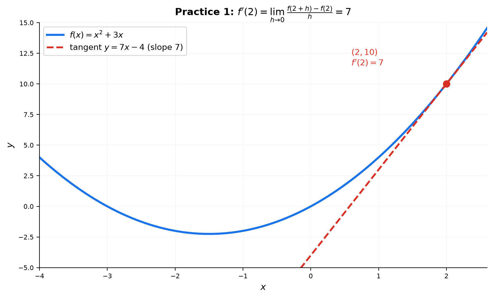
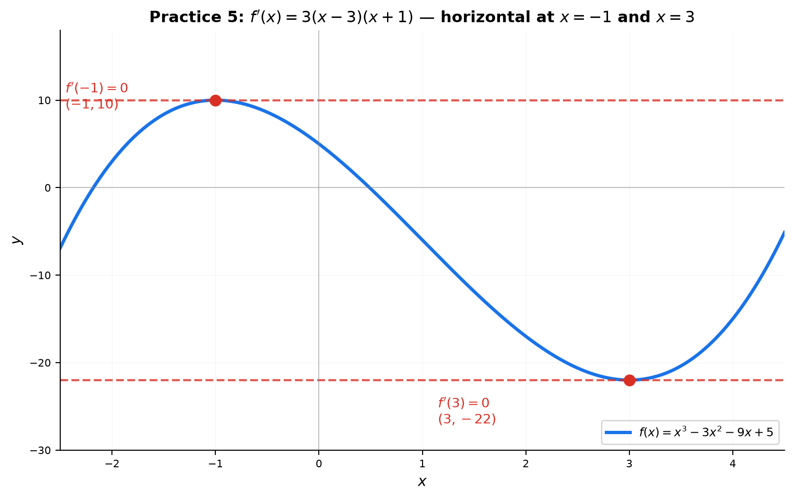
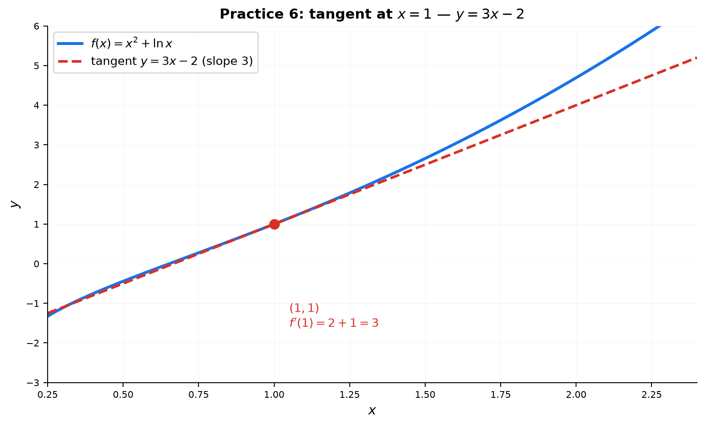

# Solutions — 14A: Derivative Fundamentals — The Basic Toolbox

---

## Practice 1

**Use the limit definition to find $f'(2)$ for $f(x)=x^2+3x$.**

① Write the limit: $f'(2)=\displaystyle\lim_{h\to 0}\frac{f(2+h)-f(2)}{h}$.

② Compute $f(2+h)=(2+h)^2+3(2+h)=4+4h+h^2+6+3h=10+7h+h^2$.

③ Subtract $f(2)=2^2+3(2)=10$:
$f(2+h)-f(2)=(10+7h+h^2)-10=7h+h^2=h(7+h)$.

④ Divide by $h$ and take the limit:
$\displaystyle\lim_{h\to 0}\frac{h(7+h)}{h}=\lim_{h\to 0}(7+h)=7$.

> **Answer**: $f'(2)=7$

---

## Practice 2

**Differentiate $f(x)=4x^5 - 3x^3 + 2x - 1 + \frac{1}{x}$ using the 3-step procedure.**

① **Split** at each $+$/$-$ into five pieces.

② **Pull constants** out of each piece.

③ **Match** each piece to the dictionary:
- $4x^5 \to 4\cdot 5x^4 = 20x^4$
- $-3x^3 \to -3\cdot 3x^2 = -9x^2$
- $2x \to 2$
- $-1 \to 0$ (constant)
- $\frac{1}{x}=x^{-1} \to -x^{-2} = -\frac{1}{x^2}$ (power rule with negative exponent)

> **Answer**: $f'(x)=20x^4 - 9x^2 + 2 - \frac{1}{x^2}$

---

## Practice 3

**Differentiate $g(x)=3e^x - 2\ln x + 5\sin x - \cos x$.**

Split and match each piece:
- $3e^x \to 3e^x$ ($e^x$ is its own derivative)
- $-2\ln x \to -2\cdot\frac{1}{x} = -\frac{2}{x}$
- $5\sin x \to 5\cos x$
- $-\cos x \to -(-\sin x)=+\sin x$ (watch the double negative!)

> **Answer**: $g'(x)=3e^x - \frac{2}{x} + 5\cos x + \sin x$

---

## Practice 4

**Differentiate $h(x)=2^x + \log_3 x + \tan x$.**

General forms from the dictionary:
- $2^x \to 2^x\ln 2$ (general exponential: multiply by $\ln$ of the base)
- $\log_3 x \to \frac{1}{x\ln 3}$ (general log: $\frac{1}{x}$ over $\ln$ of base)
- $\tan x \to \sec^2 x$

> **Answer**: $h'(x)=2^x\ln 2 + \frac{1}{x\ln 3} + \sec^2 x$

---

## Practice 5

**Find all $x$ where the tangent line to $f(x)=x^3-3x^2-9x+5$ is horizontal.**

① A horizontal tangent means $f'(x)=0$.

② $f'(x)=3x^2-6x-9$. Factor: $3(x^2-2x-3)=3(x-3)(x+1)$.

③ Set $3(x-3)(x+1)=0$: $x=3$ or $x=-1$.

**Check**: $f'(-1)=3+6-9=0$ ✓, $f'(3)=27-18-9=0$ ✓.

> **Answer**: $x=-1$ and $x=3$

---

## Practice 6: Real Battle

**Find the tangent line to $f(x)=x^2+\ln x$ at $x=1$. Write your answer in $y=mx+b$ form.**

① **Point**: $f(1)=1^2+\ln 1=1+0=1$ → $(1,1)$.

② **Slope**: $f'(x)=2x+\frac{1}{x}$, so $f'(1)=2+1=3$.

③ **Equation**: $y-1=3(x-1)$ → $y=3x-3+1=3x-2$.

> **Answer**: $y=3x-2$

---

## Basic Drills

### D1. $\frac{d}{dx}(7x^4)$ — power rule.

$7\cdot 4x^3 = 28x^3$.

> **Answer**: $28x^3$

---

### D2. $\frac{d}{dx}(-3x^{10})$ — negative coefficient rides along.

$-3\cdot 10x^9 = -30x^9$.

> **Answer**: $-30x^9$

---

### D3. $\frac{d}{dx}(\sqrt[3]{x})$ — write as a power first.

$\sqrt[3]{x}=x^{1/3}$, so $\frac{d}{dx}x^{1/3}=\frac13 x^{-2/3}=\frac{1}{3\sqrt[3]{x^2}}$.

> **Answer**: $\frac13 x^{-2/3}$

---

### D4. $\frac{d}{dx}(5e^x)$ — constant multiple.

$5e^x$.

> **Answer**: $5e^x$

---

### D5. $\frac{d}{dx}(4\ln x)$ — constant multiple.

$4\cdot\frac{1}{x}=\frac{4}{x}$.

> **Answer**: $\frac{4}{x}$

---

### D6. $\frac{d}{dx}(3\sin x - 2\cos x)$ — split and match.

$3\cos x - 2(-\sin x)=3\cos x + 2\sin x$.

> **Answer**: $3\cos x + 2\sin x$

---

### D7. $\frac{d}{dx}(\tan x + \sec x)$ — dictionary.

$\sec^2 x + \sec x\tan x$.

> **Answer**: $\sec^2 x + \sec x\tan x$

---

### D8. $\frac{d}{dx}(2^x + \log_5 x)$ — general forms.

$2^x\ln 2 + \frac{1}{x\ln 5}$.

> **Answer**: $2^x\ln 2 + \frac{1}{x\ln 5}$

---

### D9. $\frac{d}{dx}\left(\frac{1}{x^4}\right)$ — rewrite as a power.

$\frac{1}{x^4}=x^{-4}\to -4x^{-5}=-\frac{4}{x^5}$.

> **Answer**: $-\frac{4}{x^5}$

---

### D10. Find $f'(0)$ for $f(x)=x^3-2x^2+5x-1$.

$f'(x)=3x^2-4x+5$. Then $f'(0)=3(0)-4(0)+5=5$.

> **Answer**: $5$

---

## Advanced Drills

### A1. Use the limit definition to prove $\frac{d}{dx}x^2 = 2x$.

$f'(x)=\displaystyle\lim_{h\to 0}\frac{(x+h)^2-x^2}{h}=\lim_{h\to 0}\frac{x^2+2xh+h^2-x^2}{h}=\lim_{h\to 0}\frac{2xh+h^2}{h}=\lim_{h\to 0}(2x+h)=2x$.

> **Answer**: $2x$ ✓ (three steps: expand, cancel $h$, plug $h=0$)

---

### A2. Find $a$ and $b$ so $f(x)=ax^2+bx$ has $f'(1)=5$ and $f'(2)=9$.

① $f'(x)=2ax+b$.

② $f'(1)=2a+b=5$ and $f'(2)=4a+b=9$.

③ Subtract the first from the second: $2a=4 \to a=2$. Then $b=5-2a=5-4=1$.

> **Answer**: $a=2$, $b=1$, so $f(x)=2x^2+x$

---

### A3. Differentiate $f(x)=\frac{x^3}{\sqrt{x}}$ — simplify first.

$\frac{x^3}{x^{1/2}}=x^{3-1/2}=x^{5/2}$.

Then $\frac{d}{dx}x^{5/2}=\frac52 x^{3/2}$.

> **Answer**: $\frac52 x^{3/2}$

---

### A4. Find the point on $y=x^2$ where the tangent line has slope $6$.

$y'=2x$. Set $2x=6 \to x=3$. Point: $(3,9)$.

> **Answer**: $(3,9)$

---

### A5. Use the limit definition to find $f'(x)$ for $f(x)=\frac{1}{x}$.

$f'(x)=\displaystyle\lim_{h\to 0}\frac{\frac{1}{x+h}-\frac{1}{x}}{h}=\lim_{h\to 0}\frac{\frac{x-(x+h)}{x(x+h)}}{h}=\lim_{h\to 0}\frac{-h}{h\,x(x+h)}=\lim_{h\to 0}\frac{-1}{x(x+h)}=-\frac{1}{x^2}$.

> **Answer**: $-\frac{1}{x^2}$

---

### A6. Find all $x$ where $f(x)=x^3-6x^2+9x$ has horizontal tangent lines.

$f'(x)=3x^2-12x+9=3(x^2-4x+3)=3(x-1)(x-3)=0$.

> **Answer**: $x=1$ and $x=3$

---

### A7. Prove $\frac{d}{dx}\tan x = \sec^2 x$ from the limit definition.

① Tangent addition formula: $\tan(x+h)=\frac{\tan x+\tan h}{1-\tan x\tan h}$.

② Difference quotient:
$\frac{\tan(x+h)-\tan x}{h}=\frac{1}{h}\left[\frac{\tan x+\tan h}{1-\tan x\tan h}-\tan x\right]$.

③ Common denominator: numerator $=\tan x+\tan h-\tan x+\tan^2 x\tan h=\tan h(1+\tan^2 x)$.

④ So the quotient is $\frac{\tan h}{h}\cdot\frac{1+\tan^2 x}{1-\tan x\tan h}$.

⑤ As $h\to 0$: $\frac{\tan h}{h}\to 1$ (13A standard limit) and $\tan h\to 0$, so the fraction $\to \frac{1+\tan^2 x}{1}=1+\tan^2 x$.

⑥ $1+\tan^2 x=\sec^2 x$ (Pythagorean identity).

> **Answer**: $\frac{d}{dx}\tan x=\sec^2 x$ ✓

---

### A8. Find the tangent line to $f(x)=x^3$ at the point where it is parallel to $y=12x-1$.

① Parallel lines have equal slopes, so set $f'(a)=12$. $f'(x)=3x^2$, so $3a^2=12\to a^2=4\to a=\pm 2$.

② At $a=2$: point $(2,8)$, tangent $y-8=12(x-2)\to y=12x-16$.

③ At $a=-2$: point $(-2,-8)$, tangent $y+8=12(x+2)\to y=12x+16$.

> **Answer**: $y=12x-16$ and $y=12x+16$

---

### A9. A function satisfies $f'(x)=f(x)$ for all $x$ and $f(0)=3$. What is $f(x)$?

① The only function that equals its own derivative is $e^x$ (up to a constant multiple).

② So $f(x)=Ce^x$. Use $f(0)=3$: $Ce^0=C=3$.

> **Answer**: $f(x)=3e^x$

---

### A10. Find the tangent line to $y=e^x$ that passes through the origin $(0,0)$.

① At $x=a$: point $(a,e^a)$, slope $e^a$. Tangent: $y-e^a=e^a(x-a)$.

② It passes through $(0,0)$: $0-e^a=e^a(0-a)\to -e^a=-ae^a\to e^a(a-1)=0\to a=1$.

③ At $a=1$: point $(1,e)$, slope $e$. Line: $y-0=e(x-0)$.

> **Answer**: $y=ex$
