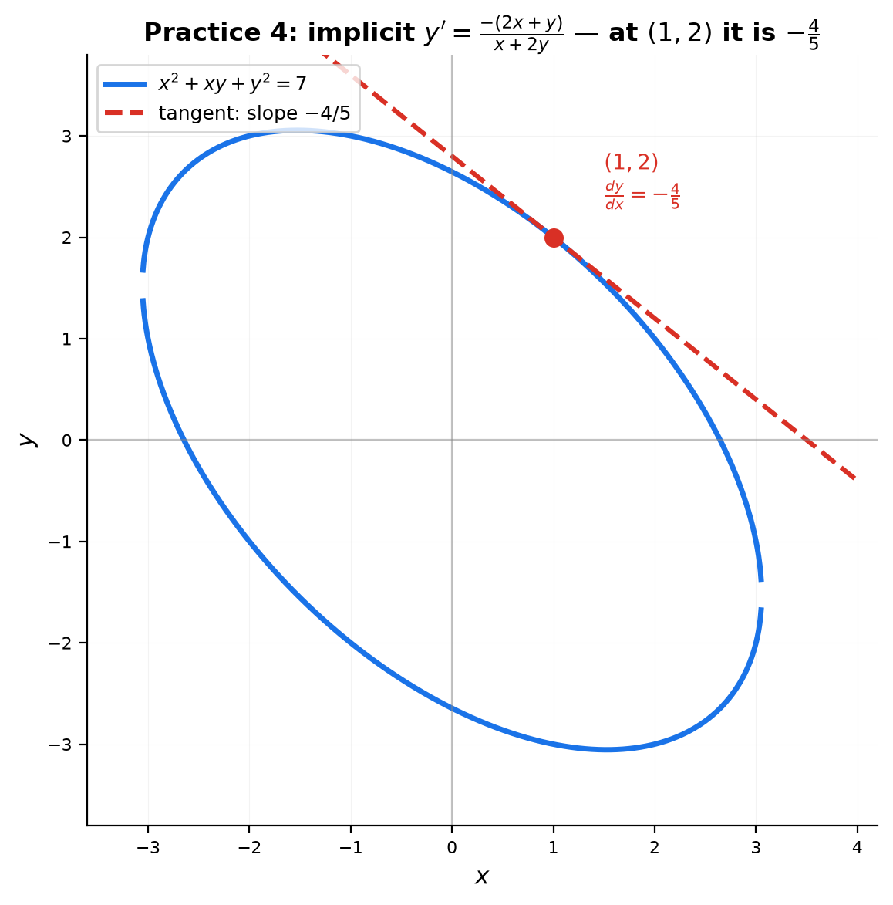
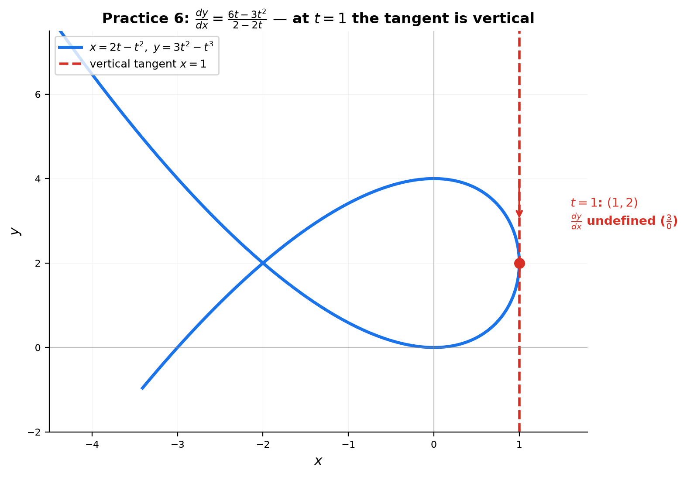

# Solutions — 14B: Advanced Differentiation — Product, Quotient, Chain, and Implicit

---

## Practice 1

**$f(x)=x^3\cos x$. Run the product rule.**

① Identify: $f=x^3$, $g=\cos x$.

② $f'=3x^2$, $g'=-\sin x$.

③ Assemble: $f'g+fg'=3x^2\cos x+x^3(-\sin x)=3x^2\cos x-x^3\sin x$.

④ Factor: $x^2(3\cos x-x\sin x)$.

> **Answer**: $f'(x)=3x^2\cos x-x^3\sin x=x^2(3\cos x-x\sin x)$

---

## Practice 2

**$g(x)=\frac{e^x}{x^2+1}$. Run the quotient rule.**

① Top: $f=e^x$, $f'=e^x$. Bottom: $g=x^2+1$, $g'=2x$.

② Assemble: $\frac{f'g-fg'}{g^2}=\frac{e^x(x^2+1)-e^x(2x)}{(x^2+1)^2}$.

③ Factor $e^x$: $\frac{e^x(x^2+1-2x)}{(x^2+1)^2}=\frac{e^x(x^2-2x+1)}{(x^2+1)^2}$.

④ $x^2-2x+1=(x-1)^2$.

> **Answer**: $g'(x)=\frac{e^x(x-1)^2}{(x^2+1)^2}$

---

## Practice 3

**$h(x)=\ln(\sin(x^2))$. Chain rule: how many layers?**

① Three layers: $\ln(\square)$ outside, then $\sin(\square)$, then $x^2$.

② Peel from outside in:
- $\frac{d}{dx}\ln(\square)=\frac{1}{\square} \to \frac{1}{\sin(x^2)}$
- $\frac{d}{dx}\sin(\square)=\cos(\square) \to \cos(x^2)$
- $\frac{d}{dx}x^2=2x$

③ Multiply the chain: $\frac{1}{\sin(x^2)}\cdot\cos(x^2)\cdot 2x$.

④ $\frac{\cos(x^2)}{\sin(x^2)}=\cot(x^2)$.

> **Answer**: $h'(x)=2x\cot(x^2)$

---

## Practice 4

**$x^2+xy+y^2=7$. Find $\frac{dy}{dx}$ at $(1,2)$.**

① Differentiate both sides w.r.t. $x$ (product rule on $xy$):
$2x+y+x\frac{dy}{dx}+2y\frac{dy}{dx}=0$.

② Collect $\frac{dy}{dx}$ terms: $\frac{dy}{dx}(x+2y)=-(2x+y)$.

③ Solve: $\frac{dy}{dx}=-\frac{2x+y}{x+2y}$.

④ At $(1,2)$: $-\frac{2(1)+2}{1+2(2)}=-\frac{4}{5}$.

**Check**: tangent slope $-\frac45$; the point $(1,2)$ satisfies $1+2+4=7$ ✓.

> **Answer**: $\frac{dy}{dx}=-\frac{4}{5}$

---

## Practice 5

**$y=(\cos x)^{\sin x}$. Log-diff.**

① Take $\ln$: $\ln y=\sin x\cdot\ln(\cos x)$.

② Differentiate (product rule on the right):
$\frac{y'}{y}=\cos x\ln(\cos x)+\sin x\cdot\frac{-\sin x}{\cos x}=\cos x\ln(\cos x)-\sin x\tan x$.

③ Multiply by $y$:

> **Answer**: $y'=(\cos x)^{\sin x}\left[\cos x\ln(\cos x)-\sin x\tan x\right]$

---

## Practice 6: Real Battle

**$x=2t-t^2$, $y=3t^2-t^3$. Find $\frac{dy}{dx}$ at $t=1$ and the equation of the tangent line.**

① Parametric rule: $\frac{dy}{dx}=\frac{dy/dt}{dx/dt}$.

② $\frac{dx}{dt}=2-2t$, $\frac{dy}{dt}=6t-3t^2$.

③ $\frac{dy}{dx}=\frac{6t-3t^2}{2-2t}$.

④ At $t=1$: $\frac{6-3}{2-2}=\frac{3}{0}$ — **undefined** → the tangent is **vertical**.

⑤ Point: $x=2(1)-1^2=1$, $y=3(1)^2-1^3=2$ → $(1,2)$.

⑥ A vertical line through $(1,2)$: $x=1$.

> **Answer**: $\frac{dy}{dx}$ is undefined at $t=1$ (vertical tangent); the tangent line is $x=1$

---

## Basic Drills

### D1. $\frac{d}{dx}(x^2e^x)$ — product rule.

$f=x^2$, $g=e^x$: $2x\cdot e^x+x^2\cdot e^x=xe^x(2+x)$.

> **Answer**: $xe^x(x+2)$

---

### D2. $\frac{d}{dx}\left(\frac{\sin x}{x}\right)$ — quotient rule.

$\frac{\cos x\cdot x-\sin x\cdot 1}{x^2}=\frac{x\cos x-\sin x}{x^2}$.

> **Answer**: $\frac{x\cos x-\sin x}{x^2}$

---

### D3. $\frac{d}{dx}((3x+2)^6)$ — chain rule.

$6(3x+2)^5\cdot 3=18(3x+2)^5$.

> **Answer**: $18(3x+2)^5$

---

### D4. $\frac{d}{dx}\cos(5x)$ — chain rule.

$-\sin(5x)\cdot 5=-5\sin 5x$.

> **Answer**: $-5\sin 5x$

---

### D5. $\frac{d}{dx}\ln(x^2+1)$ — chain rule.

$\frac{1}{x^2+1}\cdot 2x=\frac{2x}{x^2+1}$.

> **Answer**: $\frac{2x}{x^2+1}$

---

### D6. $\frac{d}{dx}\arcsin(3x)$ — inverse trig + chain.

$\frac{1}{\sqrt{1-(3x)^2}}\cdot 3=\frac{3}{\sqrt{1-9x^2}}$.

> **Answer**: $\frac{3}{\sqrt{1-9x^2}}$

---

### D7. $\frac{d}{dx}\arctan(\sqrt{x})$ — inverse trig + chain.

$\frac{1}{1+(\sqrt{x})^2}\cdot\frac{1}{2\sqrt{x}}=\frac{1}{1+x}\cdot\frac{1}{2\sqrt{x}}=\frac{1}{2\sqrt{x}(1+x)}$.

> **Answer**: $\frac{1}{2\sqrt{x}(1+x)}$

---

### D8. $\frac{d}{dx}(x^2\sin x\cos x)$ — triple product.

$(x^2)'\sin x\cos x+x^2(\sin x)'\cos x+x^2\sin x(\cos x)'$
$=2x\sin x\cos x+x^2\cos^2 x-x^2\sin^2 x$.

Using $\sin 2x=2\sin x\cos x$ and $\cos^2 x-\sin^2 x=\cos 2x$: $x\sin 2x+x^2\cos 2x$.

> **Answer**: $2x\sin x\cos x+x^2(\cos^2 x-\sin^2 x)=x\sin 2x+x^2\cos 2x$

---

### D9. Find $\frac{dy}{dx}$ for $y^2+x^2y=4x$ — implicit.

$2y\frac{dy}{dx}+2xy+x^2\frac{dy}{dx}=4$.

$\frac{dy}{dx}(2y+x^2)=4-2xy$.

> **Answer**: $\frac{dy}{dx}=\frac{4-2xy}{2y+x^2}$

---

### D10. $x=e^{2t}$, $y=\ln t$. Find $\frac{dy}{dx}$ — parametric.

$\frac{dx}{dt}=2e^{2t}$, $\frac{dy}{dt}=\frac{1}{t}$.

$\frac{dy}{dx}=\frac{1/t}{2e^{2t}}=\frac{1}{2t\,e^{2t}}$.

> **Answer**: $\frac{1}{2t\,e^{2t}}$

---

## Advanced Drills

### A1. Differentiate $x^x$ two ways and verify they match.

**(a) Log-diff**: $\ln y=x\ln x \to \frac{y'}{y}=\ln x+1 \to y'=x^x(\ln x+1)$.

**(b) Rewrite + chain**: $x^x=e^{x\ln x}$. $\frac{d}{dx}e^{x\ln x}=e^{x\ln x}\cdot(\ln x+1)=x^x(\ln x+1)$.

Both give the same result ✓.

> **Answer**: $\frac{d}{dx}x^x=x^x(\ln x+1)$

---

### A2. Find the 100th derivative of $\sin x$.

Cycle: $\sin\to\cos\to-\sin\to-\cos$ (length 4). $100\div 4=25$ remainder $0$ → back to $\sin x$.

> **Answer**: $f^{(100)}(\sin x)=\sin x$

---

### A3. $f(x)=\frac{x^2-1}{x^2+1}$. Simplify $f'(x)$ to a single fraction.

$f'=\frac{2x(x^2+1)-(x^2-1)2x}{(x^2+1)^2}=\frac{2x[(x^2+1)-(x^2-1)]}{(x^2+1)^2}=\frac{2x(2)}{(x^2+1)^2}$.

> **Answer**: $f'(x)=\frac{4x}{(x^2+1)^2}$

---

### A4. $\sin(xy)=x+y$. Find $\frac{dy}{dx}$.

$\cos(xy)\cdot(y+xy')=1+y'$ (chain on $\sin$, product on $xy$).

$y\cos(xy)+xy'\cos(xy)=1+y'$.

$y'(x\cos(xy)-1)=1-y\cos(xy)$.

> **Answer**: $\frac{dy}{dx}=\frac{1-y\cos(xy)}{x\cos(xy)-1}$

---

### A5. $f(x)=\arctan(\ln x)+\arcsin(e^{-x})$. Differentiate both terms.

Term 1: $\frac{1}{1+(\ln x)^2}\cdot\frac{1}{x}=\frac{1}{x(1+(\ln x)^2)}$.

Term 2: $\frac{1}{\sqrt{1-(e^{-x})^2}}\cdot(-e^{-x})=-\frac{e^{-x}}{\sqrt{1-e^{-2x}}}$.

> **Answer**: $f'(x)=\frac{1}{x(1+(\ln x)^2)}-\frac{e^{-x}}{\sqrt{1-e^{-2x}}}$

---

### A6. Find the tangent line to $x^3+y^3=9xy$ at $(2,4)$.

① Implicit: $3x^2+3y^2y'=9(y+xy')$.

② $3y^2y'-9xy'=9y-3x^2 \to y'=\frac{9y-3x^2}{3y^2-9x}=\frac{3y-x^2}{y^2-3x}$.

③ At $(2,4)$: $\frac{12-4}{16-6}=\frac{8}{10}=\frac45$.

④ Tangent: $y-4=\frac45(x-2)\to y=\frac45 x+\frac{12}{5}$.

> **Answer**: $y=\frac45 x+\frac{12}{5}$

---

### A7. $f(x)=|x^3-3x|$. Find all $x$ where $f$ is NOT differentiable.

Break points where the inside is zero: $x^3-3x=x(x^2-3)=0\to x=0,\pm\sqrt3$.

At each break the absolute value has a corner (sign of $x^3-3x$ flips).

> **Answer**: $x=0$, $x=\sqrt3$, $x=-\sqrt3$

---

### A8. Prove $\frac{d}{dx}\arcsin x=\frac{1}{\sqrt{1-x^2}}$.

① Let $y=\arcsin x$, so $\sin y=x$ and $y\in[-\pi/2,\pi/2]$.

② Implicit: $\cos y\cdot y'=1 \to y'=\frac{1}{\cos y}$.

③ $\cos y=\sqrt{1-\sin^2 y}=\sqrt{1-x^2}$ (positive because $y\in[-\pi/2,\pi/2]$).

> **Answer**: $y'=\frac{1}{\sqrt{1-x^2}}$ ✓

---

### A9. $f(x)=x^{x^x}$. Differentiate using log-diff.

① $\ln y=x^x\ln x$. (One $\ln$ is enough; the inner $x^x$ differentiates with its own log-diff result.)

② Differentiate with product rule:
$\frac{y'}{y}=\left(\frac{d}{dx}x^x\right)\ln x+x^x\cdot\frac{1}{x}$.

③ $\frac{d}{dx}x^x=x^x(\ln x+1)$, so:
$\frac{y'}{y}=x^x(\ln x+1)\ln x+\frac{x^x}{x}=x^x\left[(\ln x+1)\ln x+\frac{1}{x}\right]$.

④ Multiply by $y=x^{x^x}$.

> **Answer**: $f'(x)=x^{x^x}\cdot x^x\left[(\ln x+1)\ln x+\frac{1}{x}\right]$

---

### A10. Cycloid: $x=t-\sin t$, $y=1-\cos t$. Find $\frac{dy}{dx}$ and the horizontal tangents.

① $\frac{dx}{dt}=1-\cos t$, $\frac{dy}{dt}=\sin t$.

② $\frac{dy}{dx}=\frac{\sin t}{1-\cos t}$.

③ Half-angle identities: $\sin t=2\sin\frac t2\cos\frac t2$, $1-\cos t=2\sin^2\frac t2$.

$\frac{dy}{dx}=\frac{2\sin\frac t2\cos\frac t2}{2\sin^2\frac t2}=\cot\frac t2$.

④ Horizontal when $\frac{dy}{dx}=0$ (with $dx/dt\neq 0$): $\sin t=0$ and $1-\cos t\neq 0$ → $t=(2k+1)\pi$ (odd multiples of $\pi$).

> **Answer**: $\frac{dy}{dx}=\cot\frac t2$; horizontal tangents at $t=(2k+1)\pi$
