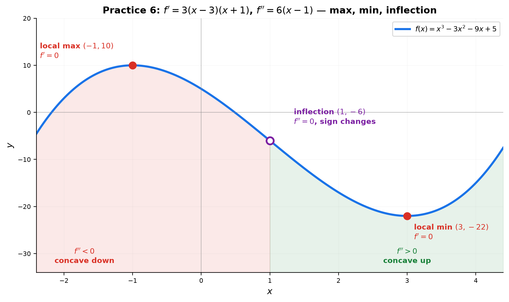

# Solutions — 14C: Higher Derivatives — Patterns, Concavity, and the $n$-th Derivative

---

## Practice 1

**Find $f''(x)$ for $f(x)=x^5-2x^3+x$. Show each step clearly.**

① $f'(x)=5x^4-6x^2+1$ (power rule on each term).

② $f''(x)=20x^3-12x$ (differentiate $f'$ again).

> **Answer**: $f''(x)=20x^3-12x$

---

## Practice 2

**Find $f^{(4)}(x)$ for $f(x)=e^{2x}$.**

Use the exponential pattern $f^{(n)}(e^{kx})=k^n e^{kx}$ with $k=2$, $n=4$:

$f^{(4)}(x)=2^4 e^{2x}=16e^{2x}$.

**Check by hand**: $f'=2e^{2x}$, $f''=4e^{2x}$, $f'''=8e^{2x}$, $f^{(4)}=16e^{2x}$ ✓

> **Answer**: $16e^{2x}$

---

## Practice 3

**Find $f^{(57)}(\cos x)$ using the trig cycle.**

① Cycle: $\cos\to-\sin\to-\cos\to\sin$ (length 4).

② $57\div 4=14$ remainder $1$.

③ $r=1$ in the $\cos$ cycle → $-\sin x$.

> **Answer**: $f^{(57)}(\cos x)=-\sin x$

---

## Practice 4

**Find $f^{(n)}(x)$ for $f(x)=\frac{1}{2x+1}$.**

General rational pattern: $f^{(n)}(x)=(-1)^n\frac{a^n n!}{(ax+b)^{n+1}}$ with $a=2$, $b=1$:

> **Answer**: $f^{(n)}(x)=(-1)^n\frac{2^n n!}{(2x+1)^{n+1}}$

---

## Practice 5

**Find $\frac{d^2y}{dx^2}$ for $x^3+y^3=6xy$.**

① First derivative (implicit, product rule on $6xy$):
$3x^2+3y^2y'=6y+6xy'$
$\to y'(3y^2-6x)=6y-3x^2$
$\to y'=\frac{6y-3x^2}{3y^2-6x}=\frac{2y-x^2}{y^2-2x}$.

② Differentiate $y'=\frac{2y-x^2}{y^2-2x}$ with the quotient rule. Let $N=2y-x^2$, $D=y^2-2x$:
- $N'=2y'-2x$
- $D'=2yy'-2$

$y''=\frac{N'D-ND'}{D^2}=\frac{(2y'-2x)(y^2-2x)-(2y-x^2)(2yy'-2)}{(y^2-2x)^2}$.

③ Substitute $y'=\frac{2y-x^2}{y^2-2x}$ to express the answer in $x$ and $y$ only.

> **Answer**: $y''=\frac{(2y'-2x)(y^2-2x)-(2y-x^2)(2yy'-2)}{(y^2-2x)^2}$, with $y'=\frac{2y-x^2}{y^2-2x}$

---

## Practice 6: Real Battle (Constructive)

**$f(x)=x^3-3x^2-9x+5$. (a) Critical points. (b) $f''=0$. (c) Concavity intervals. (d) Sketch.**

**(a)** $f'(x)=3x^2-6x-9=3(x^2-2x-3)=3(x-3)(x+1)$.
$f'(x)=0$ at $x=-1$ and $x=3$.

**(b)** $f''(x)=6x-6=6(x-1)$. $f''(x)=0$ at $x=1$ (possible inflection).

**(c)** Sign of $f''$:
- $x<1$: $f''<0$ → **concave down** on $(-\infty,1)$.
- $x>1$: $f''>0$ → **concave up** on $(1,\infty)$.
- $f''$ changes sign at $x=1$ → $(1,f(1))=(1,-6)$ is an **inflection point**.

**(d)** Sketch summary:
- Local max at $(-1,10)$ (since $f'$ changes $+\to-$ there and $f''(-1)=-12<0$).
- Local min at $(3,-22)$ ($f''(3)=12>0$).
- Inflection at $(1,-6)$: concave down left of it, concave up right of it.

> **Answer**: critical points $x=-1,3$; inflection at $x=1$; concave down on $(-\infty,1)$, concave up on $(1,\infty)$

---

## Basic Drills

### D1. Find $f''(x)$ for $f(x)=3x^4-5x^2+2x-7$.

$f'=12x^3-10x+2$, $f''=36x^2-10$.

> **Answer**: $36x^2-10$

---

### D2. Find $f'''(x)$ for $f(x)=x^5$.

$f'=5x^4$, $f''=20x^3$, $f'''=60x^2$.

> **Answer**: $60x^2$

---

### D3. Find $f''(x)$ for $f(x)=e^{-x}$.

$f'=-e^{-x}$, $f''=e^{-x}$.

> **Answer**: $e^{-x}$

---

### D4. Find $f''(x)$ for $f(x)=\ln x$.

$f'=\frac{1}{x}=x^{-1}$, $f''=-x^{-2}=-\frac{1}{x^2}$.

> **Answer**: $-\frac{1}{x^2}$

---

### D5. Find $f''(x)$ for $f(x)=\sin 2x$.

$f'=2\cos 2x$, $f''=-4\sin 2x$.

> **Answer**: $-4\sin 2x$

---

### D6. Find $f^{(n)}(x)$ for $f(x)=e^{5x}$.

Pattern: $k^n e^{kx}$ with $k=5$.

> **Answer**: $5^n e^{5x}$

---

### D7. Find $f''(x)$ for $f(x)=x\ln x$.

$f'=\ln x+1$, $f''=\frac{1}{x}$.

> **Answer**: $\frac{1}{x}$

---

### D8. Find $f''(0)$ for $f(x)=\tan x$.

$f'=\sec^2 x$, $f''=2\sec^2 x\tan x$. At $x=0$: $2\cdot 1\cdot 0=0$.

> **Answer**: $0$

---

### D9. $f(x)=|x^3|$. Where is $f'$ undefined? Where is $f''$ undefined?

For $x>0$: $f'=3x^2$, $f''=6x$. For $x<0$: $f'=-3x^2$, $f''=-6x$.

Both have a corner at $x=0$ (the sign of $x^3$ flips).

> **Answer**: both $f'$ and $f''$ are undefined at $x=0$

---

### D10. Find the inflection point(s) of $f(x)=x^3-6x^2+9x$.

$f''(x)=6x-12=6(x-2)=0\to x=2$.

Sign: $f''<0$ for $x<2$, $f''>0$ for $x>2$ — **sign changes** → inflection.

Point: $f(2)=8-24+18=2$.

> **Answer**: inflection point at $(2,2)$

---

## Advanced Drills

### A1. Prove Leibniz rule for $n=2$: $(fg)''=f''g+2f'g'+fg''$.

① $(fg)'=f'g+fg'$ (product rule).

② Differentiate again: $(f'g+fg')'=(f'g)'+(fg')'$.

③ $=f''g+f'g'+f'g'+fg''=f''g+2f'g'+fg''$ ✓

> **Answer**: $(fg)''=f''g+2f'g'+fg''$ ✓

---

### A2. Find $f^{(100)}(x)$ for $f(x)=xe^x$ using Leibniz.

Leibniz: $(fg)^{(n)}=\sum\binom{n}{k}f^{(n-k)}g^{(k)}$. Let $f=x$, $g=e^x$.

$x$ vanishes after 2 derivatives ($x'=1$, $x''=0$), so only $k=99,100$ survive:
- $k=99$: $\binom{100}{99}f'\,g^{(99)}=100\cdot 1\cdot e^x$
- $k=100$: $\binom{100}{100}f\,g^{(100)}=1\cdot x\cdot e^x$

> **Answer**: $f^{(100)}(x)=100e^x+xe^x=e^x(x+100)$

---

### A3. $f(x)=\frac{1}{1-x}$. Find a formula for $f^{(n)}(x)$.

Compute the first few:
- $f'=(1-x)^{-2}$ (derivative of $(1-x)^{-1}$ is $+(1-x)^{-2}$)
- $f''=2(1-x)^{-3}$
- $f'''=6(1-x)^{-4}$

Pattern: $n!\,(1-x)^{-(n+1)}$ (all signs positive because of the inner $-x$).

> **Answer**: $f^{(n)}(x)=n!\,(1-x)^{-(n+1)}=\frac{n!}{(1-x)^{n+1}}$

---

### A4. Find $f''(\pi/4)$ for $f(x)=\sin^2 x$.

Use $\sin^2 x=\frac{1-\cos 2x}{2}$:
- $f'(x)=\sin 2x$
- $f''(x)=2\cos 2x$
- $f''(\pi/4)=2\cos(\pi/2)=2\cdot 0=0$

**Check** (chain rule twice): $f'=2\sin x\cos x=\sin 2x$ ✓

> **Answer**: $0$

---

### A5. $f(x)=\ln(\sin x+\cos x)$. Find $f'(x)$, then $f''(0)$.

① $f'(x)=\frac{\cos x-\sin x}{\sin x+\cos x}$ (chain rule: $\frac{1}{\square}\cdot\square'$).

② Quotient rule for $f''$: with $N=\cos x-\sin x$, $D=\sin x+\cos x$:
$f''=\frac{(-\sin x-\cos x)(\sin x+\cos x)-(\cos x-\sin x)(\cos x-\sin x)}{(\sin x+\cos x)^2}$.

③ At $x=0$: $\sin 0=0$, $\cos 0=1$:
$f''(0)=\frac{(-0-1)(0+1)-(1-0)(1-0)}{(0+1)^2}=\frac{-1-1}{1}=-2$.

> **Answer**: $f''(0)=-2$

---

### A6. Prove $y=e^x\sin x$ satisfies $y''-2y'+2y=0$.

① $y'=e^x\sin x+e^x\cos x$.

② $y''=e^x\sin x+2e^x\cos x-e^x\sin x=2e^x\cos x$.

③ Substitute:
$y''-2y'+2y=2e^x\cos x-2(e^x\sin x+e^x\cos x)+2e^x\sin x$
$=2e^x\cos x-2e^x\sin x-2e^x\cos x+2e^x\sin x=0$ ✓

> **Answer**: verified — $y''-2y'+2y=0$

---

### A7. Find all $x$ where $f''(x)=0$ for $f(x)=x^4-6x^2+8x$, and verify sign change.

① $f''(x)=12x^2-12=12(x^2-1)=12(x-1)(x+1)=0\to x=\pm1$.

② Sign of $12(x-1)(x+1)$:
- $x<-1$: $(+)(-)(-)=+$
- $-1<x<1$: $(+)(-)(+)=-$
- $x>1$: $(+)(+)(+)=+$

Sign changes at both $x=-1$ and $x=1$ → both are inflection points.

> **Answer**: $x=-1$ and $x=1$ (both are inflection points)

---

### A8. Find $\frac{d^2y}{dx^2}$ for $x^2+xy+y^2=7$ using implicit differentiation twice.

① First: $2x+y+xy'+2yy'=0 \to y'=-\frac{2x+y}{x+2y}$.

② Differentiate $2x+y+xy'+2yy'=0$ again:
$2+y'+y'+xy''+2(y')^2+2yy''=0$
$\to 2+2y'+xy''+2(y')^2+2yy''=0$
$\to y''(x+2y)=-2-2y'-2(y')^2$
$\to y''=-\frac{2+2y'+2(y')^2}{x+2y}$.

③ At $(1,2)$: $y'=-\frac{4}{5}$, so
$y''=-\frac{2+2(-4/5)+2(16/25)}{1+4}=-\frac{2-\frac85+\frac{32}{25}}{5}=-\frac{\frac{50-40+32}{25}}{5}=-\frac{42}{125}$.

> **Answer**: $y''=-\frac{2+2y'+2(y')^2}{x+2y}$ with $y'=-\frac{2x+y}{x+2y}$; at $(1,2)$ it equals $-\frac{42}{125}$

---

### A9. $f(x)=x^{x^x}$. Find $f'(x)$ using log-diff twice, then $f''(1)$.

① $\ln y=x^x\ln x$. Let $z=x^x$, so $z'=x^x(\ln x+1)$.

② $\frac{y'}{y}=z'\ln x+\frac{z}{x}=x^x\left[(\ln x+1)\ln x+\frac1x\right]$.

So $y'=x^{x^x}x^x\left[(\ln x+1)\ln x+\frac1x\right]$.

③ Write $y'=yzw$ with $w=(\ln x+1)\ln x+\frac1x$. Then
$y''=y'zw+yz'w+yzw'$.

④ At $x=1$: $y(1)=1$, $z(1)=1$, $w(1)=0\cdot...+(1)=1$; $y'(1)=1$, $z'(1)=1$, $w'(1)=\frac{2\ln x+1}{x}-\frac1{x^2}\Big|_{x=1}=1-1=0$.

$y''(1)=y'(1)z(1)w(1)+y(1)z'(1)w(1)+y(1)z(1)w'(1)=1+1+0=2$.

> **Answer**: $f'(x)=x^{x^x}x^x\left[(\ln x+1)\ln x+\frac1x\right]$; $f''(1)=2$

---

### A10. $f(x)=\frac{ax+b}{cx+d}$. Find $f'''(x)$ for all $x\neq -d/c$.

① Divide: $\frac{ax+b}{cx+d}=\frac{a}{c}+\frac{bc-ad}{c}\cdot\frac{1}{cx+d}$.

Only the $\frac{1}{cx+d}$ term contributes derivatives.

② $f'=-(bc-ad)(cx+d)^{-2}$.

③ $f''=2c(bc-ad)(cx+d)^{-3}$.

④ $f'''=-6c^2(bc-ad)(cx+d)^{-4}$.

> **Answer**: $f'''(x)=-\frac{6c^2(bc-ad)}{(cx+d)^4}$
