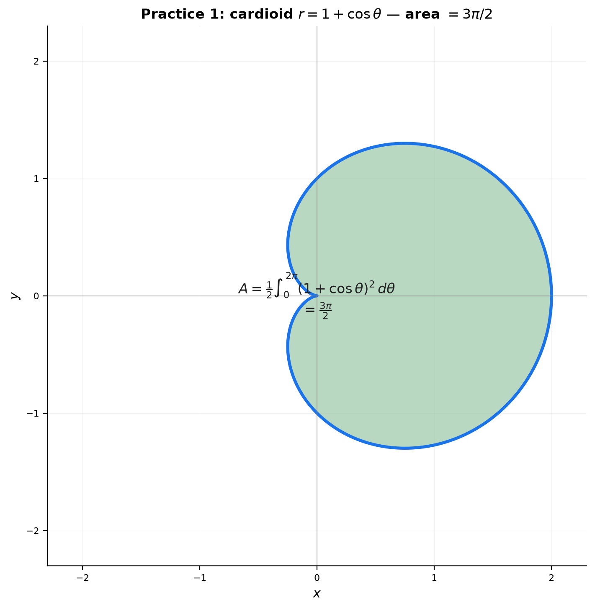
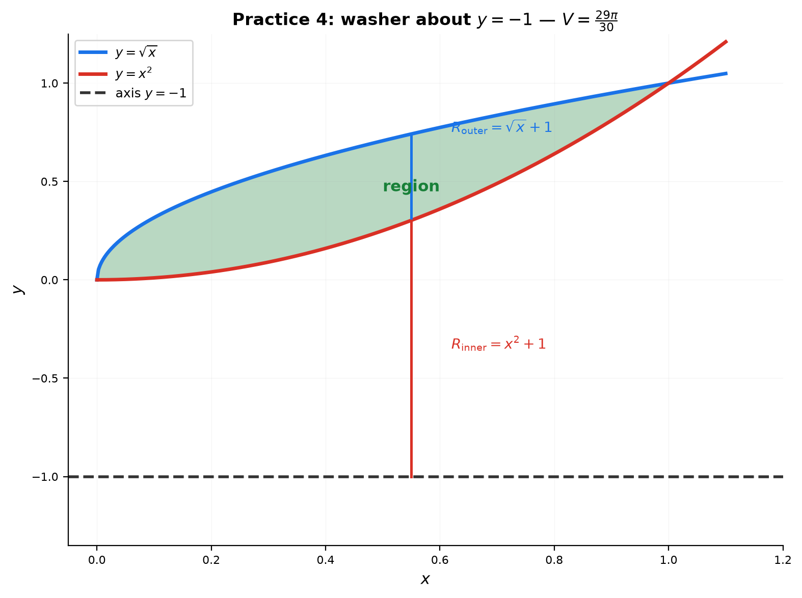
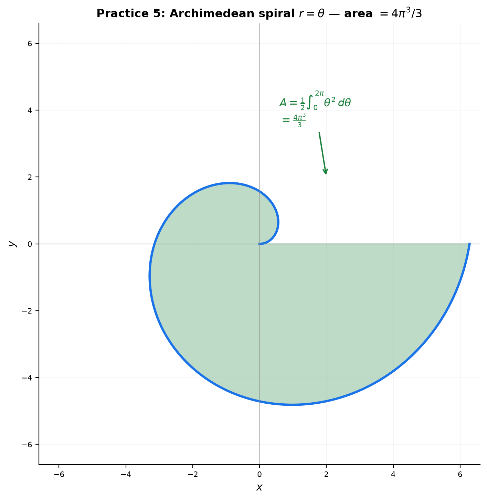

# Solutions — 17A: Area and Volume — Geometry Meets Integration

---

## Practice 1

**Find the area enclosed by the cardioid $r = 1 + \cos\theta$. ($\theta \in [0, 2\pi]$, use symmetry.)**

① Polar area formula: $A = \frac12\int_{\theta_1}^{\theta_2} r^2\,d\theta$.

② $A = \frac12\int_0^{2\pi} (1+\cos\theta)^2\,d\theta = \frac12\int_0^{2\pi} (1 + 2\cos\theta + \cos^2\theta)\,d\theta$.

③ $\int_0^{2\pi}1\,d\theta = 2\pi$, $\int_0^{2\pi}2\cos\theta\,d\theta = 0$, $\int_0^{2\pi}\cos^2\theta\,d\theta = \pi$.

④ $A = \frac12(2\pi + 0 + \pi) = \frac{3\pi}{2}$.

> **Answer**: $\frac{3\pi}{2}$

---

## Practice 2

**Find the area of the triangle $P(2,1,3)$, $Q(5,4,7)$, $R(1,6,2)$ via cross product. Verify with Heron.**

① $\vec{PQ} = (3,3,4)$, $\vec{PR} = (-1,5,-1)$.

② $\vec{PQ}\times\vec{PR} = (3\cdot(-1)-4\cdot5,\ 4\cdot(-1)-3\cdot(-1),\ 3\cdot5-3\cdot(-1)) = (-23,-1,18)$.

③ $|\vec{PQ}\times\vec{PR}| = \sqrt{529+1+324} = \sqrt{854}$.

④ $A = \frac12\sqrt{854} = \sqrt{213.5} \approx 14.61$.

**Heron check**: $|\vec{PQ}|=\sqrt{34}$, $|\vec{PR}|=\sqrt{27}=3\sqrt3$, $|\vec{QR}|=\sqrt{(-4)^2+2^2+(-5)^2}=\sqrt{45}=3\sqrt5$.

Semiperimeter $s \approx (5.831+5.196+6.708)/2 = 8.868$.

$\text{Area} = \sqrt{s(s-|PQ|)(s-|PR|)(s-|QR|)} \approx \sqrt{8.868\cdot3.037\cdot3.671\cdot2.160} \approx \sqrt{213.5} \approx 14.61$ ✓

> **Answer**: $\frac12\sqrt{854} \approx 14.61$

---

## Practice 3 (🔗 12C2)

**Ellipse $\frac{x^2}{9} + \frac{y^2}{4} = 1$ rotated about the $x$-axis. Find the ellipsoid volume.**

① $y^2 = 4\left(1-\frac{x^2}{9}\right)$, $x\in[-3,3]$.

② Disk method: $V = \pi\int_{-3}^{3} y^2\,dx = \pi\int_{-3}^{3} 4\left(1-\frac{x^2}{9}\right)dx$.

③ $= 4\pi\left[x - \frac{x^3}{27}\right]_{-3}^{3} = 4\pi\left[(3-1)-(-3+1)\right] = 4\pi(2+2) = 16\pi$.

**Formula check**: ellipsoid $V = \frac43\pi abc = \frac43\pi\cdot3\cdot2\cdot2 = 16\pi$ ✓

> **Answer**: $16\pi$

---

## Practice 4

**Region between $y = x^2$ and $y = \sqrt{x}$ rotated about $y = -1$. Washer method.**

① Intersections: $x^2 = \sqrt{x}$ → $x^4 = x$ → $x=0,1$. Bounds $[0,1]$.

② On $[0,1]$, $\sqrt{x} \ge x^2$. The axis $y=-1$ is below the region, so:
- Outer radius (farther from axis) $= \sqrt{x}+1$
- Inner radius $= x^2+1$

③ $V = \pi\int_0^1\left[(\sqrt{x}+1)^2 - (x^2+1)^2\right]dx = \pi\int_0^1\left(x + 2\sqrt{x} - x^4 - 2x^2\right)dx$.

④ $= \pi\left[\frac{x^2}{2} + \frac43 x^{3/2} - \frac{x^5}{5} - \frac{2x^3}{3}\right]_0^1 = \pi\left(\frac12 + \frac43 - \frac15 - \frac23\right) = \frac{29\pi}{30}$.

> **Answer**: $\frac{29\pi}{30}$

---

## Practice 5: Real Battle (🔗 12C3)

**Archimedean spiral $r = \theta$ from $\theta = 0$ to $2\pi$ with the $x$-axis. Find the area.**

① The spiral and the $x$-axis enclose the region swept by $r=\theta$, $\theta\in[0,2\pi]$.

② $A = \frac12\int_0^{2\pi} r^2\,d\theta = \frac12\int_0^{2\pi} \theta^2\,d\theta = \frac12\left[\frac{\theta^3}{3}\right]_0^{2\pi} = \frac12\cdot\frac{8\pi^3}{3} = \frac{4\pi^3}{3}$.

> **Answer**: $\frac{4\pi^3}{3}$

---

## Practice 6: Real Battle (🔗 12C1, 12A2)

**Unit square $[0,1]\times[0,1]$ transformed by $M = \begin{pmatrix} 3 & 1 \\ 1 & 2 \end{pmatrix}$. Parallelogram area via (a) determinant, (b) cross product.**

**(a) Determinant**: $\det M = 3\cdot2 - 1\cdot1 = 5$. Area $= |\det M|\times(\text{original area}) = 5\cdot1 = 5$.

**(b) Cross product**: adjacent sides are $M(1,0)=(3,1)$ and $M(0,1)=(1,2)$.
2D cross product: $3\cdot2 - 1\cdot1 = 5$.

> **Answer**: area $= 5$ (both methods agree)

![Unit square → parallelogram under M=[[3,1],[1,2]], area 5](graphs/17A/p6-determinant.png)

---

## Practice 7: Real Battle (🔗 12C2, 9C)

**Torus: $R=5$, $r=2$. (a) Volume via shell. (b) Verify via Pappus.**

**(a) Shell method**: $V = 4\pi\int_{-r}^{r}(u+R)\sqrt{r^2-u^2}\,du = 4\pi R\cdot\frac{\pi r^2}{2} = 2\pi^2 R r^2$.
With $R=5$, $r=2$: $V = 2\pi^2\cdot5\cdot4 = 40\pi^2$.

**(b) Pappus**: $V = (\text{area of circle})\times(\text{distance centroid travels}) = (\pi r^2)(2\pi R) = 4\pi\cdot 10\pi = 40\pi^2$ ✓

> **Answer**: $40\pi^2$ (both methods agree)

---

## Basic Drills

### D1. Area between $y=2x$ and $y=x^2$ on $[0,2]$.

Intersections: $2x=x^2$ → $x=0,2$. $A = \int_0^2(2x-x^2)dx = \left[x^2 - \frac{x^3}{3}\right]_0^2 = 4 - \frac83 = \frac43$.

> **Answer**: $\frac43$

---

### D2. Rotate $y=3x$, $x\in[0,2]$ about the $x$-axis.

$V = \pi\int_0^2(3x)^2dx = \pi\int_0^2 9x^2\,dx = \pi[3x^3]_0^2 = 24\pi$.

> **Answer**: $24\pi$

---

### D3. Region between $y=x$ and $y=x^3$ on $[0,1]$ about the $x$-axis.

On $[0,1]$, $x\ge x^3$. $V = \pi\int_0^1(x^2 - x^6)dx = \pi\left[\frac{x^3}{3}-\frac{x^7}{7}\right]_0^1 = \pi\left(\frac13-\frac17\right) = \frac{4\pi}{21}$.

> **Answer**: $\frac{4\pi}{21}$

---

### D4. Rotate $y=x^2$, $x\in[0,3]$ about the $y$-axis (shell).

$V = 2\pi\int_0^3 x\cdot x^2\,dx = 2\pi\int_0^3 x^3\,dx = 2\pi\cdot\frac{81}{4} = \frac{81\pi}{2}$.

> **Answer**: $\frac{81\pi}{2}$

---

### D5. Area of one petal of $r = \sin(3\theta)$.

Petal when $\sin3\theta\ge0$ → $\theta\in[0,\pi/3]$.
$A = \frac12\int_0^{\pi/3}\sin^2(3\theta)d\theta = \frac12\int_0^{\pi/3}\frac{1-\cos6\theta}{2}d\theta = \frac14\left[\theta - \frac{\sin6\theta}{6}\right]_0^{\pi/3} = \frac14\cdot\frac{\pi}{3} = \frac{\pi}{12}$.

> **Answer**: $\frac{\pi}{12}$

---

### D6. Region under $y=e^x$, $x\in[0,\ln 3]$, about the $x$-axis.

$V = \pi\int_0^{\ln 3} e^{2x}dx = \pi\left[\frac{e^{2x}}{2}\right]_0^{\ln 3} = \pi\left(\frac92 - \frac12\right) = 4\pi$.

> **Answer**: $4\pi$

---

### D7. Region between $y=4$ and $y=x^2$ about $y=4$.

The region touches the axis $y=4$, so it's a disk with radius $4-x^2$ (distance from $y=4$ down to $y=x^2$), $x\in[-2,2]$.
$V = \pi\int_{-2}^{2}(4-x^2)^2dx = 2\pi\int_0^2(16-8x^2+x^4)dx = 2\pi\left[16x - \frac{8x^3}{3} + \frac{x^5}{5}\right]_0^2 = 2\pi\left(32 - \frac{64}{3} + \frac{32}{5}\right) = \frac{512\pi}{15}$.

> **Answer**: $\frac{512\pi}{15}$

---

### D8. (🔗 12A2) Parallelogram $(0,0),(3,1),(4,5),(1,4)$.

Adjacent sides: $(3,1)$ and $(1,4)$. 
(a) Cross product: $3\cdot4 - 1\cdot1 = 11$. (b) Determinant: $\det\begin{pmatrix}3&1\\1&4\end{pmatrix} = 11$.

> **Answer**: $11$

---

### D9. (🔗 9C) Cone: rotate $y=\frac{R}{H}x$ about the $x$-axis.

$V = \pi\int_0^H\left(\frac{Rx}{H}\right)^2dx = \pi\frac{R^2}{H^2}\cdot\frac{H^3}{3} = \frac{1}{3}\pi R^2 H$ ✓

> **Answer**: $\frac13\pi R^2 H$

---

### D10. (🔗 12C3) Area inside both $r=1$ and $r=2\sin\theta$.

Intersections: $2\sin\theta=1$ → $\theta=\pi/6, 5\pi/6$. By symmetry about the $y$-axis, double the region for $\theta\in[0,\pi/2]$: inside both means $r\le\min(1,2\sin\theta)$, so $r=2\sin\theta$ on $[0,\pi/6]$ and $r=1$ on $[\pi/6,\pi/2]$.

$A = 2\left[\frac12\int_0^{\pi/6}(2\sin\theta)^2d\theta + \frac12\int_{\pi/6}^{\pi/2}1^2\,d\theta\right] = 2\left[2\int_0^{\pi/6}\sin^2\theta\,d\theta + \frac{\pi}{6}\right]$.

$\int_0^{\pi/6}\sin^2\theta\,d\theta = \left[\frac{\theta}{2}-\frac{\sin2\theta}{4}\right]_0^{\pi/6} = \frac{\pi}{12}-\frac{\sqrt3}{8}$.

$A = 2\left[\frac{\pi}{6}-\frac{\sqrt3}{4}+\frac{\pi}{6}\right] = \frac{2\pi}{3} - \frac{\sqrt3}{2}$.

> **Answer**: $\frac{2\pi}{3} - \frac{\sqrt3}{2}$

---

### D11. Base under $y=\sqrt{x}$, $y=0$, $x=4$; square cross-sections ⟂ $x$-axis.

Side of square $= \sqrt{x}$. $V = \int_0^4 (\sqrt{x})^2\,dx = \int_0^4 x\,dx = 8$.

> **Answer**: $8$

---

### D12. (🔗 12C2) Verify ellipse area $=\pi ab$ via parametric formula.

$x=a\cos t$, $y=b\sin t$, upper half $t\in[0,\pi]$. 
$A = \left|\int_0^\pi b\sin t\cdot(-a\sin t)\,dt\right| = ab\int_0^\pi\sin^2 t\,dt = ab\cdot\frac{\pi}{2}$. Double: $\pi ab$ ✓

> **Answer**: $\pi ab$ ✓

---

### D13. (🔗 12C1) Region under $y=\sin x$, $x\in[0,\pi]$, about $y=1$. Set up.

Axis $y=1$ above the region: outer radius $=1$ (from $y=0$), inner radius $=1-\sin x$ (from $y=\sin x$).
$V = \pi\int_0^\pi\left[1^2 - (1-\sin x)^2\right]dx$.

> **Answer**: $V = \pi\int_0^\pi\left[1 - (1-\sin x)^2\right]dx$

---

### D14. Sphere with a cylindrical hole (napkin ring). Set up.

Hole of radius $r$ through the center of a sphere $R$. Remaining ring spans $x\in[-\sqrt{R^2-r^2},\sqrt{R^2-r^2}]$.
Washer: outer radius $\sqrt{R^2-x^2}$, inner radius $r$.
$V = \pi\int_{-\sqrt{R^2-r^2}}^{\sqrt{R^2-r^2}}\left[(R^2-x^2)-r^2\right]dx = \frac{4\pi}{3}(R^2-r^2)^{3/2}$.

With ring height $h = 2\sqrt{R^2-r^2}$: $(R^2-r^2)^{3/2} = h^3/8$, so $V = \frac{\pi h^3}{6}$ — **depends only on $h$** ✓

> **Answer**: $V = \frac{\pi h^3}{6}$ (only the ring's height matters)

---

### D15. (🔗 12A2, 12C1) $y=x^2$ on $[0,2]$ about $y$-axis: shell vs. disk.

**Shell**: $V = 2\pi\int_0^2 x\cdot x^2\,dx = 2\pi\cdot\frac{16}{4} = 8\pi$.

**Disk** (using $x=\sqrt{y}$, $y\in[0,4]$): $V = \pi\int_0^4(\sqrt{y})^2dy = \pi\int_0^4 y\,dy = 8\pi$.

> **Answer**: both give $8\pi$ ✓

---

### D16. $y=\sqrt{x}$, $x\in[0,4]$ about the $y$-axis — disk with $dy$.

Solve for $x$: $y=\sqrt{x} \to x = y^2$, with $y\in[0,2]$.

Disk at height $y$: radius $y^2$, thickness $dy$.

$V = \pi\int_0^2 (y^2)^2\,dy = \pi\int_0^2 y^4\,dy = \pi\left[\frac{y^5}{5}\right]_0^2 = \frac{32\pi}{5}$.

> **Answer**: $\frac{32\pi}{5}$

---

### D17. Region between $y=x^2$ and $y=\sqrt{x}$ on $[0,1]$ about $x=1$ — washer with $dy$.

At height $y\in[0,1]$, the region spans $x$ from $y^2$ (on $y=x^2$) to $\sqrt{y}$ (on $y=\sqrt{x}$). Axis $x=1$ is to the right, so:
- outer radius: $1-y^2$ (farther, since $y^2\le\sqrt{y}$)
- inner radius: $1-\sqrt{y}$

> **Answer**: $V = \pi\int_0^1\left[(1-y^2)^2 - (1-\sqrt{y})^2\right]dy$

---

### D18. Region under $y=x$, $x\in[0,2]$, about the $x$-axis — shells with $dy$.

At height $y\in[0,2]$, the horizontal strip spans $x$ from $y$ to $2$ (the region reaches $x=2$). Shell: radius $y$, height $2-y$, thickness $dy$.

$V = 2\pi\int_0^2 y(2-y)\,dy = 2\pi\left[y^2 - \frac{y^3}{3}\right]_0^2 = 2\pi\left(4-\frac{8}{3}\right) = \frac{8\pi}{3}$.

**Cross-check with disks**: $V=\pi\int_0^2 x^2\,dx = \frac{8\pi}{3}$ ✓

> **Answer**: $\frac{8\pi}{3}$

---

## Advanced Drills

### A1. Area common to $r=2\cos\theta$ and $r=2\sin\theta$.

Intersection: $2\cos\theta=2\sin\theta$ → $\theta=\pi/4$. By symmetry, double the region $\theta\in[0,\pi/4]$ where $r=2\sin\theta\le 2\cos\theta$.
$A = 2\cdot\frac12\int_0^{\pi/4}(2\sin\theta)^2d\theta = \int_0^{\pi/4}4\sin^2\theta\,d\theta = 2\left[\theta - \frac{\sin2\theta}{2}\right]_0^{\pi/4} = 2\left(\frac{\pi}{4}-\frac12\right) = \frac{\pi}{2}-1$.

> **Answer**: $\frac{\pi}{2}-1$

---

### A2. (🔗 9C) Spherical cap of height $h$ from sphere $R$.

The cap is the part $x\in[R-h,R]$ of the sphere.
$V = \pi\int_{R-h}^{R}(R^2-x^2)dx = \pi\left[R^2x - \frac{x^3}{3}\right]_{R-h}^{R} = \frac{\pi h^2}{3}(3R-h)$.

> **Answer**: $V = \frac{\pi h^2}{3}(3R-h)$

---

### A3. (🔗 12C2) Cycloid $x=a(t-\sin t)$, $y=a(1-\cos t)$, $t\in[0,2\pi]$.

$x'(t) = a(1-\cos t)$.
$A = \int_0^{2\pi} y(t)x'(t)\,dt = a^2\int_0^{2\pi}(1-\cos t)^2dt = a^2\int_0^{2\pi}(1-2\cos t+\cos^2t)dt = a^2(2\pi+0+\pi) = 3\pi a^2$ ✓

> **Answer**: $3\pi a^2$

---

### A4. (🔗 12C1, 12A2) $M=\begin{pmatrix}2&1\\0&3\end{pmatrix}$ on the region between $y=x^2$ and $y=x$.

$\det M = 2\cdot3-1\cdot0 = 6$. Original area $= \int_0^1(x-x^2)dx = \frac16$.
Transformed area $= 6\cdot\frac16 = 1$.

> **Answer**: $1$

---

### A5. (🔗 12C2) Lemniscate $r^2 = a^2\cos(2\theta)$, total area.

Defined where $\cos2\theta\ge0$ → $\theta\in[-\pi/4,\pi/4]$ and $[3\pi/4,5\pi/4]$. By symmetry (fourfold), double the first lobe:
$A = 2\cdot\frac12\int_{-\pi/4}^{\pi/4}a^2\cos2\theta\,d\theta = a^2\left[\frac{\sin2\theta}{2}\right]_{-\pi/4}^{\pi/4} = a^2\left(\frac12+\frac12\right) = a^2$.

> **Answer**: $a^2$

---

### A6. Torus via washer (horizontal cut).

At height $y$, the horizontal slice is an annulus with inner radius $R-\sqrt{r^2-y^2}$ and outer radius $R+\sqrt{r^2-y^2}$.
Area of slice $= \pi\left[(R+\sqrt{r^2-y^2})^2 - (R-\sqrt{r^2-y^2})^2\right] = 4\pi R\sqrt{r^2-y^2}$.
$V = \int_{-r}^{r}4\pi R\sqrt{r^2-y^2}\,dy = 4\pi R\cdot\frac{\pi r^2}{2} = 2\pi^2Rr^2$ ✓

> **Answer**: $2\pi^2 R r^2$ ✓

---

### A7. Region inside $r=1+\cos\theta$ and outside $r=1$, about the $x$-axis. Set up.

Inside the cardioid and outside $r=1$ requires $1+\cos\theta>1$, i.e., $\theta\in(-\pi/2,\pi/2)$.
Polar volume about the $x$-axis: $V = \frac{2\pi}{3}\int\left(r_{\text{outer}}^3 - r_{\text{inner}}^3\right)\sin\theta\,d\theta$.

> **Answer**: $V = \frac{2\pi}{3}\int_{-\pi/2}^{\pi/2}\left[(1+\cos\theta)^3 - 1\right]\sin\theta\,d\theta$

---

### A8. (🔗 12B2, 9C) Base under $y=e^{-x}$, $x\ge0$; semicircle cross-sections.

Semicircle radius $= \frac12 e^{-x}$; area $= \frac12\pi\left(\frac{e^{-x}}{2}\right)^2 = \frac{\pi}{8}e^{-2x}$.
$V = \int_0^\infty \frac{\pi}{8}e^{-2x}dx = \frac{\pi}{8}\cdot\frac12 = \frac{\pi}{16}$.

> **Answer**: $\frac{\pi}{16}$

---

### A9. Unit disk under $M=\begin{pmatrix}4&2\\1&3\end{pmatrix}$.

$\det M = 12-2 = 10$. Image area $= |\det M|\cdot\pi = 10\pi$.

> **Answer**: $10\pi$

---

### A10. (🔗 12C3) Paraboloid $z=x^2+y^2$ under $z=4$.

**(a) Disk in $z$**: at height $z$, radius $\sqrt z$, area $\pi z$. $V = \int_0^4\pi z\,dz = 8\pi$.

**(b) Cylindrical**: $V = \int_0^{2\pi}\int_0^2(4-r^2)r\,dr\,d\theta = 2\pi\left[2r^2 - \frac{r^4}{4}\right]_0^2 = 2\pi(8-4) = 8\pi$.

> **Answer**: $8\pi$ (both methods agree)
