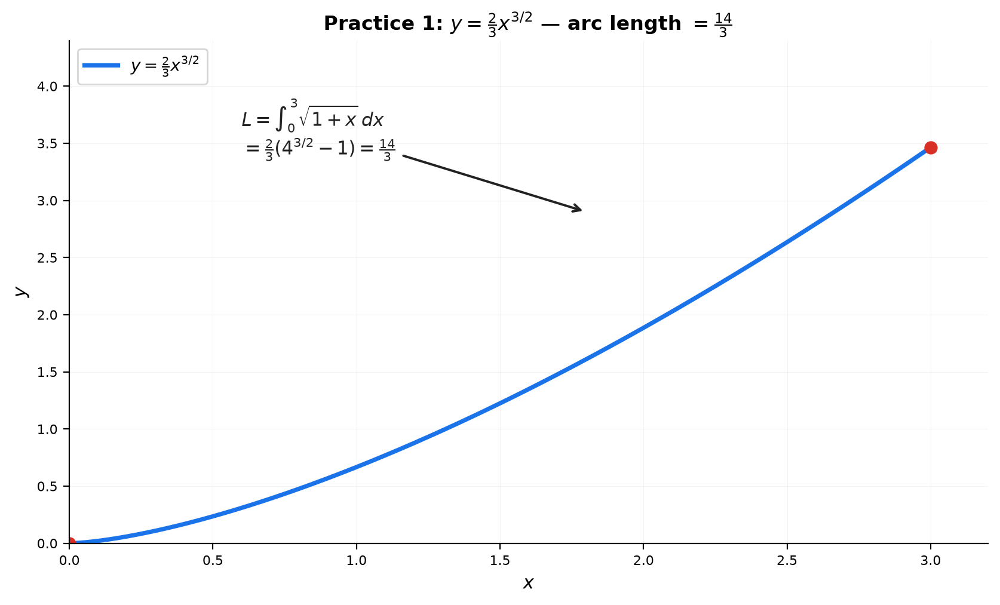
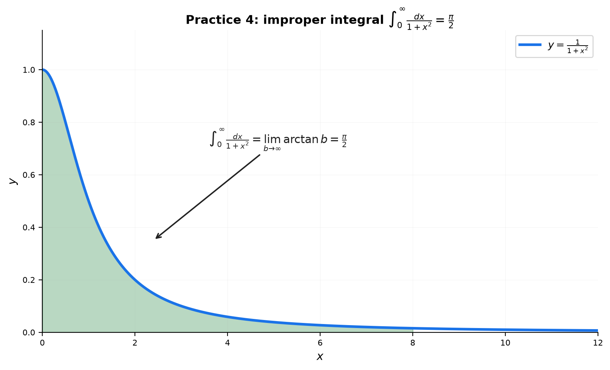

# Solutions — 17B: Arc Length, Surface Area, and Improper Integrals

---

## Practice 1

**Find the arc length of $y = \frac{2}{3}x^{3/2}$ from $x=0$ to $x=3$.**

① $y' = x^{1/2}$, so $1+(y')^2 = 1+x$.

② $L = \int_0^3 \sqrt{1+x}\,dx = \frac{2}{3}(1+x)^{3/2}\Big|_0^3 = \frac{2}{3}(4^{3/2}-1) = \frac{2}{3}(8-1)$.

> **Answer**: $\frac{14}{3}$

---

## Practice 2 (🔗 12C2)

**Arc length of the helix $\vec{r}(t) = (2\cos t, 2\sin t, 3t)$, $t \in [0, 4\pi]$.**

① $\vec{r}{\,}'(t) = (-2\sin t, 2\cos t, 3)$.

② Speed: $|\vec{r}{\,}'| = \sqrt{4\sin^2 t + 4\cos^2 t + 9} = \sqrt{4+9} = \sqrt{13}$ (constant).

③ $L = \int_0^{4\pi}\sqrt{13}\,dt = 4\pi\sqrt{13}$.

> **Answer**: $4\pi\sqrt{13}$

---

## Practice 3 (🔗 12C3)

**Arc length of the cardioid $r = 1 + \cos\theta$, $\theta \in [0, 2\pi]$.**

① $\frac{dr}{d\theta} = -\sin\theta$. $(\frac{dr}{d\theta})^2 + r^2 = \sin^2\theta + (1+\cos\theta)^2 = 2+2\cos\theta = 4\cos^2(\theta/2)$.

② $\sqrt{(\frac{dr}{d\theta})^2 + r^2} = 2|\cos(\theta/2)|$.

③ $L = \int_0^{2\pi} 2|\cos(\theta/2)|\,d\theta$. Split at $\theta=\pi$ (where $\cos(\theta/2)$ changes sign):

$L = 2\left[\int_0^\pi \cos(\theta/2)\,d\theta - \int_\pi^{2\pi}\cos(\theta/2)\,d\theta\right] = 2\left[2 - (0-2)\right] = 8$.

> **Answer**: $8$

---

## Practice 4

**$\displaystyle \int_0^\infty \frac{dx}{x^2+1}$.**

① Improper at $\infty$: $\int_0^b \frac{dx}{1+x^2} = \arctan x\Big|_0^b = \arctan b$.

② Take $b \to \infty$: $\lim_{b\to\infty}\arctan b = \frac{\pi}{2}$.

> **Answer**: $\frac{\pi}{2}$

---

## Practice 5: Real Battle (🔗 12C2)

**Cycloid arch: $x = t-\sin t$, $y = 1-\cos t$, $t\in[0,2\pi]$. Arc length, and compare with the straight chord.**

① $\frac{dx}{dt} = 1-\cos t$, $\frac{dy}{dt} = \sin t$.

② Speed$^2 = (1-\cos t)^2 + \sin^2 t = 2(1-\cos t) = 4\sin^2(t/2)$. Speed $= 2|\sin(t/2)|$.

③ On $[0,2\pi]$, $\sin(t/2)\ge0$: $L = \int_0^{2\pi}2\sin(t/2)\,dt = 4[-\cos(t/2)]_0^{2\pi} = 4(1+1) = 8$.

④ **Straight line**: start $(0,0)$, end $(2\pi,0)$ → length $2\pi \approx 6.28$.

**Why is the cycloid longer?** The cycloid detours up to height 2 and back — the shortest path between the endpoints is the straight chord, and any curve that leaves the line must be longer. The ratio $8/(2\pi) \approx 1.27$ reflects the detour.

> **Answer**: cycloid length $8$; straight chord $2\pi$; the cycloid is longer because it leaves the straight line (a non-straight path between two points is always longer)

---

## Practice 6: Gabriel's Horn (🔗 12B2)

**Verify: $y=1/x$, $x\in[1,\infty)$ rotated about $x$-axis gives $V=\pi$ but $S=\infty$. Why is this not a paradox?**

① **Volume** (finite): $V = \pi\int_1^\infty \frac{1}{x^2}\,dx = \pi\left[-\frac{1}{x}\right]_1^\infty = \pi$.

② **Surface area** (infinite): $S = 2\pi\int_1^\infty \frac{1}{x}\sqrt{1+\frac{1}{x^4}}\,dx \ge 2\pi\int_1^\infty\frac{1}{x}\,dx = \infty$.

③ **Not a paradox — the $p$-test tells the story**: volume integrates $\frac{1}{x^2}$ ($p=2>1$, converges), while surface area integrates $\frac{1}{x}\cdot(\text{slant}\to 1) \sim \frac{1}{x}$ ($p=1$, diverges). Different powers — different convergence. Volume and surface area measure different things.

> **Answer**: $V=\pi$ (finite), $S=\infty$ (divergent like the harmonic tail); the $p$-test explains why ($p=2$ vs $p=1$)

---

## Practice 7: Real Battle (🔗 12C3, 12A2)

**Sketch the proof that $\int_{-\infty}^\infty e^{-x^2}\,dx = \sqrt{\pi}$.**

① Let $I = \int_{-\infty}^\infty e^{-x^2}\,dx$. Square: $I^2 = \int_{-\infty}^\infty\int_{-\infty}^\infty e^{-(x^2+y^2)}\,dx\,dy$.

② The integrand $e^{-(x^2+y^2)}=e^{-r^2}$ has circular symmetry → switch to polar:

$I^2 = \int_0^{2\pi}\int_0^\infty e^{-r^2}\,r\,dr\,d\theta$.

③ **Where the extra $r$ comes from**: a small polar rectangle spans $dr$ radially and $d\theta$ angularly; its sides are $dr$ and $r\,d\theta$, so its area is $r\,dr\,d\theta$ — wider at larger $r$. (The 2D analog of $du=g'(x)dx$.)

④ $I^2 = \int_0^{2\pi}d\theta \cdot \int_0^\infty r e^{-r^2}dr = 2\pi\cdot\left[-\frac12 e^{-r^2}\right]_0^\infty = 2\pi\cdot\frac12 = \pi$.

> **Answer**: $I = \sqrt{\pi}$ (the factor $r$ comes from the polar area element $r\,dr\,d\theta$)

---

## Basic Drills

### D1. Arc length of $y=2x$ from $x=0$ to $x=3$.

$y'=2$: $L = \int_0^3\sqrt{1+4}\,dx = 3\sqrt5$.

**Check**: distance formula between $(0,0)$ and $(3,6)$: $\sqrt{3^2+6^2} = \sqrt{45} = 3\sqrt5$ ✓

> **Answer**: $3\sqrt5$

---

### D2. $\int_1^\infty \frac{dx}{x^3}$ — $p$-test.

$p=3>1$ → converges. $\lim_{b\to\infty}\left[-\frac{1}{2x^2}\right]_1^b = \frac12$.

> **Answer**: $\frac12$

---

### D3. $\int_0^1 \frac{dx}{\sqrt[3]{x}}$ — $p$-test at a singularity.

$\frac{1}{\sqrt[3]{x}} = x^{-1/3}$, $p=\frac13<1$ → converges. $\int_0^1 x^{-1/3}dx = \frac32 x^{2/3}\Big|_0^1 = \frac32$.

> **Answer**: $\frac32$

---

### D4. Arc length of $y = \sqrt{1-x^2}$ from $x=0$ to $x=1$.

Quarter circle of radius 1: $L = \frac{2\pi}{4} = \frac{\pi}{2}$.

(Or: $y' = \frac{-x}{\sqrt{1-x^2}}$, $\sqrt{1+(y')^2} = \frac{1}{\sqrt{1-x^2}}$, $L = \int_0^1\frac{dx}{\sqrt{1-x^2}} = \arcsin 1 = \frac{\pi}{2}$.)

> **Answer**: $\frac{\pi}{2}$

---

### D5. $\int_2^\infty \frac{dx}{x\ln x}$ — does it converge?

$u = \ln x$, $du = dx/x$: $\int \frac{dx}{x\ln x} = \int\frac{du}{u} = \ln|u| = \ln(\ln x)$.

$\lim_{b\to\infty}\left[\ln(\ln x)\right]_2^b = \infty$ → **diverges**.

> **Answer**: diverges (like $\int du/u$)

---

### D6. Rotate $y=3$, $x\in[0,5]$ about the $x$-axis — surface area.

$f'=0$: $S = 2\pi\int_0^5 3\cdot 1\,dx = 30\pi$.

**Check**: lateral area of a cylinder $2\pi rh = 2\pi\cdot3\cdot5 = 30\pi$ ✓

> **Answer**: $30\pi$

---

### D7. $\int_{-\infty}^\infty \frac{dx}{1+x^2}$ — symmetric, improper.

By symmetry: $2\int_0^\infty\frac{dx}{1+x^2} = 2\lim_{b\to\infty}\arctan b = 2\cdot\frac{\pi}{2} = \pi$.

> **Answer**: $\pi$

---

### D8. Arc length of one arch of $y=\sin x$ on $[0,\pi]$.

$L = \int_0^\pi\sqrt{1+\cos^2 x}\,dx$ — an **elliptic integral** (no elementary antiderivative). Leave as setup; numerically $\approx 3.82$.

> **Answer**: $L = \int_0^\pi\sqrt{1+\cos^2 x}\,dx$ (elliptic, ≈3.82)

---

### D9. $\int_0^\infty e^{-2x}\,dx$.

$\lim_{b\to\infty}\left[-\frac12 e^{-2x}\right]_0^b = \frac12$.

> **Answer**: $\frac12$

---

### D10. Rotate $y = \sqrt{4-x^2}$, $x\in[-2,2]$ about the $x$-axis.

Sphere of radius $R=2$: $S = 4\pi R^2 = 16\pi$.

> **Answer**: $16\pi$

---

### D11. (🔗 12C2) Find $c$ so $(\cos ct,\sin ct,ct)$ has speed exactly 1.

$\vec{r}{\,}' = (-c\sin ct, c\cos ct, c)$, speed $= \sqrt{c^2+c^2} = c\sqrt2$. Set $=1$: $c = \frac{1}{\sqrt2}$.

> **Answer**: $c = \frac{1}{\sqrt2}$

---

### D12. (🔗 12B2) $\int_1^\infty \frac{dx}{x^{1.01}}$ — converge or diverge?

$p = 1.01 > 1$ → **converges** (just barely).

> **Answer**: converges

---

### D13. (🔗 12C3) Arc length of $r = e^\theta$ from $0$ to $2\pi$.

$\sqrt{(r')^2 + r^2} = \sqrt{e^{2\theta}+e^{2\theta}} = \sqrt2\,e^\theta$.

$L = \sqrt2\int_0^{2\pi}e^\theta d\theta = \sqrt2(e^{2\pi}-1)$.

> **Answer**: $\sqrt2(e^{2\pi}-1)$

---

### D14. $\int_0^1 \ln x\,dx$ — improper at $x=0$.

$\lim_{a\to0^+}\int_a^1 \ln x\,dx = \lim_{a\to0^+}[x\ln x - x]_a^1 = (0-1) - \lim_{a\to0^+}(a\ln a - a) = -1 - 0 = -1$.

> **Answer**: $-1$

---

### D15. (🔗 12C2, 9C) Cycloid arch rotated about the $x$-axis — set up the surface area.

$y=1-\cos t$, speed $=2|\sin(t/2)|$ (with $a=1$).

$S = 2\pi\int_0^{2\pi} y(t)\cdot(\text{speed})\,dt = 2\pi\int_0^{2\pi}(1-\cos t)\,2\sin(t/2)\,dt = 4\pi\int_0^{2\pi}(1-\cos t)\sin(t/2)\,dt$ — elliptic, set up only.

> **Answer**: $S = 2\pi\int_0^{2\pi}(1-\cos t)\cdot 2\sin(t/2)\,dt$ (elliptic)

---

## Advanced Drills

### A1. Arc length of $y = \ln(\sec x)$ from $x=0$ to $x=\pi/3$.

$y' = \tan x$. $\sqrt{1+(y')^2} = \sqrt{1+\tan^2 x} = \sec x$.

$L = \int_0^{\pi/3}\sec x\,dx = \ln|\sec x+\tan x|\Big|_0^{\pi/3} = \ln(2+\sqrt3) - \ln(1+0)$.

> **Answer**: $\ln(2+\sqrt3)$

---

### A2. Gabriel's Horn extended: $y=1/x^p$, $x\ge1$ about the $x$-axis.

**Volume**: $V = \pi\int_1^\infty x^{-2p}dx$ converges iff $2p>1$, i.e. $p>\frac12$.

**Surface**: $S = 2\pi\int_1^\infty x^{-p}\sqrt{1+p^2x^{-2p-2}}\,dx$. As $x\to\infty$, the root $\to1$, so $S$ behaves like $2\pi\int x^{-p}dx$ → converges iff $p>1$.

**Gabriel's Horn phenomenon** (volume finite, surface infinite): $\frac12 < p \le 1$.

> **Answer**: volume finite iff $p>\frac12$; surface finite iff $p>1$; the horn paradox occurs for $\frac12 < p \le 1$

---

### A3. $\int_0^\infty x e^{-x}\,dx$ — integration by parts + improper limit.

$\int x e^{-x}dx = -xe^{-x} - e^{-x}$. From $0$ to $b$: $(-be^{-b}-e^{-b}) - (0-1) = 1 - (b+1)e^{-b}$.

$\lim_{b\to\infty} = 1 - 0 = 1$.

> **Answer**: $1$

---

### A4. Arc length of $y = \frac{x^2}{4} - \frac{\ln x}{2}$ from $x=1$ to $x=e$.

$y' = \frac{x}{2} - \frac{1}{2x} = \frac{x^2-1}{2x}$.

$1+(y')^2 = 1 + \frac{(x^2-1)^2}{4x^2} = \frac{4x^2 + x^4 - 2x^2 + 1}{4x^2} = \frac{x^4+2x^2+1}{4x^2} = \frac{(x^2+1)^2}{4x^2}$ — a perfect square!

$L = \int_1^e \frac{x^2+1}{2x}\,dx = \int_1^e\left(\frac{x}{2}+\frac{1}{2x}\right)dx = \left[\frac{x^2}{4}+\frac12\ln x\right]_1^e = \left(\frac{e^2}{4}+\frac12\right) - \frac14 = \frac{e^2+1}{4}$.

> **Answer**: $\frac{e^2+1}{4}$

---

### A5. Prove $\int_{-\infty}^\infty e^{-x^2}\,dx = \sqrt{\pi}$.

Same polar trick as Practice 7: square $I$, convert to polar with $r\,dr\,d\theta$, get $I^2=\pi$, so $I=\sqrt{\pi}$. The factor $r$ is the polar area element — a small polar rectangle has area $r\,dr\,d\theta$.

> **Answer**: $\sqrt{\pi}$ (see Practice 7 for the full proof)

---

### A6. Surface area when $y = e^{-x}$, $x\in[0,\infty)$, rotated about the $x$-axis.

$S = 2\pi\int_0^\infty e^{-x}\sqrt{1+e^{-2x}}\,dx$.

As $x\to\infty$: $e^{-x}\sqrt{1+e^{-2x}} \sim e^{-x}$, and $\int_0^\infty e^{-x}dx$ converges → **$S$ converges** (finite).

**Compare with Gabriel's Horn**: $1/x$ decays too slowly ($p=1$ → surface diverges), but $e^{-x}$ decays faster than any power — so its rotated surface is finite.

> **Answer**: converges (finite surface), unlike Gabriel's Horn — $e^{-x}$ decays exponentially fast

---

### A7. $\int_0^1 \frac{\arcsin x}{\sqrt{1-x^2}}\,dx$.

$u = \arcsin x$, $du = \frac{dx}{\sqrt{1-x^2}}$. Then $\int u\,du = \frac{u^2}{2} = \frac{(\arcsin x)^2}{2}\Big|_0^1 = \frac{(\pi/2)^2}{2}$.

(The integral is improper at $x=1$ — the denominator blows up — but the $u$-sub makes it perfectly finite.)

> **Answer**: $\frac{\pi^2}{8}$

---

### A8. (🔗 12C2) $y=x^2$ from $0$ to $2$ rotated about the $y$-axis.

Use $x=\sqrt{y}$, $dx/dy = \frac{1}{2\sqrt y}$, $y\in[0,4]$.

$S = 2\pi\int_0^4 \sqrt{y}\sqrt{1+\frac{1}{4y}}\,dy = 2\pi\int_0^4 \sqrt{y}\cdot\frac{\sqrt{4y+1}}{2\sqrt y}\,dy = \pi\int_0^4\sqrt{4y+1}\,dy$.

$= \frac{\pi}{4}\cdot\frac{2}{3}(17^{3/2}-1) = \frac{\pi}{6}(17^{3/2}-1) \approx 36.18$.

> **Answer**: $\frac{\pi}{6}(17^{3/2}-1) \approx 36.18$

---

### A9. $\int_0^\infty \frac{\arctan x}{1+x^2}\,dx$.

$u = \arctan x$, $du = \frac{dx}{1+x^2}$: $\int u\,du = \frac{(\arctan x)^2}{2}\Big|_0^\infty = \frac{(\pi/2)^2}{2}$.

> **Answer**: $\frac{\pi^2}{8}$

---

### A10. (🔗 12B2) Prove $\int_0^\infty \frac{\sin x}{x}\,dx$ converges.

Write it as a sum over half-periods: $\int_0^\infty = \sum_{n=0}^\infty \int_{n\pi}^{(n+1)\pi}\frac{\sin x}{x}\,dx$.

Each piece $a_n = \int_{n\pi}^{(n+1)\pi}\frac{\sin x}{x}\,dx$ has sign $(-1)^n$, and $|a_n|$ decreases to $0$ (the integrand's magnitude $\le 1/x$ shrinks each period). The **alternating series test** applies → converges. (Value $=\pi/2$.)

> **Answer**: converges by the alternating series test over the periods $[n\pi,(n+1)\pi]$; value $\pi/2$

---

### A11. (🔗 12C2, 17A) Paraboloid: $y=x^2$, $0\le x\le2$, rotated about the $y$-axis.

$S = 2\pi\int_0^2 x\sqrt{1+(2x)^2}\,dx = 2\pi\int_0^2 x\sqrt{1+4x^2}\,dx$.

$u = 1+4x^2$, $du = 8x\,dx$: $= 2\pi\cdot\frac18\int_1^{17}u^{1/2}du = \frac{\pi}{4}\cdot\frac23(17^{3/2}-1) = \frac{\pi}{6}(17^{3/2}-1) \approx 36.18$.

(Matches A8 — rotating $y=x^2$ about the $y$-axis mirrors Example 6's $y=\sqrt{x}$ about the $x$-axis.)

> **Answer**: $\frac{\pi}{6}(17^{3/2}-1) \approx 36.18$

---

### A12. (🔗 9C, 12C2) $y=\ln x$ from $x=1$ to $x=e$ rotated about the $y$-axis.

Express $x=e^y$, $dx/dy=e^y$, $y\in[0,1]$.

$S = 2\pi\int_0^1 e^y\sqrt{1+e^{2y}}\,dy$. Let $u=e^y$, $du=e^y dy$: $= 2\pi\int_1^e\sqrt{1+u^2}\,du$.

Using $\int\sqrt{1+u^2}\,du = \frac{u}{2}\sqrt{1+u^2}+\frac12\ln(u+\sqrt{1+u^2})$:

$S = \pi\left[e\sqrt{1+e^2} + \ln(e+\sqrt{1+e^2}) - \sqrt2 - \ln(1+\sqrt2)\right]$.

> **Answer**: $\pi\left[e\sqrt{1+e^2} + \ln(e+\sqrt{1+e^2}) - \sqrt2 - \ln(1+\sqrt2)\right]$

---

### A13. (🔗 9C) Surface area of a zone of a sphere (between two parallel planes distance $h$ apart).

Sphere $x^2+y^2+z^2=R^2$, zone between $x=x_1$ and $x=x_2$ ($x_2-x_1=h$). Rotate $y=\sqrt{R^2-x^2}$:

$S = 2\pi\int_{x_1}^{x_2}\sqrt{R^2-x^2}\cdot\frac{R}{\sqrt{R^2-x^2}}\,dx = 2\pi R\int_{x_1}^{x_2}dx = 2\pi R(x_2-x_1) = 2\pi Rh$.

The slant factor cancels the shrinking radius again — **independent of where the zone sits**; only the height $h$ matters.

> **Answer**: $S = 2\pi Rh$ (depends only on the zone's height)
