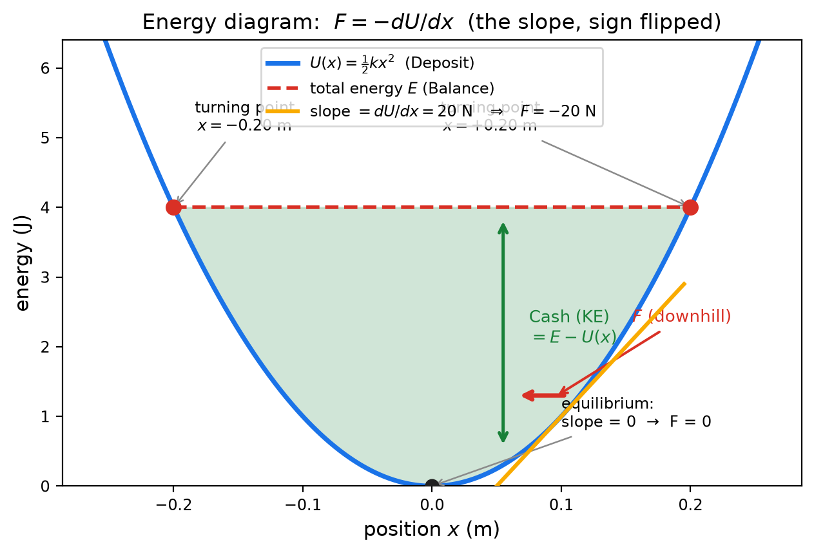

# Energy — 에너지란 무엇인가

> **시리즈:** `fields/reading/` 세 번째이자 마지막. `field.md`(힘의 지도)와 `potential.md`(에너지의 지도)가 준비되었으니, 이제 지도 위에서 물체가 **왜, 얼마나** 움직이는지 봅니다.
> **한 문장:** 에너지는 "일을 할 수 있는 능력"의 부기(bookkeeping)이고, 보존법칙은 그 장부가 **항상 맞는다**는 뜻입니다 — 위치(Deposit)와 움직임(Cash)이 서로 바뀔 뿐, 합은 변하지 않습니다.

---

# 1. 두 지도가 만나는 곳

앞선 두 읽기에서 우리는 두 장의 지도를 얻었습니다:

- **장** $\vec{E}$, $g$ — 각 점에서 "얼마나 세게, 어느 쪽으로 밀리는가" (힘의 지도)
- **전위** $V$, $\varphi$ — 각 점의 "에너지 가격" (에너지의 지도)

이제 그 지도 위에 **움직이는 물체**를 올려놓습니다. 물체가 움직이면 두 가지가 생깁니다:

1. 물체가 **속력**을 얻습니다 — 운동 에너지 $K=\tfrac12mv^2$ (움직임이라는 돈)
2. 물체가 지형의 **높이**를 바꿉니다 — 퍼텐셜 에너지 $U$ (위치라는 돈)

그리고 물리학에서 가장 오래된 통찰이 이겁니다: **이 두 돈의 합이 일정하다.**

$$K + U = \text{일정} \qquad \text{(역학적 에너지 보존)}$$

# 2. 일: 돈을 옮기는 손

에너지가 "돈"이라면, 돈을 옮기는 손이 **일(work)**입니다.

$$W = F\,d \qquad \text{(힘 × 그 방향으로의 이동)}$$

일과 에너지는 신분이 다릅니다. **에너지는 상태의 양** — 물체가 "지금 얼마나 가졌는가" (순간 사진에 찍힘). **일은 과정의 양** — "얼마나 옮겨졌는가" (동영상에만 찍힘). 계좌 잔고가 상태라면, 송금 내역이 일입니다.

힘이 물체에 일을 하면 물체의 운동 에너지가 그만큼 늘어납니다 — 이것이 일–에너지 정리 $W=\Delta K$입니다.

# 3. 두 종류의 돈: Cash와 Deposit

은행 비유로 정리하면 이렇습니다.

| 돈 | 물리량 | 소유권 |
|---|---|---|
| **Cash (현금)** | 운동 에너지 $K=\tfrac12mv^2$ | **개인** — 각 물체가 자기 것만 가짐, 당장 쓸 수 있음 |
| **Deposit (예금)** | 퍼텐셜 에너지 $U=mgh,\ qV,\ \tfrac12kx^2$ | **공동** — 중력은 물체+지구, 전기는 전하+전하, 용수철은 시스템 소유. 혼자 가질 수 없음 |

Deposit이 공동 소유인 이유는 $U$가 언제나 **둘 사이의 관계**이기 때문입니다. "공의 높이 에너지"라고들 하지만, 엄밀히는 **공–지구 계좌**의 돈입니다 — 지구가 없으면 $mgh$는 의미가 없습니다.

# 4. 장부: 합이 항상 맞는다

용수철의 **에너지 다이어그램**입니다. 파란 곡선이 Deposit($U$), 빨간 점선이 Balance($K+U$), 그 사이 세로 간격이 Cash($K$)입니다. 이 그림 하나에서:

- **Cash ↔ Deposit 전환:** 공이 굴러 내려가면 Deposit이 Cash로 바뀝니다. 올라가면 반대. **내부 이체라 Balance는 안 변합니다.**
- **교점 = turning point:** Cash가 0이 되는 곳 — 물체가 방향을 도는 지점. 곡선과 점선이 만나는 곳입니다.
- **경사 = 힘:** 곡선의 기울기가 $-F$ — 내리막으로 밀립니다.

같은 장부를 막대로 그리면 이렇습니다: 출발에서 도착까지 **Deposit이 Cash로 바뀌어도 Balance(빨간 점선)는 그대로**입니다. 보존이란 결국 "장부가 맞는다"는 말입니다.

# 5. 보존은 왜 성립하나 — 정의의 결과

보존은 신비한 법칙이 아니라 **정의 세 줄의 조립**입니다 (역학 문서 B0의 유도와 동일):

1. 일의 정의: $W=F\,\Delta x$
2. Deposit의 정의: $\Delta U=-W$ — "힘이 일을 해주면 예금이 그만큼 줄어든다"
3. 일–에너지 정리: $\Delta K=W$

세 줄을 더하면:

$$\Delta K + \Delta U = 0 \qquad\Rightarrow\qquad K+U=\text{일정}$$

**마이너스의 출처가 보입니다:** $\Delta U=-W$에서 왔습니다. 이 마이너스를 지우면 Balance가 저절로 불어나는 영구기관이 됩니다. 즉 **보존은 Deposit의 정의에 새겨져 있고, 그래서 Deposit이 존재할 수 있는 힘(보존력)에서만 성립합니다.** 마찰은 Deposit을 정의할 수 없는 힘 — 경로마다 일이 달라 "고도"가 존재하지 않기 때문입니다.

# 6. 외부 거래: Balance가 변할 때

Balance가 항상 같은 것은 아닙니다. 외부에서 누가 일을 해주면 변합니다:

$$W_{\rm ext} = \Delta(K+U)$$

- **Balance가 늘었다** → 바깥의 무언가가 이 시스템에 **일을 해줬다** (입금).
- **Balance가 줄었다** → 시스템이 바깥의 무언가에 **일을 해줬다** (출금).

이것이 일–에너지 정리의 시스템 버전입니다. 주의할 점은 **경계를 어디에 그었는가**가 입금인지 이체인지를 결정한다는 것 — 지구를 시스템에 넣으면 중력은 내부 이체(Deposit→Cash)이고, 빼면 지구가 일을 해주는 외부 거래입니다. 같은 사건, 두 장부 — 둘 다 맞습니다.

# 7. 수수료: 열이라는 환불 불가 출금

마찰이 있으면 장부에 **수수료(fee)**가 붙습니다. 미끄러지는 블록의 Balance는 $100$ J에서 $80$ J로 줄어들고, $20$ J는 열로 갑니다.

- **에너지는 사라지지 않았습니다** — 전체(장부 + 열)는 여전히 $100$ J입니다.
- 그러나 그 $20$ J는 **환불 불가**입니다. 열은 저절로 Cash나 Deposit으로 돌아오지 않습니다.

파인만이 에너지 보존을 설명할 때 쓴 유명한 비유가 이것입니다: 아이의 장난감 블록이 보이지 않으면 양탄자 밑, 창밖, 목욕물 속을 뒤지면 **항상 총개수가 맞는다** — 열은 "목욕물 속에 빠진 블록", 즉 셀 수는 있지만 꺼내 쓰기 어려운 돈입니다. 그래서 두 문장이 동시에 참입니다: "에너지는 보존된다" 그리고 "쓸 수 있는 에너지는 줄었다."

# 8. 왜 에너지가 물리학의 화폐인가

1. **스칼라** — 벡터와 달리 그냥 더하면 됩니다. 복잡한 시스템도 숫자 합으로 회계됩니다.
2. **보존** — 장부가 항상 맞으니, 모르는 과정이 있어도 시작과 끝만 비교하면 됩니다. 이것이 "중간을 몰라도 답이 나오는" 유일한 방법입니다.
3. **지형과 연결** — $U$를 알면 힘을 알고($F=-dU/dx$), 힘을 알면 운동을 압니다. 에너지 지형 하나가 역학 전체를 품습니다.

그리고 20세기로 가면 화폐의 위상은 더 커집니다: 광자의 에너지 $E=h\nu$, 질량–에너지 $E=mc^2$, 원자 속 전자의 이산 준위까지 — **모든 물리학이 에너지로 말합니다.**

# 9. 한 줄 사전

| 말 | 한 줄 의미 |
|---|---|
| 에너지 $E$ | "일을 할 수 있는 능력"의 부기 — 상태의 양 |
| 운동 에너지 $K$ | 개인 Cash — $K=\tfrac12mv^2$, 당장 쓸 수 있음 |
| 퍼텐셜 에너지 $U$ | 공동 Deposit — $mgh$, $qV$, $\tfrac12kx^2$ |
| 일 $W$ | 돈을 옮기는 손 — $W=Fd$, 과정의 양 |
| Balance | $K+U$ — 보존되는 합 |
| 보존력 | Deposit(고도)을 정의할 수 있는 힘 — 경로 무관 |
| 수수료(열) | 마찰이 떼가는 환불 불가 출금 |
| $W_{\rm ext}=\Delta(K+U)$ | Balance 변화 = 외부 거래 — 일–에너지 정리(시스템판) |

# 10. 생각해볼 거리

1. 완전 비탄성 충돌(두 물체가 붙어서 멈춤)에서 Cash는 사라졌는데 일도 외부 거래도 없습니다. 장부는 어떻게 맞나요? (힌트: 7절의 수수료 — 그리고 이 사건은 "보존력"으로 설명되지 않습니다.)
2. "들어 올린 상자를 등에 지고 평지에서 걸으면 힘들다" — 그런데 물리학적으로 일은 0입니다. 피로는 어디서 오나요? (일의 정의 $W=Fd$와 근육의 내부 일)
3. 지표면을 기준으로 하면 공의 $U=mgh$가 양수이지만, 무한대를 기준으로 하면 음수입니다. Balance 보존은 기준을 바꿔도 성립하나요? $K$는요?

> **읽기 3부작 완결:** `field.md` — 힘의 지도 → `potential.md` — 에너지의 지도 → `energy.md` — 지도 위의 움직임. 이제 문제 훈련으로 돌아가려면 시리즈 1단계 `../역학.md`부터 다시 시작하세요 — 읽기가 있었으니 문제가 새로 보일 것입니다.
