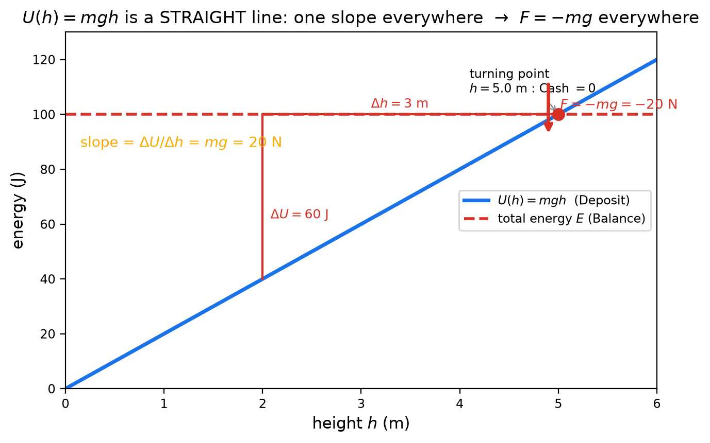
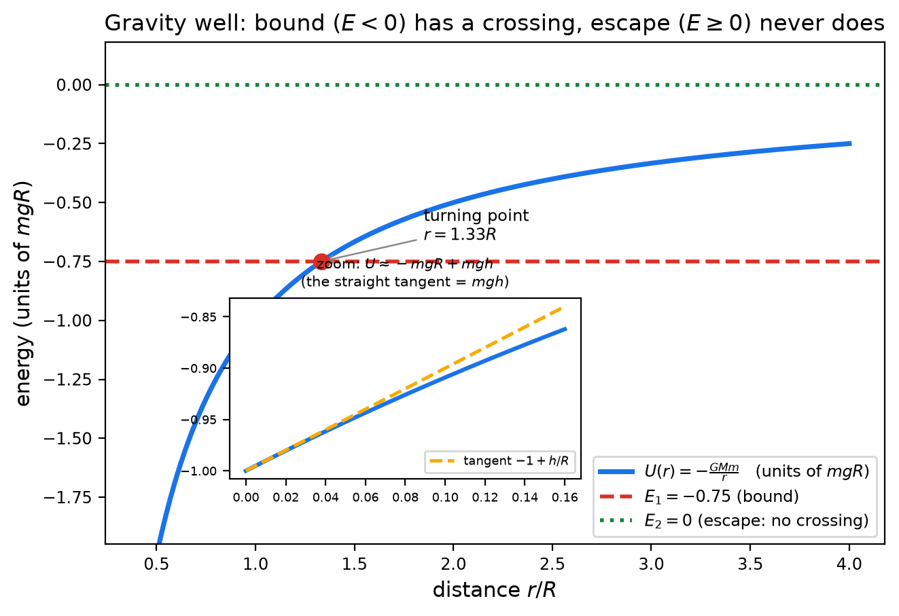
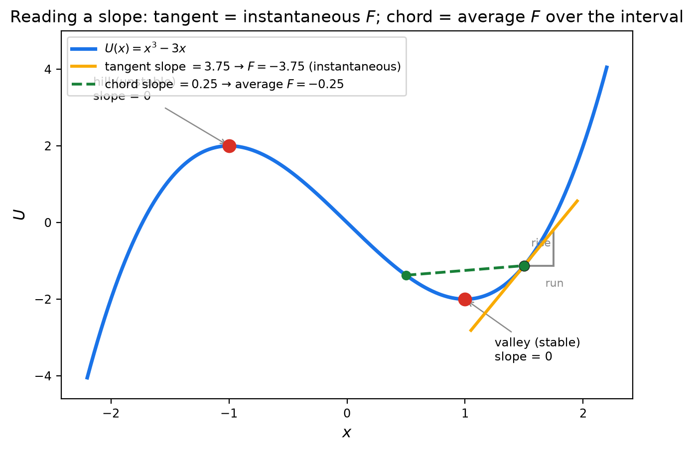
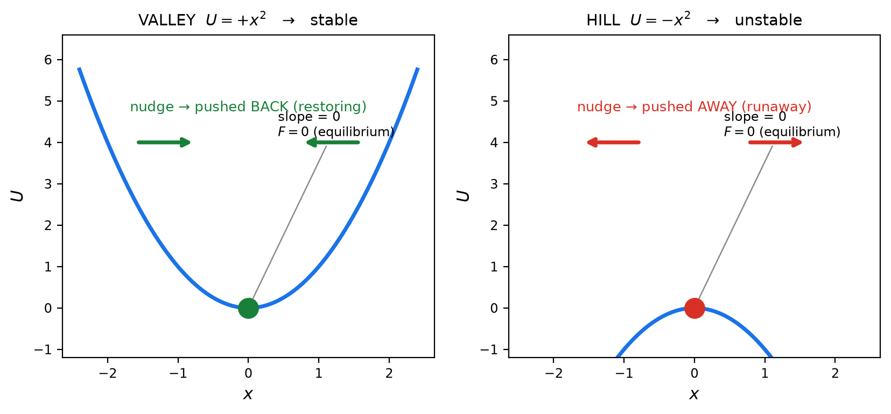

# Fields & Potential — 1단계: 역학 — 에너지 지형과 기울기의 발견

> **4단계 로드맵:** ① **`역학.md` (지금)** — $U$ 지형과 $F=-dU/dx$ 기울기의 발견 → ② `전자기학.md` — $V$ 지형과 $E=-dV/dr$ → ③ `통합1.md` — 네 가지 옷·공식 변환 지도 → ④ `통합2.md` — 3D 등고선·gradient·한 줄 사전·종합 문제.
> **Purpose:** 힘을 "물체 사이의 신비한 작용"이 아니라 **에너지 지형의 경사도**로 다시 본다. 이 문서 전체는 단 한 문장의 증명이다:
> $$F = -\frac{dU}{dx} \qquad\text{= } \text{“힘은 예금(Deposit)이 줄어드는 내리막 방향으로, 경사만큼 센다”}$$
> **Level:** Regular Physics / SAT Physics — **algebraic only, no calculus.** $dU/dx$는 미분이 아니라 **그래프의 기울기(경사도)**로만 읽습니다.
> **How to use:** Part A–D를 읽으면서 그림을 **직접 손으로 베껴 그려보고**, Problem 1–5를 순서대로 푸세요. Full solutions (✅ Solution)는 [`solutions/역학-solutions.md`](solutions/역학-solutions.md). 그래프 재생성: `python3 generate_graphs.py`.
> **The core feel to build:** 마이너스 부호는 수학 장식이 아니라 **"내리막 방향"이라는 뜻 하나**입니다.

---

# Part A — Deposit(퍼텐셜 에너지)을 다시 봅시다

은행 비유를 한 문단으로 복습합니다: 각 물체의 **Cash**는 운동 에너지, 둘 이상이 **공동 소유한 Deposit**은 퍼텐셜 에너지, **Balance**는 그 합(= 역학적 에너지)이고 계 수준에서 보존됩니다. 이번 단계에서 우리가 공격하는 질문은 하나입니다:

> **"Deposit이 위치에 따라 어떻게 변하는가?" — 그 변화율(기울기)이 바로 힘이다.**

대표적인 Deposit 두 개를 표로 놓으면, 이 문서가 증명할 핵심이 이미 다 보입니다:

| 계 | Deposit $U$ | 기울기 $\dfrac{dU}{dx}$ | 힘 $F = -\dfrac{dU}{dx}$ |
|---|---|---|---|
| 지표면 근처 중력 | $mgh$ | $mg$ | $-mg$ (아래로) |
| 용수철 | $\frac{1}{2}kx^2$ | $kx$ | $-kx$ (원점으로) |

두 줄이 전부입니다. 아래에서 그래프로 직접 확인합니다.

**중요한 자유 하나:** $U$에 **상수를 통째로 더해도**(기준점을 옮겨도) 기울기는 안 변합니다. 가격표의 영점은 마음대로 잡아도 되고, **경사만이 물리적**입니다. 이 자유가 Part B3에서 $mgh$를 만들어냅니다.

---

# Part B — 에너지 다이어그램 마스터 클래스

## B0. 공식의 유도: 왜 $F = -dU/dx$인가 (3줄 증명)

그래프가 왜 힘을 알려주는지, 미적분 없이 대수로 유도합니다. 준비물은 두 가지입니다:

1. **일의 정의:** 힘 $F$가 작은 변위 $\Delta x$ 동안 한 일은 $W = F\,\Delta x$ (같은 방향이면 $+$, 반대면 $-$).
2. **보존력과 Deposit의 관계:** $\Delta U = -W$. 힘이 일을 해주면 그만큼 예금이 줄어든다는 뜻입니다. 언덕을 내려가면 중력이 $+$의 일을 하고 Deposit $U$는 감소합니다 — 이 마이너스가 공식의 씨앗입니다.

둘을 조립합니다. 외부 거래가 없으면 Balance는 보존되고($\Delta K + \Delta U = 0$), 일–에너지 정리에 따르면 Cash의 변화는 힘이 한 일과 같습니다($\Delta K = W = F\,\Delta x$). 따라서:

$$\underbrace{F\,\Delta x}_{=\ \Delta K} + \underbrace{\Delta U}_{=\ -W} = 0 \qquad\Rightarrow\qquad F\,\Delta x = -\Delta U \qquad\Rightarrow\qquad F = -\frac{\Delta U}{\Delta x}$$

$\Delta x$를 한없이 작게 잡으면, $\Delta U/\Delta x$는 그 지점의 **기울기** $dU/dx$가 됩니다:

$$\boxed{\;F = -\frac{dU}{dx}\;}$$

- **마이너스의 출처:** $\Delta U = -W$, 즉 "예금은 힘이 한 일만큼 줄어든다"입니다. 마이너스는 수학 장식이 아니라 에너지 보존이 새긴 방향 표지판입니다 (마이너스를 지우면 Balance가 저절로 불어나는 영구기관이 됩니다 — 4단계에서 다룹니다).
- **검산 1 (직선):** $U=mgh$는 직선이므로 $\Delta U/\Delta h = mg$가 어느 구간에서나 같습니다 → $F = -mg$ ✓
- **검산 2 (곡선):** $U=\frac{1}{2}kx^2$에서 $x$에서 $x+\Delta x$로 갈 때
  $$\Delta U = \tfrac{1}{2}k\big[(x+\Delta x)^2 - x^2\big] = kx\,\Delta x + \tfrac{1}{2}k(\Delta x)^2 \;\Rightarrow\; \frac{\Delta U}{\Delta x} = kx + \tfrac{1}{2}k\,\Delta x \;\xrightarrow{\ \Delta x \to 0\ }\; kx \;\Rightarrow\; F = -kx$$ ✓
  이 전개가 곡선의 기울기를 대수로 재는 방법입니다. 미적분이 필요한 것은 마지막 $\Delta x \to 0$ 한 걸음뿐이고, 그 의미는 B4에서 다룹니다.

> **B0의 결론:** $F = -dU/dx$는 새로운 법칙이 아니라 **일의 정의 + 예금의 정의 + Balance 보존** 세 줄의 조립입니다. 이어지는 그림들은 이 공식을 눈으로 읽는 훈련입니다.

---

## B1. 용수철: 한 장의 그림에 역학 전부

용수철 $k=200$ N/m, 물체 $m=1.0$ kg, 총 에너지 $E=4.0$ J의 **에너지 다이어그램**입니다. 이 그림 한 장에서 다섯 가지가 전부 읽힙니다 — 이것이 이번 단계의 핵심 5원칙입니다:

1. **Cash(KE) = $E$선과 $U$곡선 사이의 세로 간격** — $E - U(x)$. 바닥($x=0$)에서 최대, 교점에서 0.
2. **교점 = turning point** — Cash가 0이 되어 물체가 방향을 돌리는 지점 ($x=\pm0.20$ m).
3. **접선의 기울기 = 힘의 크기(부호 반대)** — $x=0.10$ m에서 접선 기울기 $kx = +20$ N → $F = -20$ N (왼쪽으로).
4. **기울기 0 = 평형** — 골짜기 바닥 $x=0$에서 $F=0$.
5. **마이너스 = 내리막** — 힘은 항상 Deposit이 *낮아지는* 쪽. 공은 언덕에서 굴러떨어집니다.

> 이 5원칙은 용수철 전용이 아닙니다. **어떤** $U(x)$ 그래프에도 그대로 적용됩니다. B4에서 그걸 연습합니다.

## B2. $mgh$: 직선의 특권

$U(h)=mgh$는 **직선**입니다 ($m=2$ kg, $E=100$ J). 직선이 주는 특권은 하나 — **기울기가 어디서나 같다**는 것. 그래서:

- 어느 구간이든 $\dfrac{\Delta U}{\Delta h} = mg = 20$ N (빨간 삼각형: 60 J ÷ 3 m) — 미분이 필요 없습니다.
- $F = -mg = -20$ N **어디서나** 아래쪽. "무게"가 곧 이 직선의 경사도입니다.
- $E$선과의 **교점 $h=5$ m = 최고점** — 던져올린 공이 멈춰서 방향을 도는 곳.

## B3. 중력 우물: 음수 예금, bound vs escape

진짜 중력 $U(r) = -GMm/r$은 **음수 우물**입니다 (단위 $mgR$로 그렸습니다).

- **음수 예금의 의미:** 멀리 갈수록 예금이 커지고(0에 가까워지고), 가까울수록 더 음수 — 즉 계가 **우물에 묶여(bound) 있다**는 뜻입니다. 탈출하려면 그 빚을 전부 갚아야 합니다.
- **$E<0$ (bound):** $E$선과 곡선의 **교점 = 최고점** ($E_1=-0.75$ → $r=1.33R$). 올라갔다가 반드시 돌아옵니다.
- **$E\ge0$ (escape):** $E=0$선은 곡선과 **영원히 만나지 않습니다** — 교점이 없으니 돌아올 지점도 없습니다.
- **인셋이 핵심:** 지표면 근처를 확대하면 우물 벽이 **접선(직선)**과 구분이 안 됩니다. $U \approx -mgR + mgh$이고, 상수 $-mgR$은 기준 재조정으로 지워지므로 → **$U = mgh$.** 익숙한 공식의 정체가 "지구의 Deposit 가격표를 지표 근처에서 직선 근사한 것"이었습니다.

## B4. 기울기 읽는 법 자체: 접선 vs 현

"기울기"를 정확히 읽는 연습입니다. $U(x)=x^3-3x$라는 낯선 지형을 봅니다.

- **접선(tangent)의 기울기 = 그 점의 순간적인 힘.** $x=1.5$에서 접선 기울기 $+3.75$ → $F=-3.75$ (왼쪽으로).
- **현(chord)의 기울기 = 구간의 평균 힘.** $x=0.5$와 $1.5$를 잇는 현의 기울기 $+0.25$ → 평균 $F=-0.25$.
- **곡선에서는 접선 ≠ 현** (3.75 vs 0.25). 직선에서만 둘이 같습니다 — B2의 $mgh$가 그 특별한 경우.
- $dY/dX$ 읽기란 결국: **"그 지점에 자를 대고 경사를 재는 것"**. 미분은 그 자를 무한히 짧게 대는 기술일 뿐, 개념은 여기서 끝입니다.
- 이 지형에는 기울기 0인 점이 둘 있습니다 — 다음 B5로.

## B5. 평형의 두 얼굴: 골짜기 vs 언덕

두 경우 모두 **기울기 0 → $F=0$ → 평형**입니다. 그런데 운명이 정반대입니다.

- **골짜기(왼쪽):** 살짝 밀면 기울기가 생겨 **복원력**이 밀어 되돌립니다 → **안정 평형**. (공을 그릇에 놓은 것)
- **언덕(오른쪽):** 살짝 밀면 기울기가 생겨 **더 멀리** 밀어냅니다 → **불안정 평형**. (공을 꼭대기에 올린 것)

**대수적 판정법(기울기의 부호 변화):** 그 점 왼쪽·오른쪽에서 기울기 부호를 재세요.
- 왼쪽: 기울기 **음** → 오른쪽: 기울기 **양** = 골짜기 = **안정** (B1의 $x=0$이 이 경우)
- 왼쪽: 기울기 **양** → 오른쪽: 기울기 **음** = 언덕 = **불안정** (B4의 $x=-1$이 이 경우)

---

# Part C — dY/dX 한 줄 사전 (역학편)

| 기호 | 한 줄 의미 |
|---|---|
| $U(x)$ | 이 위치에서의 공동 예금 = **에너지 지형의 고도** |
| $\dfrac{dU}{dx}$ | 지형의 **경사도** — 가파를수록 큰 수 |
| $-\dfrac{dU}{dx}$ | 경사도의 반대 방향 = **내리막으로 미는 힘** |
| 기울기 $=0$ | 평평한 지점 = 평형 (골짜기면 안정, 언덕이면 불안정) |
| 접선의 기울기 | 그 지점의 **순간** 힘 |
| 현의 기울기 | 구간의 **평균** 힘 |
| $E$선과의 교점 | turning point — Cash 0, 방향 전환 |
| 세로 간격 $E-U$ | Cash(운동 에너지) |
| $U$의 상수 이동 | 기준점 재조정 — 기울기·힘에 영향 없음 |

---

# Part D — 이 그림이 중요한 이유 (다음 단계 예고)

1. 힘을 **벡터로 하나하나 더하지 않고 지형 하나로** 전부 읽습니다. 용수철+중력+마찰이 섞인 문제도 $U(x)$ 하나에 다 들어갑니다.
2. 평형·진폭·최고점·탈출 같은 **"어디까지 가는가" 질문**은 그래프의 교점 문제가 됩니다.
3. 이 지형 사고방식이 그대로 **전기**로 이어집니다: 전하 $Q$가 깔아놓은 전위 $V(r)$도 같은 지형이고, $E = -dV/dr$도 같은 기울기 문장입니다 — 2단계 `전자기학.md`에서 똑같은 5원칙을 다시 씁니다.

---

# Problems

## Problem 1 — 한 장의 그림에서 역학 전부 읽기

B1의 그림($k=200$ N/m, $m=1.0$ kg, $E=4.0$ J)을 보고 답하세요.

<b>1.1</b>

평형점은 어디이고 그곳의 힘은? 그래프의 어느 특징이 그것을 말해주는지 "기울기"라는 단어로 설명하세요.

<b>1.2</b>

$x=+0.10$ m에서 힘의 크기와 방향을 (i) $F=-kx$로 계산하고, (ii) 그래프의 접선 기울기로도 읽으세요. 두 답이 일치함을 보이세요.

<b>1.3</b>

최대 진폭 $A$는 그래프의 어느 점에 해당하나요? $x=0$을 지날 때의 최대 속력을 구하고, 그래프에서 Cash(KE)가 정확히 어느 세로 간격인지 말하세요.

→ ✅ [Solution (Problem 1)](solutions/역학-solutions.md#problem-1)

---

## Problem 2 — 직선 지형 $mgh$의 특권

B2의 상황($m=2.0$ kg, $E=100$ J, $g=10$ m/s²)에서.

<b>2.1</b>

$E$선과 $U(h)$ 직선의 **교점**을 읽어 최고점을 구하세요. 교점의 물리적 의미는?

<b>2.2</b>

빨간 삼각형으로 $\Delta U / \Delta h$를 계산해 기울기 $=mg$임을 확인하고, $F=-mg$가 **어디서나** 같음을 보이세요. 직선이 아닌 곡선이었다면 어땠을까요?

<b>2.3</b>

$h=3$ m에서 Cash와 Deposit을 구하세요. 이제 **기준점을 $h=2$ m로 옮기면**(모든 $U$에 $-40$ J) 기울기, 힘, 최고점은 변하나요? 변하는 것과 안 변하는 것을 구분하세요.

→ ✅ [Solution (Problem 2)](solutions/역학-solutions.md#problem-2)

---

## Problem 3 — 중력 우물: bound vs escape

$g=10$ m/s², $R=6.4\times10^6$ m, $GM=gR^2$을 사용. B3 그림 참고.

<b>3.1</b>

질량 $m$의 물체를 지표면에서 총 에너지 $E=-0.75\,mgR$로 수직 발사했다. $E = U(r)$를 풀어 최고점 $r_{\rm max}$을 구하고, 이것이 그래프의 **교점**임을 설명하세요.

<b>3.2</b>

**탈출 속도:** $E=0$이면 교점이 존재하지 않음을 그래프로 설명하고, $v_{\rm esc}=\sqrt{2gR}$을 유도해 수치로 계산하세요.

<b>3.3</b>

총 에너지가 정확히 $E=-mgR$인 물체는 무엇을 하고 있나요? (그래프의 어느 점인지 말하세요.)

<b>3.4</b>

$m=10$ kg 물체를 지표면에서 $h=1000$ m까지 올릴 때 $\Delta U$를 **접선 근사** $mgh$로 구하세요. 왜 접선으로 충분한지 인셋 그림으로 한 문장 설명하세요.

→ ✅ [Solution (Problem 3)](solutions/역학-solutions.md#problem-3)

---

## Problem 4 — 기울기 읽기 연습 (낯선 지형에서)

B4의 지형 $U(x)=x^3-3x$ (단위는 무시하고 도식적으로)를 봅니다.

<b>4.1</b>

$x=-1.8$, $x=0$, $x=+1.8$에서 기울기의 부호를 각각 판정하고(계산: $3x^2-3$), 힘의 방향을 말하세요. 각 지점에서 물체는 어느 쪽으로 밀리나요?

<b>4.2</b>

기울기가 0인 점을 모두 찾고, 각각이 **골짜기(안정)**인지 **언덕(불안정)**인지 좌우 기울기 부호로 판정하세요.

<b>4.3</b>

$x=0.5$와 $x=1.5$를 잇는 **현의 기울기**가 $+0.25$인데 $x=1.5$의 **접선 기울기**는 $+3.75$입니다. "평균 힘"과 "순간 힘"의 차이를 이 숫자들로 한 문장 설명하세요.

→ ✅ [Solution (Problem 4)](solutions/역학-solutions.md#problem-4)

---

## Problem 5 — 평형의 두 얼굴 + 단계 요약

<b>5.1</b>

B5의 골짜기와 언덕 각각에서, 공을 아주 살짝 옆으로 밀었을 때 벌어지는 일을 **기울기의 부호**를 써서 서술하세요.

<b>5.2</b>

두 경우 모두 기울기가 0인데 왜 하나만 안정적인가요? "기울기의 부호 변화"로 한 문장 답하세요.

<b>5.3</b>

이번 단계 전체를 **한 문장**으로 요약하세요. (힌트: 힘, 경사, 내리막 — 세 단어를 모두 쓰세요.)

→ ✅ [Solution (Problem 5)](solutions/역학-solutions.md#problem-5)
