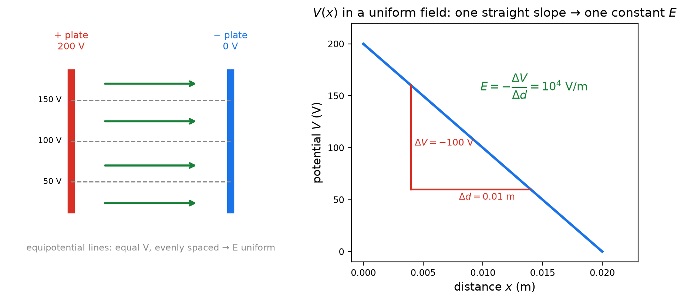
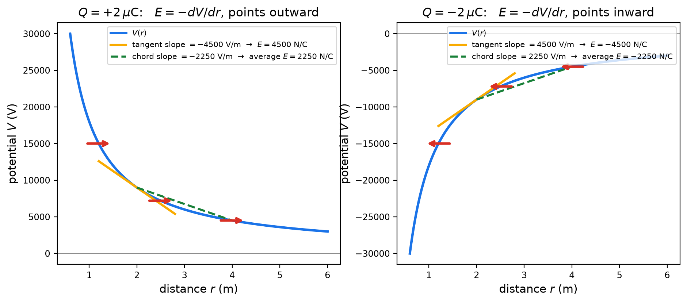
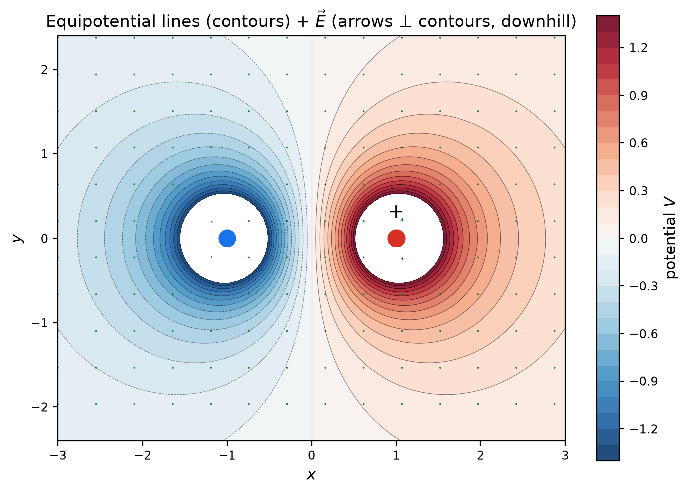
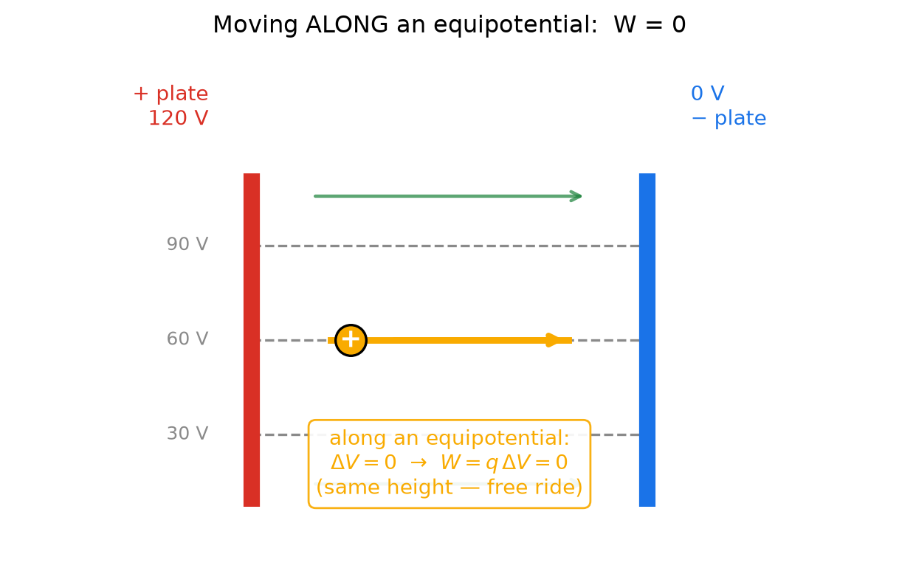
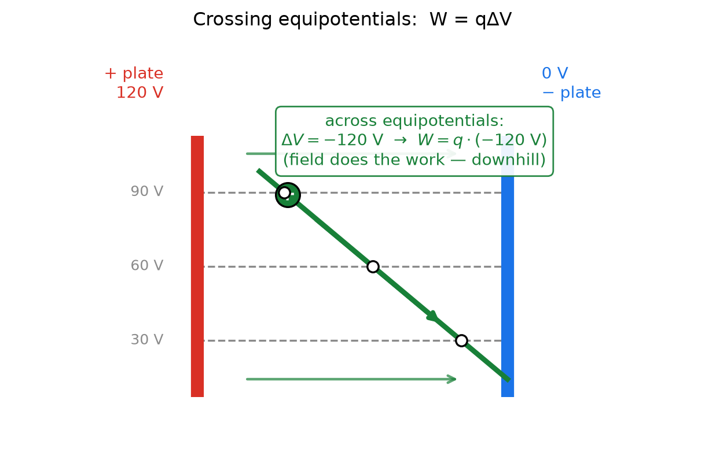

# Fields & Potential — 2단계: 전자기학 — 전위 지형과 전기장의 발견

> **4단계 로드맵:** ① `역학.md` (완료) — $F=-dU/dx$ → ② **`전자기학.md` (지금)** — $E=-dV/dr$ → ③ `통합1.md` — 네 가지 옷·공식 변환 지도 → ④ `통합2.md` — 3D 등고선·gradient·한 줄 사전·종합 문제.
> **Purpose:** 1단계에서 발견한 "힘 = 에너지 지형의 내리막 경사"를 전기로 옮깁니다. 문장은 그대로이고 글자만 바뀝니다: $F \to E$, $U \to V$, 즉
> $$E = -\frac{dV}{dr} \qquad\text{= } \text{“전기장은 전위 지형의 내리막 경사다”}$$
> **Level:** Regular Physics / SAT Physics — **algebraic only, no calculus.** $dV/dr$는 그래프의 기울기로만 읽습니다.
> **How to use:** Part A–D를 읽고 Problem 1–5를 순서대로 푸세요. Full solutions (✅ Solution)는 [`solutions/전자기학-solutions.md`](solutions/전자기학-solutions.md). 그래프 재생성: `python3 generate_graphs.py`.
> **The core feel to build:** 전위 $V$는 "1 C당 공동 예금"이라는 **지형의 고도**이고, 전기장 $E$는 그 지형의 **경사도**입니다. 나머지는 모두 그래프 읽기입니다.

---

# Part A — 새 장부 열기: 전기장과 전위

역학에서 한 일을 그대로 한 번 더 합니다 — **시험 전하 $q$로 나누기.** 점전하 $Q$가 만드는 힘부터 출발합니다:

$$F = k\frac{Qq}{r^2} \;\xrightarrow{\;\div q\;}\; E = k\frac{Q}{r^2} \;\xrightarrow{\;\text{거리 적분}\;} U = k\frac{Qq}{r} \;\xrightarrow{\;\div q\;}\; V = k\frac{Q}{r}$$

| 옷 | 공식 | 한 줄 의미 |
|---|---|---|
| 힘 | $F = kQq/r^2$ | 이 두 전하 사이에 실제로 작용하는 힘 |
| **장** $E$ | $E = kQ/r^2$ (N/C) | 원천 $Q$가 공간에 깔아둔 "**1 C이 받을 힘**" — 시험 전하 없이도 존재 |
| 에너지 $U$ | $U = kQq/r$ | 이 위치에서 둘 사이의 공동 예금 |
| **전위** $V$ | $V = kQ/r$ (J/C = volt) | "**1 C당** 공동 예금" = 지형의 **고도** |

**이 표의 핵심 세 문장:**

1. **Field의 정체:** $E = F/q$는 시험 전하를 지운 식입니다. 그래서 $E(\mathbf{r})$는 **원천 혼자서 공간의 모든 점에 깔아놓은 것**이고, 전하는 그 자리의 값을 읽어 $F = qE$로 힘을 받습니다.
2. **전위의 정체:** $V = U/q$는 "그 자리에 1 C을 갖다 놓으면 생길 공동 예금"입니다. 그래서 $V(\mathbf{r})$는 **전기 지형의 고도**이고, 실제 예금은 $U = qV$ — "내 전하 × 그 자리 가격"입니다.
3. **부호의 자유:** 중력 퍼텐셜과 달리 $V$는 $Q$의 부호에 따라 양도 음도 됩니다. 양전하 주변은 "언덕", 음전하 주변은 "구덩이"입니다. 이것이 B2와 B3의 지형 해석을 풍부하게 만듭니다.

---

# Part B — $V$ 지형의 기울기: $E = -dV/dr$

## B0. 공식의 유도 (역학 B0의 3줄 증명, 전하 버전)

준비물은 역학과 동일한 두 가지입니다:

1. **일의 정의:** 힘 $F$가 작은 변위 $\Delta r$ 동안 한 일은 $W = F\,\Delta r$.
2. **보존력과 예금의 관계:** $\Delta U = -W$. 힘이 일을 해주면 그만큼 예금이 줄어듭니다.

$U = qV$를 넣으면 $\Delta U = q\,\Delta V$이므로:

$$F\,\Delta r = -q\,\Delta V \quad\Rightarrow\quad F = -q\,\frac{\Delta V}{\Delta r} \quad\xrightarrow{\;\div q\;}\quad E = -\frac{\Delta V}{\Delta r}$$

$\Delta r$를 한없이 작게 잡으면 $\Delta V/\Delta r$는 그 지점의 **기울기** $dV/dr$가 됩니다:

$$\boxed{\;E = -\frac{dV}{dr}\;}$$

- **검산 1 (직선 — 균일장):** $V(x)$가 직선이면 기울기가 일정하므로 $E = \Delta V/d$가 정확합니다 (B1).
- **검산 2 (곡선 — 점전하):** $V=kQ/r$에서 $r \to r+\Delta r$로 갈 때
  $$\Delta V = kQ\Big[\frac{1}{r+\Delta r}-\frac{1}{r}\Big] = -\frac{kQ\,\Delta r}{r(r+\Delta r)} \;\Rightarrow\; \frac{\Delta V}{\Delta r} = -\frac{kQ}{r(r+\Delta r)} \;\xrightarrow{\ \Delta r \to 0\ }\; -\frac{kQ}{r^2} \;\Rightarrow\; E = +\frac{kQ}{r^2}$$ ✓
  균일장은 이 곡선 지형을 **판 사이에서 직선 근사**한 것입니다.

> **B0의 결론:** $E = -dV/dr$는 새로운 법칙이 아니라 일의 정의 + 예금의 정의 + $U=qV$의 조립입니다. 이어지는 그림 넷은 이 공식을 눈으로 읽는 훈련입니다.

## B1. 균일장: 직선 지형 (평행판)

두 평행판 사이(간격 $d=2$ cm, 전압 $200$ V)에서는 $V(x)$가 **직선**입니다.

- 직선의 특권: **기울기가 어디서나 같음** → $E = -\Delta V/\Delta d = 10^4$ V/m **어디서나 일정**.
- 왼쪽 그림의 등전위선(50, 100, 150 V)이 **등간격**인 이유가 이것입니다 — 경사가 일정한 비탈.
- 방향: $E$는 전위가 **낮아지는 쪽** (+판 → −판), 즉 내리막.

## B2. 점전하: 곡선 지형

$V(r) = kQ/r$은 곡선이므로 기울기가 **점마다 다릅니다** — 그래서 $E$도 점마다 다릅니다.

- **접선의 기울기 = 그 지점의 순간 $E$.** $r=2$ m에서 접선 기울기 $-4500$ V/m → $E = 4500$ N/C (바깥쪽).
- **현의 기울기 = 구간의 평균 $E$.** $r=2\to4$ m의 현 기울기 $-2250$ V/m → 평균 $E = 2250$ N/C. 접선과 현이 다름 = 역학 B4와 같은 이유.
- **전하에 가까울수록 곡선이 가파름** → $E$가 셈 (그래프가 그대로 말해줍니다).
- **부호가 방향을 정합니다:** $Q>0$은 언덕(올라갈수록 $V$ 증가) → $E$ 바깥쪽. $Q<0$은 구덩이 → $E$ 안쪽. 두 경우 모두 **내리막**입니다.

## B3. 등전위선 지도: 등고선과 물길

양전하와 음전하 옆에 나란히 — 전위를 **등고선**으로 그린 지도입니다.

- **등전위선 = 등고선:** 같은 선 위에서는 $V$가 일정 → $\Delta V = 0$ → 필드가 하는 일 $W = q\Delta V = 0$.
- **$\vec{E}$는 등고선에 수직, 내리막 방향** (초록 화살표 = 물길). 양전하 언덕에서 음전하 구덩이로 흘러내립니다.
- **등고선이 촘촘한 곳 = 경사 급함 = $E$가 셈.** 두 전하 가까이에서 등고선이 몰리는 것이 그 증거입니다.
- 이 지도는 3차원 지형을 위에서 내려다본 것입니다 — 4단계에서 실제 3D로 세워봅니다.

## B4. 일과 경로: $W = q\Delta V$

전하를 옮기는 두 경로를 각각 그려 비교합니다 ($120$ V 판 → $0$ V 판, $q = +2\,\mu$C).

 

- **왼쪽 — 등전위선을 따라:** $\Delta V = 0$ → $W = q\Delta V = 0$. 등고선을 따라 걸으면 높이가 안 변하듯, 공짜입니다.
- **오른쪽 — 등전위선을 가로질러:** $\Delta V = -120$ V → $W = q\Delta V = -2.4\times10^{-4}$ J. 음수 = **필드가 일을 해줍니다** (내리막). 흰 점들은 경로가 90 V, 60 V, 30 V 선을 지나는 지점입니다.
- **경로와 무관하게 출발점과 도착점의 $V$ 차이만이 일을 결정합니다.** 이것이 정전기력이 **보존력**이라는 뜻이고, 그래서 $V$라는 "고도"가 존재할 수 있는 이유입니다. (마찰은 경로마다 일이 달라서 "고도"를 정의할 수 없습니다.)

---

# Part C — dY/dX 한 줄 사전 (전자기학편)

| 기호/공식 | 한 줄 의미 |
|---|---|
| $E$ | 원천이 공간에 깔아둔 "**1 C이 받을 힘**" — 시험 전하 없이도 존재 |
| $V$ | "**1 C당** 공동 예금" = 전기 지형의 **고도** |
| $U = qV$ | 내 전하 × 그 자리 가격 = 내가 이 계좌에 넣은 돈 |
| $W = q\Delta V$ | 고도 차이 × 전하 = 이동하며 주고받는 일 (경로 무관) |
| $\dfrac{dV}{dr}$ | 전위 지형의 **경사도** (가파를수록 큰 수) |
| $E = -\dfrac{dV}{dr}$ | 전기장 = 전위 지형의 **내리막 경사** |
| 등전위선 | 고도가 같은 등고선 — 따라 움직이면 $W=0$ |
| 전기력선 | 공이 굴러가는 **물길** — 매 점에서 $E$ 방향, 등고선에 수직 |
| eV | 전자 1개가 **1 V 내리막**을 탈 때 얻는 에너지 ($1.6\times10^{-19}$ J) |

---

# Part D — 다음 단계 예고

역학의 $F=-dU/dx$와 전자기학의 $E=-dV/dr$가 **글자만 다른 같은 문장**임이 보였다면 2단계는 완료입니다. 3단계 `통합1.md`에서는 이 두 장부를 한 표로 합치고(힘/장/에너지/전위 네 가지 옷), 한 문제를 네 가지 옷으로 풀어 같은 답이 나옴을 확인합니다.

---

# Problems

## Problem 1 — 균일장: 직선 지형 읽기

평행판 $d=2.0$ cm, 전압 $200$ V (B1 그림).

<b>1.1</b>

$E$의 크기와 방향을 구하세요. B1 그래프에서 $E$가 **무엇으로 보이는지** 한 문장으로.

<b>1.2</b>

$+3.0\,\mu$C 전하가 받는 힘과, 한 판에서 반대 판까지 건너며 얻는 운동 에너지를 구하세요.

<b>1.3</b>

전자($-1.6\times10^{-19}$ C)를 **낮은 전위 판**에서 출발시키면 어느 방향으로 가속되나요? 건널 때 얻는 KE를 **J와 eV** 둘 다로 구하고, eV가 편한 이유를 한 문장으로.

→ ✅ [Solution (Problem 1)](solutions/전자기학-solutions.md#problem-1)

---

## Problem 2 — 점전하: 곡선 지형 읽기 (접선 vs 현)

$Q = +2.0\,\mu$C, $k = 9.0\times10^9$ (B2 그림).

<b>2.1</b>

$r = 1$, $2$, $4$ m에서 $V = kQ/r$를 각각 계산하세요.

<b>2.2</b>

$r=2$ m에서 **접선 기울기**로 순간 $E$를, $r=2\to4$ m **현의 기울기**로 평균 $E$를 구하세요. 두 값이 다른 이유를 "곡선에서는 접선 ≠ 현"으로 한 문장 설명하세요.

<b>2.3</b>

$-2.0\,\mu$C를 **무한히 먼 곳**에서 $r=2$ m까지 데려오는 일은 몇 J인가? 누가 일을 도와주나요? 전하가 $+2.0\,\mu$C라면 답이 어떻게 바뀌나요?

→ ✅ [Solution (Problem 2)](solutions/전자기학-solutions.md#problem-2)

---

## Problem 3 — 등전위선 지도 읽기

B3의 쌍극자 지도를 보고 답하세요.

<b>3.1</b>

$+2.0\,\mu$C 전하가 **같은 등전위선 위를** 이동한다. 필드가 한 일은? 그 이유를 $W = q\Delta V$로 한 줄 설명하세요.

<b>3.2</b>

$\vec{E}$ 화살표(초록)와 등전위선의 **기하적 관계**를 말하세요. 그리고 $\vec{E}$가 가리키는 방향이 전위의 높낮이와 어떤 관계인지 한 문장으로.

<b>3.3</b>

등고선이 **촘촘한 곳**에서 $E$가 센 이유를 설명하고, 양전하를 지도 위 아무 곳에 놓으면 어느 쪽으로 움직이는지 말하세요.

→ ✅ [Solution (Problem 3)](solutions/전자기학-solutions.md#problem-3)

---

## Problem 4 — 일과 경로: $W = q\Delta V$

B4의 두 그림 ($120$ V 판 → $0$ V 판, $q=+2.0\,\mu$C)을 보고 답하세요.

<b>4.1</b>

경로 A(60 V 등전위선을 따라)에서 필드가 한 일을 구하세요.

<b>4.2</b>

경로 B(등전위선들을 가로질러)에서 필드가 한 일을 구하세요. 부호의 의미는?

<b>4.3</b>

출발점과 도착점이 같다면 어떤 경로로 가든 일이 같은 이유는 무엇인가요? 이것이 정전기력의 어떤 성질을 뜻하는지, 그리고 왜 그래서 "고도" $V$가 존재할 수 있는지 한 문장으로.

→ ✅ [Solution (Problem 4)](solutions/전자기학-solutions.md#problem-4)

---

## Problem 5 — 유도를 직접 재현하기

<b>5.1</b>

다음 순서로 $E = -dV/dr$를 직접 유도하세요: (i) $W = F\,\Delta r$, (ii) $\Delta U = -W$, (iii) $U = qV$를 (ii)에 대입. 마이너스가 어느 단계에서 생기는지 표시하세요.

<b>5.2</b>

$V = kQ/r$에서 $\Delta V = V(r+\Delta r) - V(r)$를 **통분해서 직접 전개**하고, $\Delta r \to 0$으로 보내 $E = kQ/r^2$를 얻으세요 (B0 검산 2 재현).

<b>5.3</b>

$V = Ed$와 $V = kQ/r$의 관계를 "곡선과 접선"의 언어로 한 문장 쓰고, 이번 단계 전체를 한 문장으로 요약하세요.

→ ✅ [Solution (Problem 5)](solutions/전자기학-solutions.md#problem-5)
