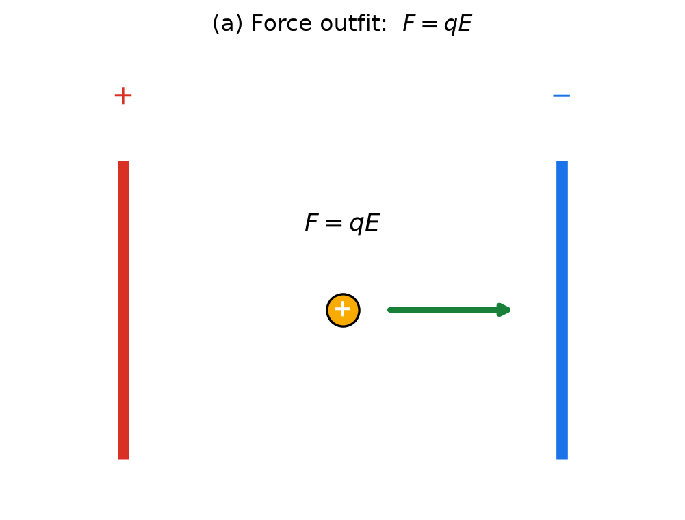
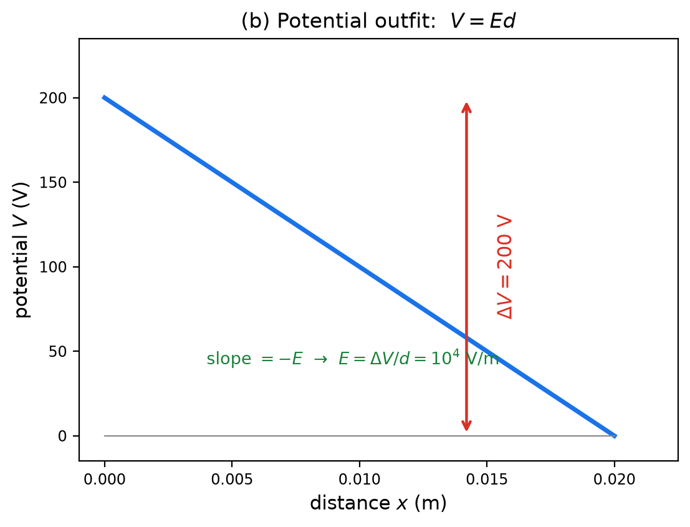
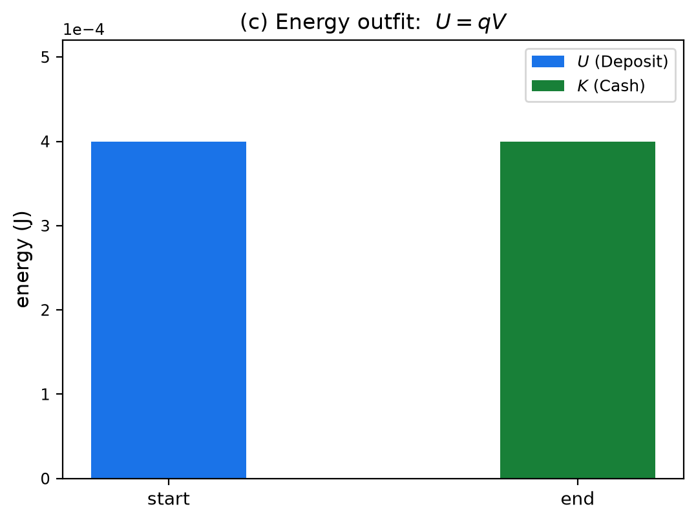
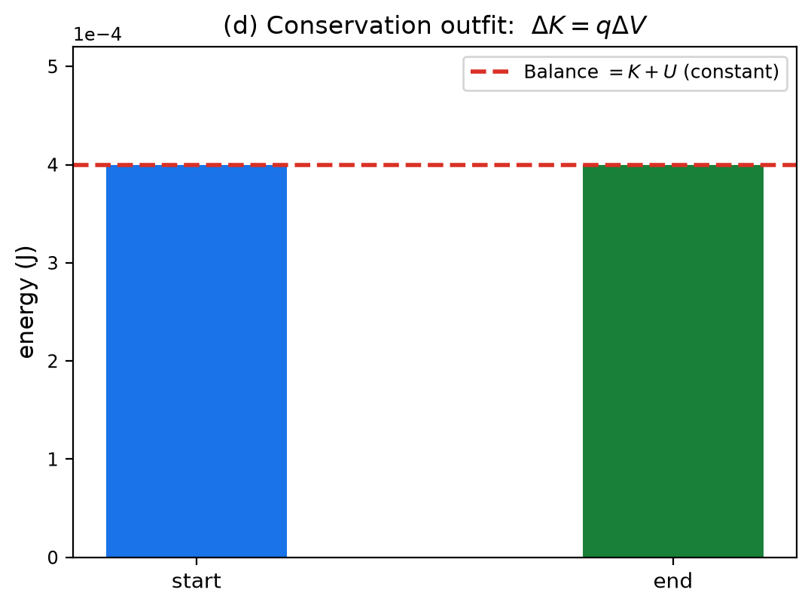

# Fields & Potential — 3단계: 통합1 — 네 가지 옷과 공식 변환 지도

> **4단계 로드맵:** ① `역학.md` (완료) — $F=-dU/dx$ → ② `전자기학.md` (완료) — $E=-dV/dr$ → ③ **`통합1.md` (지금)** — 두 장부 합치기 → ④ `통합2.md` — 3D 등고선·gradient·한 줄 사전·종합 문제.
> **Purpose:** 1·2단계에서 각각 발견한 두 공식이 **글자만 다른 같은 문장**임을 확인하고, 같은 법칙의 **네 가지 옷**(힘 / 장 / 에너지 / 전위)을 자유롭게 갈아입는 훈련을 합니다. 결론은 하나입니다 — **한 문제를 네 가지 옷으로 풀어도 답은 같다.**
> **Level:** Regular Physics / SAT Physics — **algebraic only, no calculus.**
> **How to use:** Part A–E를 읽고 Problem 1–5를 순서대로 푸세요. Full solutions (✅ Solution)는 [`solutions/통합1-solutions.md`](solutions/통합1-solutions.md). 그래프 재생성: `python3 generate_graphs.py`.
> **The core feel to build:** 공식이 "외우는 것"에서 "질문에 맞게 고르는 것"으로 바뀌는 단계입니다. 어떤 옷을 입을지는 **문제가 묻는 질문**이 정합니다.

---

# Part A — 두 장부를 합친 마스터 표

역학과 전자기학을 한 표에 나란히 놓습니다. 1·2단계의 전부가 이 표 한 장입니다.

| 옷 | 대답하는 질문 | 역학 | 전자기학 | 한 줄 의미 |
|---|---|---|---|---|
| ① 힘 | "지금 이 둘 사이의 힘은?" | $F=\dfrac{GMm}{r^2}$ | $F=k\dfrac{Qq}{r^2}$ | 실제 밀고당김 |
| ② 장 | "1단위 시험 물체가 받을 힘은?" | $g=\dfrac{GM}{r^2}$ (N/kg) | $E=k\dfrac{Q}{r^2}$ (N/C) | 원천이 공간에 깔아둔 것 (시험 물체 없이 존재) |
| ③ 에너지 | "이 위치의 공동 예금은?" | $U=-\dfrac{GMm}{r}$ | $U=k\dfrac{Qq}{r}$ | 둘 사이 공동 Deposit |
| ④ 전위 | "1단위당 예금(고도)은?" | $\varphi=-\dfrac{GM}{r}$ (J/kg) | $V=k\dfrac{Q}{r}$ (J/C = volt) | 지형의 고도 |
| ⑤ 기울기 | "어느 쪽으로, 얼마나 세게?" | $F=-\dfrac{dU}{dx},\ g=-\dfrac{d\varphi}{dr}$ | $E=-\dfrac{dV}{dr}$ | 경사도, 내리막 |

**행 사이의 네 가지 규칙** (옷 갈아입기의 전부):

1. **장 = 힘 ÷ 시험 속성:** $E=F/q$, $g=F/m$
2. **전위 = 에너지 ÷ 시험 속성:** $V=U/q$, $\varphi=U/m$
3. **곱해서 복원:** $F=qE$, $U=qV$, $F=mg$, $U=m\varphi$
4. **기울기가 밀림:** $F=-dU/dx$, $E=-dV/dr$, $g=-d\varphi/dr$ — 셋 다 같은 문장 "내리막 경사"입니다.

---

# Part B — 공식 변환 지도 (사다리)

각 과목의 공식들은 서로 다른 공식이 아니라 **한 사다리의 층들**입니다. 아래로 내려가면 "특수한 상황"이 되고, 위로 올라가면 "일반적인 상황"이 됩니다.

**역학 사다리:**

$$F=\frac{GMm}{r^2} \;\xrightarrow{\ \div m\ }\; g=\frac{GM}{r^2} \;\xrightarrow{\ \text{거리 적분}\ }\; \varphi=-\frac{GM}{r} \;\xrightarrow{\ \text{지표 접선}\ }\; \varphi\approx gh \;\xrightarrow{\ \times m\ }\; U=mgh \;\xrightarrow{\ \text{기울기}\ }\; F=mg$$

**전자기학 사다리:**

$$F=k\frac{Qq}{r^2} \;\xrightarrow{\ \div q\ }\; E=k\frac{Q}{r^2} \;\xrightarrow{\ \text{거리 적분}\ }\; V=k\frac{Q}{r} \;\xrightarrow{\ \text{균일장 근사}\ }\; V=Ed \;\xrightarrow{\ \times q\ }\; U=qV \;\xrightarrow{\ \text{기울기}\ }\; F=qE$$

**두 사다리에서 같은 세 가지가 일어납니다:**

1. **÷시험 속성**이 장과 전위를 만듭니다 (②④ — 공간의 성질).
2. **접선(직선) 근사**가 $mgh$와 $Ed$를 만듭니다 — 곡선 지형을 가까이서 보면 직선. 이것이 "어려운 공식이 교과서 앞부분 공식으로 접히는" 순간입니다.
3. **기울기가 밀림을 복원**합니다 — $U=mgh$의 기울기가 $mg$, $V=Ed$의 기울기가 $E$.

**왜 네 가지 옷이 존재하는가:** ①③은 "원천과 시험 물체 **둘 다**"가 식에 들어 있고, ②④는 시험 물체가 지워져 있습니다. 따라서 **시험 물체가 여러 개** 등장할수록 ②④가 압도적으로 편해집니다. 옷은 취향이 아니라 효율의 문제입니다.

---

# Part C — 한 문제, 네 가지 옷

**상황:** 전자 하나가 평행판 사이($d=2$ cm, $\Delta V=200$ V)를 건넌다.

| 옷 | 공식 | 계산 | 답 |
|---|---|---|---|
| ① 힘 | $F=qE$, $E=\dfrac{\Delta V}{d}$ | $F=(1.6\times10^{-19})\times10^4$ | $1.6\times10^{-15}$ N |
| ② 장·일 | $W=Fd$ | $1.6\times10^{-15}\times0.02$ | $3.2\times10^{-17}$ J |
| ③ 에너지 | $\Delta U=q\Delta V$ | $1.6\times10^{-19}\times200$ | $3.2\times10^{-17}$ J = 200 eV |
| ④ 보존 | $\frac{1}{2}mv^2=q\Delta V$ | $v=\sqrt{2q\Delta V/m}$ | $v\approx8.4\times10^6$ m/s |

**네 옷, 한 장부.** 어떤 옷으로 입어도 $3.2\times10^{-17}$ J = 200 eV라는 같은 답이 나옵니다. 차이는 "계산의 편의"뿐입니다.

---

# Part D — 그래프로 보는 네 가지 옷

같은 여행(전자 200 V 통과)을 네 장의 그림으로 그렸습니다:

 

 

- **(a) 힘의 옷:** 전하가 $F=qE$로 밀리는 그림. "얼마나 세게 밀리나"가 보입니다.
- **(b) 전위의 옷:** $V(x)$ 직선. "고도가 얼마나 떨어지나"가 보이고, 기울기가 $E$입니다.
- **(c) 에너지의 옷:** 출발/도착의 막대 — Deposit($U$)이 Cash($K$)로 바뀝니다.
- **(d) 보존의 옷:** 같은 막대에 Balance 선을 얹음 — **합은 불변**이고, Cash의 증가분이 정확히 $q\Delta V$입니다.

네 그림은 서로 다른 그림이 아니라 **같은 장부의 네 가지 페이지**입니다.

---

# Part E — 옷 고르는 법 (질문이 옷을 정한다)

| 문제가 묻는 것 | 고를 옷 | 공식 |
|---|---|---|
| "힘은 얼마?" | ① 힘 | $F=kQq/r^2$, $F=mg$ |
| "전압(고도 차이)이 주어졌다" | ③④ 에너지·전위 | $W=q\Delta V$, $U=mgh$ |
| "그래프에서 힘의 방향은?" | ⑤ 기울기 | $F=-dU/dx$, $E=-dV/dr$ |
| "어디까지 가나?" | 그래프의 교점 | $E$선 ∩ $U$곡선 |
| "시험 물체가 여러 개?" | ②④ 장·전위 | $F=qE$, $U=qV$ |

**한 문장 규칙:** 문제의 질문을 보고 옷을 고르세요. 옷이 바뀌어도 장부는 같습니다.

---

# Problems

## Problem 1 — 마스터 표 채우기

<b>1.1</b>

다음 표의 빈칸을 채우세요 (Part A를 보지 않고).

| | 역학 | 전자기학 |
|---|---|---|
| 힘 | | |
| 장 | | |
| 에너지 | | |
| 전위 | | |

<b>1.2</b>

각 행이 대답하는 질문을 한 문장씩 쓰고, ②④(장·전위)가 ①③과 다른 결정적 차이를 말하세요.

<b>1.3</b>

$V=U/q$에서 시작해 $F=qE$에 도달하는 경로를 규칙 1–4만으로 한 줄씩 쓰세요. 중간에 $E=-dV/dr$가 어떻게 들어가는지 표시하세요.

→ ✅ [Solution (Problem 1)](solutions/통합1-solutions.md#problem-1)

---

## Problem 2 — 사다리 오르내리기

<b>2.1</b>

$\varphi=-\dfrac{GM}{r}$에서 시작해, $r=R+h$ ($h\ll R$)일 때 $\varphi \approx -gR + gh$가 됨을 $GM=gR^2$으로 보이세요. 상수 $-gR$이 왜 무시 가능한지 한 문장으로.

<b>2.2</b>

$V=k\dfrac{Q}{r}$에서 시작해, 균일장에서는 $V=Ed$가 되는 이유를 "곡선과 접선"의 언어로 설명하세요. 무엇을 근사로 버리는 건가요?

<b>2.3</b>

$U=mgh$의 기울기가 $F=mg$를, $V=Ed$의 기울기가 $E$를 복원함을 확인하세요. 사다리를 내려갈 때 "잃어버리는 것"과 "보존되는 것"을 구분하세요.

→ ✅ [Solution (Problem 2)](solutions/통합1-solutions.md#problem-2)

---

## Problem 3 — 한 문제, 네 가지 옷 (직접 재현)

전자 하나가 평행판 사이($d=2.0$ cm, $\Delta V=200$ V)를 건넌다. $e=1.6\times10^{-19}$ C, $m_e=9.1\times10^{-31}$ kg.

<b>3.1</b>

**힘의 옷:** $E$를 구하고, 전자가 받는 힘 $F=qE$를 계산하세요. 힘의 방향은?

<b>3.2</b>

**장·일의 옷:** $W=Fd$로 판 사이를 건너며 얻는 에너지를 구하세요.

<b>3.3</b>

**에너지의 옷:** $\Delta U=q\Delta V$로 같은 양을 구하고 J와 eV로 쓰세요.

<b>3.4</b>

**보존의 옷:** $\frac{1}{2}mv^2=q\Delta V$로 전자의 최종 속력을 구하세요. 네 옷의 답이 같음을 확인하고, "옷은 편의일 뿐"임을 한 문장으로 정리하세요.

→ ✅ [Solution (Problem 3)](solutions/통합1-solutions.md#problem-3)

---

## Problem 4 — 옷 고르기 연습

각 상황에서 **가장 편한 옷**과 그 이유를 한 줄씩 답하세요.

<b>4.1</b>

두 점전하 $+3\,\mu$C와 $-2\,\mu$C가 $0.30$ m 떨어져 있다. 서로 당기는 힘은?

<b>4.2</b>

전압 $12$ V 배터리에 연결된 평행판에서, 전자 하나가 얻는 운동 에너지는?

<b>4.3</b>

$V(x)$ 그래프가 주어졌다. $x=2$ m에서 전하가 어느 쪽으로 밀리는가?

<b>4.4</b>

$20$ m/s로 던진 공의 최고점은?

<b>4.5</b>

한 판 근처에 전하를 100개 흩어놓았다. 각각이 받는 힘을 전부 구해야 한다면?

→ ✅ [Solution (Problem 4)](solutions/통합1-solutions.md#problem-4)

---

## Problem 5 — 그래프 통합 해석 (f_t1)

<b>5.1</b>

Part D의 네 그림 (a)–(d)가 **같은 여행**을 그린 것임을, 각 그림에서 읽히는 수치를 연결해 보이세요 (힘 → 일 → 에너지 → 속력).

<b>5.2</b>

마이너스 부호가 이 그림들 어디에 숨어 있는지 찾으세요: $F=-dU/dx$ 계열의 마이너스는 (b) 그림에서 무엇으로 보이는가?

<b>5.3</b>

(c)와 (d) 그림의 차이를 한 문장으로 말하고, "Balance 불변"이 왜 ④ 보존의 옷의 핵심인지 설명하세요.

→ ✅ [Solution (Problem 5)](solutions/통합1-solutions.md#problem-5)
