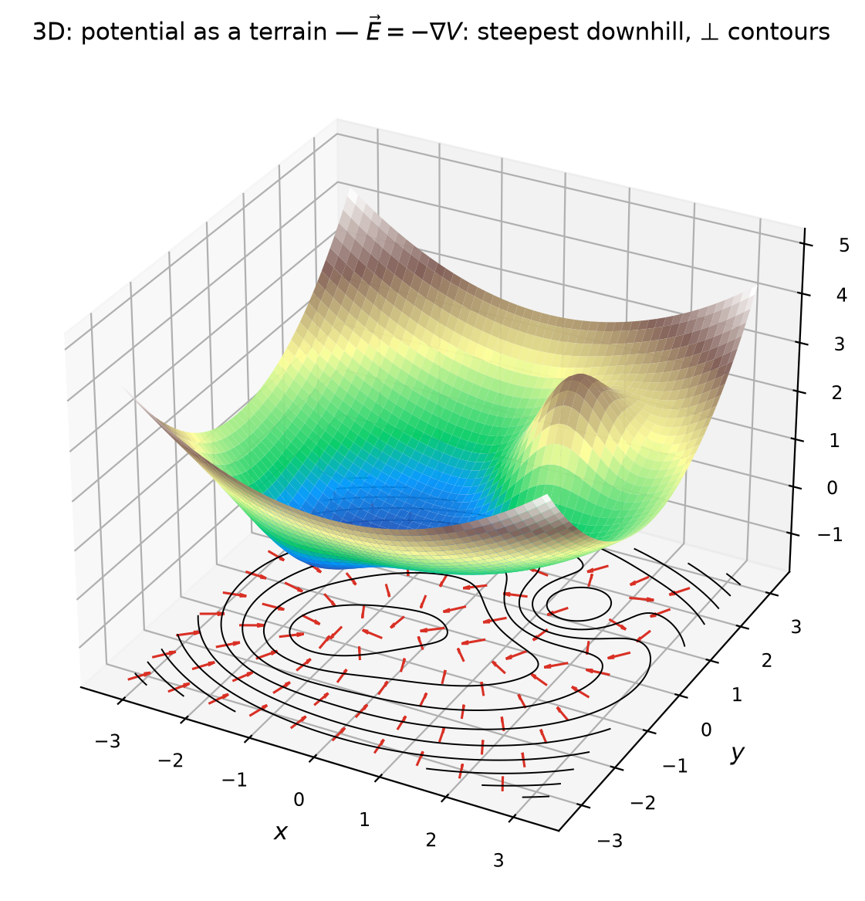
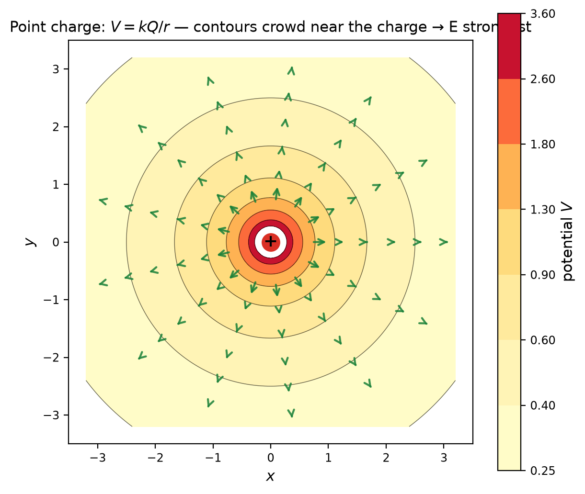

# Fields & Potential — 4단계: 통합2 — 3D 지형·gradient·총정리 사전

> **4단계 로드맵:** ① `역학.md` (완료) — $F=-dU/dx$ → ② `전자기학.md` (완료) — $E=-dV/dr$ → ③ `통합1.md` (완료) — 네 가지 옷 → ④ **`통합2.md` (지금, 마지막)** — 1차원 기울기를 3차원 경사로 확장하고 전 과정을 한 줄 사전으로 총정리.
> **Purpose:** 지금까지의 기울기(1차원의 수 하나)를 **3차원의 벡터**로 키웁니다. 결론은 여전히 한 문장입니다 — **에너지(전위)는 지형이고, 힘(장)은 그 지형의 가장 가파른 내리막이다.**
> **Level:** Regular Physics / SAT Physics — **algebraic only, no calculus.** $\nabla V$는 "가장 가파른 내리막 방향 벡터"라는 의미로만 사용합니다 (계산하지 않습니다).
> **How to use:** Part A–E를 읽고 Problem 1–5를 순서대로 푸세요. Full solutions (✅ Solution)는 [`solutions/통합2-solutions.md`](solutions/통합2-solutions.md). 그래프 재생성: `python3 generate_graphs.py`.
> **The core feel to build:** 차원이 늘어도 문장은 같다. **경사도 + 내리막** — 이것이 4단계 전체의 결론입니다.

---

# Part A — 1차원 기울기에서 3차원 경사로

1·2단계에서 기울기는 **수 하나**였습니다 ($dU/dx$, $dV/dr$ — 한 방향의 경사). 그런데 실제 지형은 2차원 평면 위의 함수입니다: $V(x,y)$.

**무엇이 달라지나:** 한 점에서 기울기는 **방향마다 다릅니다.** 언덕 위에서 북쪽으로는 완만하고 동쪽으로는 급할 수 있습니다. 그래서 "기울기"는 수 하나가 아니라 **방향을 가진 벡터**가 됩니다:

$$\vec{E} = -\nabla V \qquad (\nabla V = \text{가장 가파른 내리막 방향 + 그 경사도})$$

- **방향:** $\nabla V$는 그 지점에서 $V$가 **가장 빠르게 증가하는** 방향 → $-\nabla V$는 **가장 가파른 내리막**.
- **크기:** 그 내리막의 경사도 ($|\vec{E}|$ = V/m).
- **1차원과의 관계:** 길이 하나뿐인 직선 위에서는 $\nabla V$가 그냥 $dV/dr$로 줄어듭니다. 즉 1·2단계의 공식은 3차원 공식의 **특수한 경우**였습니다.

---

# Part B — 3D 지형도

전위를 **3차원 지형**으로 세웠습니다. 바닥에 투영된 검은 선들이 **등고선(등전위면)**이고, 빨간 화살표가 $\vec{E} = -\nabla V$입니다.

- 화살표는 **항상 등고선에 수직**이고 **내리막**을 가리킵니다 — 물길의 방향.
- 언덕(혹)이 가파를수록 등고선이 촘촘하고 화살표가 몰립니다 — 경사가 곧 장의 세기.
- 공을 아무 데나 놓으면 **가장 가파른 내리막**을 따라 굴러갑니다.

같은 규칙이 단일 전하 $V = kQ/r$에서 그대로 성립합니다:

- 등전위선은 **동심원** (같은 $r$ = 같은 $V$).
- $\vec{E}$는 원에 **수직**(반지름 방향), **바깥쪽** — 양전하 언덕에서 내리막.
- **중심에 가까울수록 등고선이 촘촘** → $E = kQ/r^2$가 강해짐 (화살표도 길게 그렸습니다).

---

# Part C — 등고선 읽기 규칙 (3D 사전)

| 규칙 | 내용 |
|---|---|
| 1. 등고선 = 등전위선·면 | 같은 선 위는 $V$ 일정 → 따라 움직이면 $W = q\Delta V = 0$ |
| 2. 수직 | $\vec{E}$는 등고선에 항상 수직 — 등고선 방향 성분 $E_\parallel = -\Delta V/\Delta s = 0$ |
| 3. 내리막 | $\vec{E}$는 전위가 낮아지는 쪽 (양전하 기준) |
| 4. 밀도 = 세기 | 등고선 촘촘 = 경사 급함 = $E = \Delta V/\Delta d$ 큼 |
| 5. 경로 무관 | 일은 경로가 아니라 **출발·도착의 $V$ 차이**로만 결정 ($W = q\Delta V$) |

이 다섯 규칙이 1·2·3단계에서 배운 전부의 3차원 버전입니다. 새것은 하나도 없습니다.

---

# Part D — 4단계 총정리: 한 줄 사전

전 과정의 알맹이를 한 표로. 이 표가 시리즈의 마지막 선물입니다.

| 기호/공식 | 한 줄 의미 |
|---|---|
| $F$ | 지금 이 둘 사이의 실제 밀고당김 |
| $g$, $E$ | 원천이 공간에 깔아둔 "1단위 시험 물체가 받을 힘" — 시험 물체 없이 존재 |
| $U$ | 이 위치의 **공동 예금** (시스템의 계좌) |
| $\varphi$, $V$ | "1단위당 예금" = 지형의 **고도** (J/kg, J/C) |
| $U=qV,\ U=m\varphi$ | 내 속성 × 그 자리 가격 |
| $W=q\Delta V,\ W=mg\Delta h$ | 고도 차이 × 속성 = 이동하며 주고받는 일 (경로 무관) |
| $\dfrac{dU}{dx},\ \dfrac{dV}{dr}$ | 1차원 **경사도** (수 하나) |
| $F=-\dfrac{dU}{dx},\ E=-\dfrac{dV}{dr}$ | 경사도의 반대 = **내리막으로 미는 힘·장** |
| $\vec{E}=-\nabla V$ | 3차원: **가장 가파른 내리막** 방향·크기 (벡터) |
| 등전위선·면 | 등고선 — 따라가면 일 0, $\vec{E}$와 수직 |
| 전기력선 | 물길 — 매 점에서 $\vec{E}$ 방향 |
| eV | 전자 1개가 1 V 내리막을 탈 때 얻는 에너지 |
| Cash / Deposit / Balance | KE / PE / 역학적 에너지 — 은행 장부 |
| turning point | $E$선 ∩ $U$곡선 — Cash 0, 방향 전환 |
| bound / escape | $E<0$ / $E\ge0$ — 우물에 묶임 / 탈출 |

---

# Part E — 시리즈 마무리: 한 문장

4단계 전체를 한 문장으로 접으면 이렇게 됩니다:

> **"에너지는 지형이고, 힘(장)은 그 지형의 가장 가파른 내리막 경사다."**

복습 순서: ① 지형 그리기($U$, $V$) → ② 교점·간격·기울기·부호 읽기 → ③ 질문에 맞는 옷 고르기 → ④ 3D에서는 등고선과 내리막으로 확장. 이제 어떤 문제를 만나도 **먼저 지형을 그리는 것**부터 시작하면 됩니다.

---

# Problems

## Problem 1 — 3D 지형 읽기 (f_t2a)

<b>1.1</b>

빨간 화살표들이 가리키는 방향의 **공통점**을 두 가지 말하세요 (방향의 성질 + 크기의 근거).

<b>1.2</b>

화살표와 검은 등고선이 이루는 각도는? 그 이유를 "$E$의 등고선 방향 성분"으로 한 문장 설명하세요.

<b>1.3</b>

이 지형에서 **가장 가파른 곳**을 찾는 방법을 등고선의 밀도로 설명하고, 그곳에 공을 놓으면 어떻게 굴러가는지 말하세요.

→ ✅ [Solution (Problem 1)](solutions/통합2-solutions.md#problem-1)

---

## Problem 2 — 단일 전하 지도 읽기 (f_t2b)

$V=kQ/r$의 등고선 지도에서.

<b>2.1</b>

등전위선이 **동심원**인 이유를 $V=kQ/r$로 한 문장 설명하고, $r=1$과 $r=2$의 $V$ 비율을 구하세요.

<b>2.2</b>

거리가 2배가 되면 $E=kQ/r^2$는 몇 배 약해지나요? 그래프에서 그 사실이 **두 가지**(화살표 길이, 등고선 간격)로 어떻게 보이는지 말하세요.

<b>2.3</b>

전하 $q$가 **한 등전위 원을 따라 한 바퀴** 돈다면 필드가 한 일은? $W=q\Delta V$로 답하고, 3단계의 "경로 무관"과 연결하세요.

→ ✅ [Solution (Problem 2)](solutions/통합2-solutions.md#problem-2)

---

## Problem 3 — gradient 개념 완성하기

<b>3.1</b>

빈칸을 채우세요: "1차원에서 기울기는 수 하나였지만, 3차원에서는 기울기가 방향마다 달라서 ____이 필요하다. $\nabla V$는 ____ 방향을 가리키고, $-\nabla V$는 ____ 방향이다."

<b>3.2</b>

등고선을 **비스듬히** 가로질러 건너도 일은 변하지 않습니다. 그 이유를 "경로 무관, $\Delta V$만"으로 한 문장 설명하세요.

<b>3.3</b>

$F=-\dfrac{dU}{dx}$ (1단계), $E=-\dfrac{dV}{dr}$ (2단계), $\vec{E}=-\nabla V$ (4단계)가 **같은 문장의 세 버전**임을 한 문장으로 설명하세요.

→ ✅ [Solution (Problem 3)](solutions/통합2-solutions.md#problem-3)

---

## Problem 4 — 총정리 사전 채우기

<b>4.1</b>

다음의 한 줄 의미를 쓰세요 (보지 않고): (a) $E$, (b) $V$, (c) $W=q\Delta V$, (d) $E=-\dfrac{dV}{dr}$.

<b>4.2</b>

은행 장부(Cash/Deposit/Balance)와 지형(고도/등고선/내리막)이라는 **두 비유가 어떻게 연결되는지** 두 문장으로 설명하세요.

<b>4.3</b>

"bound vs escape", "turning point", "eV"의 한 줄 의미를 각각 쓰세요.

→ ✅ [Solution (Problem 4)](solutions/통합2-solutions.md#problem-4)

---

## Problem 5 — 종합: 역학과 전자기학, 한 장부

<b>5.1</b>

공($m=2$ kg)이 높이 $h=5$ m에서 내려온다. 바닥에서 속력은? ($g=10$)

<b>5.2</b>

대전 입자($q=3\,\mu$C, $m=6$ g)가 전위차 $\Delta V=100$ V를 내려온다. 최종 속력은?

<b>5.3</b>

두 문제의 대응표를 완성하세요: $h \leftrightarrow ?$, $m \leftrightarrow ?$, $g \leftrightarrow ?$, $mgh \leftrightarrow ?$, $\sqrt{2gh} \leftrightarrow ?$. 그리고 이 시리즈 전체를 **한 문장**으로 마무리하세요.

→ ✅ [Solution (Problem 5)](solutions/통합2-solutions.md#problem-5)
