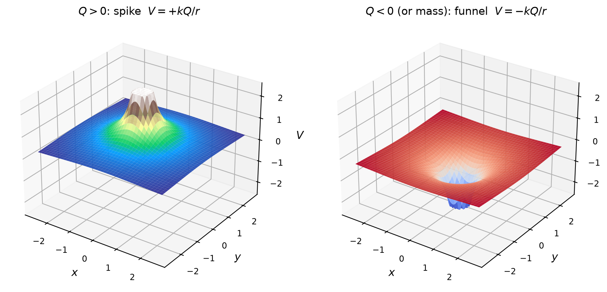
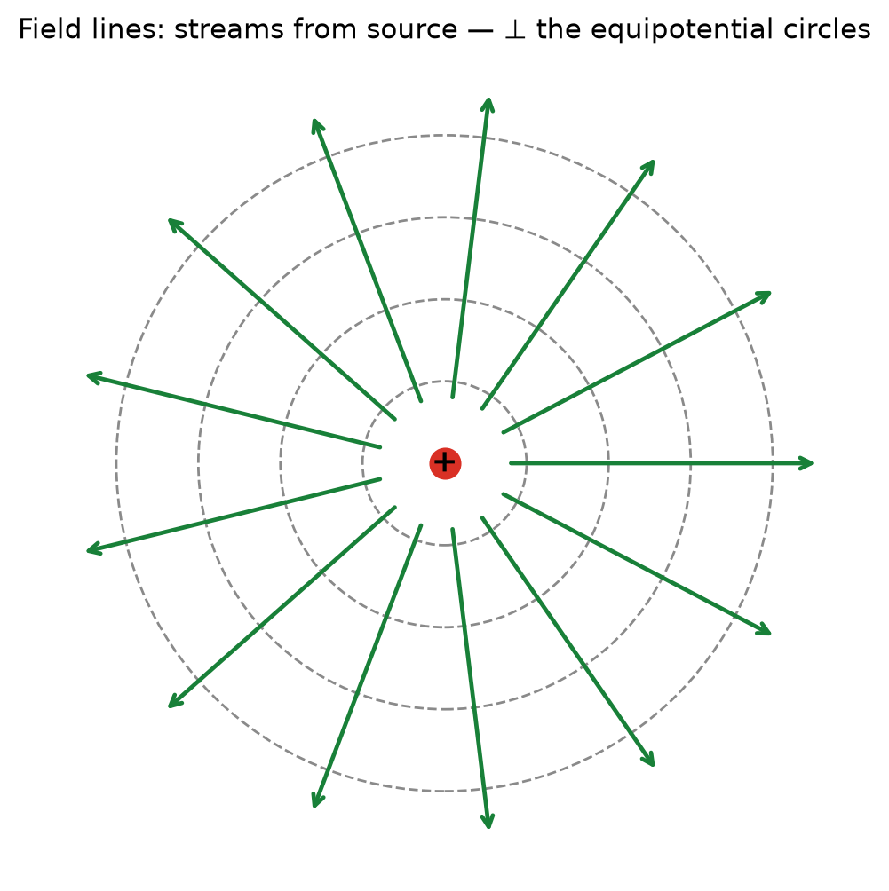
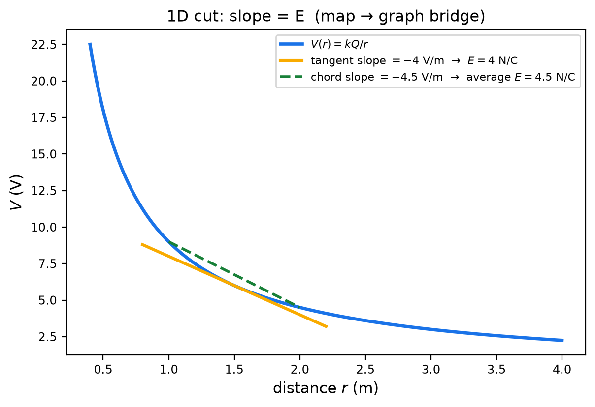
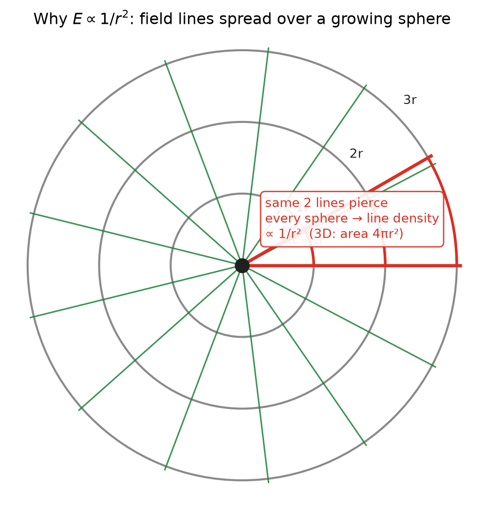
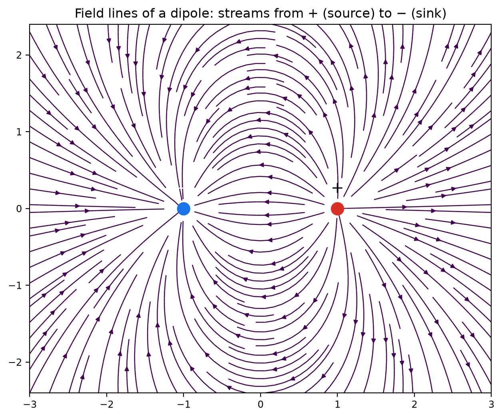
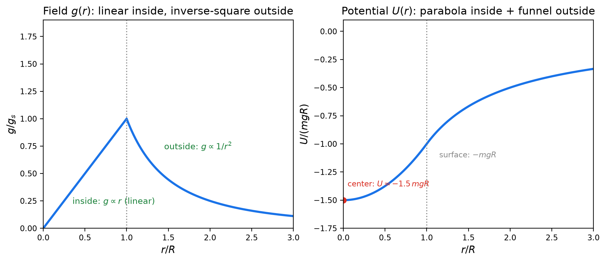
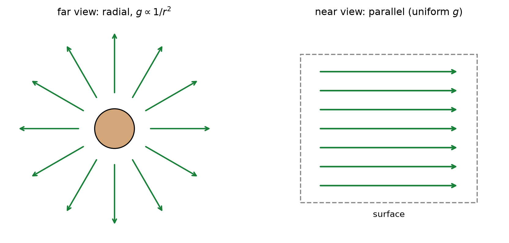
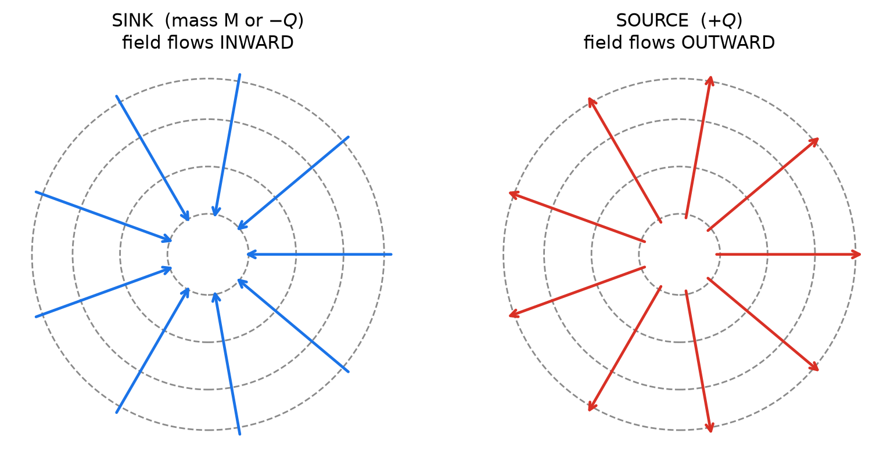

# Fields & Potential — 5단계: 필드 갤러리 — 한 장(field)을 다섯 시점으로

> **시리즈 위치:** 1~4단계(`역학` → `전자기학` → `통합1` → `통합2`)의 확장. 공식은 새로 없습니다 — **같은 장을 여러 각도에서 보는 훈련**입니다.
> **다섯 시점:** ① 지형 3D (곡면) · ② 등고선 지도 (contour) · ③ 장선 (field line, 물길) · ④ 화살표 장 (quiver) · ⑤ 단면 그래프 (1D cut). 어떤 장이든 이 다섯 렌즈로 보면 통짜로 보입니다.
> **Level:** Regular Physics / SAT Physics — **algebraic only, no calculus.**
> **How to use:** 갤러리 1~4를 읽고 Problem 1–5를 푸세요. Full solutions (✅ Solution)는 [`solutions/필드갤러리-solutions.md`](solutions/필드갤러리-solutions.md). 그래프 재생성: `python3 generate_graphs.py`.
> **The core feel to build:** "한 장, 다섯 시점" — 한 각도에서 안 보이던 것이 다른 각도에서 보입니다.

---

# Part A — 다섯 시점 렌즈

같은 전위 $V(\mathbf{r})$를 다섯 가지로 그릴 수 있습니다:

| 시점 | 그림 | 보이는 것 | 대응 공식 |
|---|---|---|---|
| ① 지형 3D | 곡면(surface) | 높낮이 전체 — 뿔·깔때기·안장 | $V=kQ/r$ |
| ② 등고선 | contour + 화살표 | 등전위면, 수직·내리막, 밀도=세기 | $E=-\dfrac{\Delta V}{\Delta d}$ |
| ③ 장선 | field line | 흐름 전체 — 어디서 나와 어디로 | 물길 = $E$ 방향 |
| ④ 화살표 | quiver | 각 점의 $\vec{E}$ 크기·방향 | $\vec{E}=-\nabla V$ |
| ⑤ 단면 | 1D cut | 한 줄을 자른 $V(x)$ — 기울기 = $E$ | $E=-\dfrac{dV}{dr}$ |

지금까지 1~4단계는 ①②⑤를 주로 썼습니다. 이 갤러리의 새 렌즈는 **③ 장선**이고, 각 배치마다 다섯 렌즈를 교차시키는 것이 목표입니다.

---

# Part B — 갤러리 1: 점전하·점질량의 다섯 시점

**① 지형 3D** — $V=\pm kQ/r$는 3차원에서 **뿔(Q>0) 또는 깔때기(Q<0·질량)** 입니다. 중력은 항상 깔때기 — 이것이 "모든 것은 우물로 굴러떨어진다"의 그림입니다.

**② 등고선 지도** — 위에서 내려다보면 동심원(4단계 f_t2b와 동일).

**③ 장선** — 원에서 뻗어나가는 직선들. 등고선(점선 원)에 **수직**입니다.

**⑤ 단면 그래프** — 지도의 중심을 지나는 직선 하나를 자르면 $V(r)=kQ/r$ 곡선. **접선 기울기 = $E$, 현의 기울기 = 평균 $E$** — 2D 지도와 1D 그래프를 잇는 다리입니다.

> **읽기:** ③의 장선이 ②의 등고선에 수직인 이유 = ⑤의 기울기($E$)가 ②의 "등고선 사이 간격"에 반비례인 이유 = 4단계 규칙 2·4. 다섯 시점은 서로를 증명합니다.

---

# Part C — 갤러리 2: 장선과 역제곱 법칙의 정체

**통찰:** $E\propto 1/r^2$는 "계산 결과"가 아니라 **그림의 성질**입니다.

원천에서 나오는 장선의 수는 일정합니다. 그 선들이 반지름 $r$, $2r$, $3r$의 구면을 뚫을 때 — **선의 수는 같고, 면적은 $4\pi r^2$로 커지므로** 단위면적당 선의 수(밀도)는 $\propto 1/r^2$입니다. 장의 세기가 곧 선의 밀도라면, 역제곱 법칙은 **계산 없이 당연**합니다.

- 빨간 부채꼴: 두 장선 사이의 간격이 $r$에 비례해 벌어집니다 (2D 호 ∝ $r$, 3D 면적 ∝ $r^2$).
- **심화 한 줄:** 장선이 평면(2D)으로만 퍼진다면 밀도 $\propto 1/r$ → $E\propto 1/r$이 됩니다. 실제로 **무한히 긴 선전하**의 전기장은 $E\propto 1/r$입니다. 차원이 법칙을 바꿉니다.

**장선 렌즈로 본 쌍극자** — 흐름이 +에서 −로:

장선은 **+ (source)에서 나와 − (sink)로 들어갑니다.** 등고선(등전위선)을 항상 직각으로 가로지릅니다.

---

# Part D — 갤러리 3: 지구 안팎 (가장 놀라운 그림)

- **왼쪽 — 장 $g(r)$:** 지구 **안**에서는 $g \propto r$ (중심에서 0, 표면에서 최대!), **밖**에서는 $g\propto 1/r^2$. 지구 중심에서는 모든 방향의 당김이 상쇄되어 **무중력**입니다.
- **오른쪽 — 전위 $U(r)$:** 안쪽은 **포물선(우물 바닥)**, 바깥은 **깔때기**가 이어집니다. 우물의 총 깊이는 $-1.5\,mgR$ (균일 밀도 근사) — 표면까지 오르는 데 필요한 에너지 $0.5\,mgR$보다 깊습니다.
- **기울기 확인:** $U$ 곡선의 기울기가 왼쪽 그래프의 $g$입니다 — 안쪽은 직선(기울기 일정), 바깥은 가팔라졌다가 완만해지는 곡선.

---

# Part E — 갤러리 4: 줌 전환 + 싱크/소스 비유

**같은 장의 두 얼굴:**

- **멀리서:** 방사형, $g\propto 1/r^2$.
- **지표 가까이(줌 인):** 장선이 **평행** — 균일장 $g$ = 상수. 3단계의 "접선 근사"가 그림으로 보입니다. 같은 지구인데 시점에 따라 "균일장"이기도 하고 "역제곱장"이기도 합니다.

**유체 비유 — 장 = 물의 흐름:**

- **싱크(sink) = 질량 또는 음전하:** 물이 배수구로 빨려들어가는 흐름 = 중력.
- **소스(source) = 양전하:** 샘에서 뿜어나오는 흐름.
- 전기장·중력장은 "보이지 않는 물"이고, 등전위선은 그 물의 압력이 같은 선(등고선)입니다. **물은 항상 압력이 낮은 쪽으로, 등고선에 수직으로 흐릅니다** — 이것이 $E=-\nabla V$의 유체 번역입니다.

---

# Problems

## Problem 1 — 다섯 시점 교차 읽기 (갤러리 1)

<b>1.1</b>

① 3D 뿔에서 **가장 가파른 곳**은 어디인가? ② 등고선 지도에서 그 사실이 어떻게 보이는지 대응시키세요.

<b>1.2</b>

③ 장선이 ② 등고선과 **수직**인 이유를 ⑤ 단면 그래프의 기울기 언어로 설명하세요.

<b>1.3</b>

⑤에서 접선 기울기($E=4$ N/C)와 현의 기울기(평균 $E=4.5$ N/C)가 다른 이유를 한 문장으로. ② 지도에서는 "평균"이 무엇에 해당하는지 말하세요.

→ ✅ [Solution (Problem 1)](solutions/필드갤러리-solutions.md#problem-1)

---

## Problem 2 — 역제곱 법칙의 그림 증명 (갤러리 2)

<b>2.1</b>

f_g2 그림을 말로 증명하세요: "장선의 수는 일정하고 면적은 $4\pi r^2$ → 밀도 $\propto 1/r^2$ → $E\propto 1/r^2$." 각 화살표(→)의 근거를 한 줄씩.

<b>2.2</b>

같은 논리로 **무한히 긴 선전하**는 $E\propto 1/r$임을 설명하세요. (힌트: 장선이 퍼지는 "면"이 원기둥 옆면 $2\pi rL$)

<b>2.3</b>

쌍극자 장선 그림(f_g6)에서 +에서 출발한 장선은 어디로 끝나나요? 장선이 교차할 수 없는 이유를 한 문장으로 (교차하면 한 점에 $\vec{E}$가 두 개).

→ ✅ [Solution (Problem 2)](solutions/필드갤러리-solutions.md#problem-2)

---

## Problem 3 — 지구 안팎 (갤러리 3)

$g=10$ m/s², $R=6.4\times10^6$ m, 균일 밀도 근사.

<b>3.1</b>

깊이 $R/2$에서 중력가속도는 표면의 몇 배인가? ($g \propto r$ 사용) 지구 **중심**에서 0인 이유를 말하세요.

<b>3.2</b>

$U(r)$ 그래프에서 기울기가 $g$임을 확인하세요: 안쪽 포물선 $U=-1.5mgR+0.5mgr^2/R$의 기울기를 계산해 $F=-dU/dr=-mgr/R$을 얻으세요.

<b>3.3</b>

우물 바닥(중심)에서 표면까지 물체를 들어 올리는 데 필요한 일은? ($U$ 차이 = $0.5mgR$) 이 값이 "표면에서 무한대까지"의 일($mgR$)보다 작은 이유를 그래프로 설명하세요.

→ ✅ [Solution (Problem 3)](solutions/필드갤러리-solutions.md#problem-3)

---

## Problem 4 — 줌 전환 (갤러리 4)

<b>4.1</b>

f_g4의 두 그림이 **같은 장**임을 설명하세요. 어느 쪽이 "접선 근사"인가요? 3단계 사다리($\varphi=-GM/r \to \varphi\approx gh$)와 연결하세요.

<b>4.2</b>

높이 $h=100$ m 건물 옥상에서 $g$는 지표보다 몇 % 약한가? ($R=6.4\times10^6$ m, $g\propto1/r^2$) "균일장"이라는 말이 왜 좋은 근사인지 수치로 답하세요.

<b>4.3</b>

"물은 압력이 낮은 쪽으로 흐른다"가 $E=-\nabla V$의 번역임을 두 문장으로 설명하세요.

→ ✅ [Solution (Problem 4)](solutions/필드갤러리-solutions.md#problem-4)

---

## Problem 5 — 통합: 한 장을 다섯 시점으로 직접 그리기

<b>5.1</b>

**평행판**의 장을 다섯 시점으로 서술하세요: ① 지형(경사면) ② 등고선(평행선) ③ 장선(평행 직선) ④ 화살표(일정 길이) ⑤ 단면(직선). 각 시점이 "균일"을 어떻게 표현하는지가 포인트입니다.

<b>5.2</b>

같은 다섯 시점을 **쌍극자**에 적용해 서술하세요 (그리지 말고 말로). 어느 시점이 가장 정보가 많고, 어느 시점이 가장 적은지 판정하세요.

<b>5.3</b>

이 갤러리 전체를 한 문장으로 요약하세요.

→ ✅ [Solution (Problem 5)](solutions/필드갤러리-solutions.md#problem-5)
