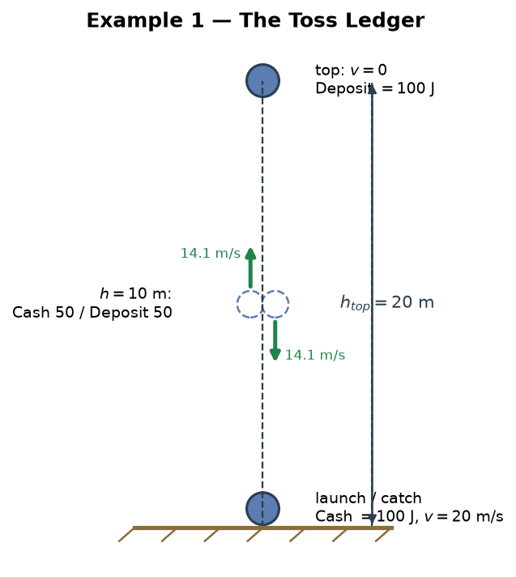
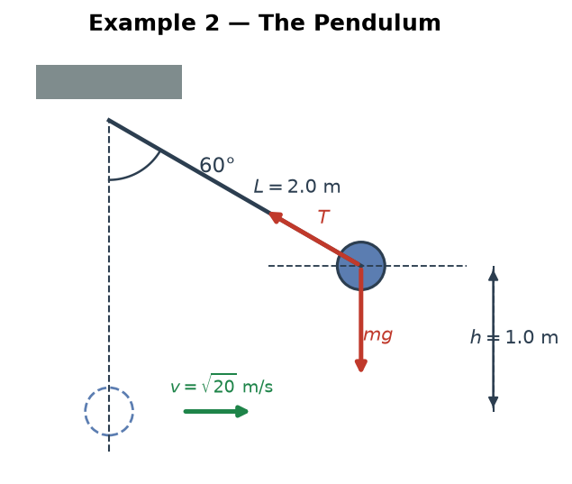
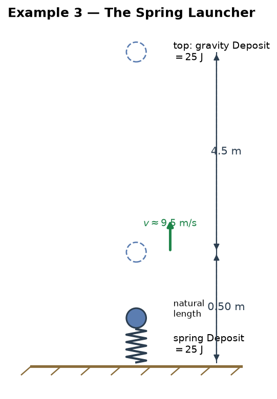
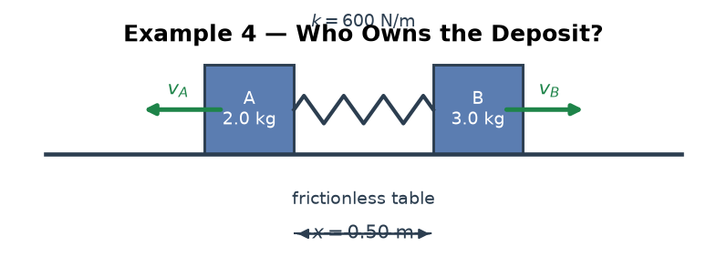
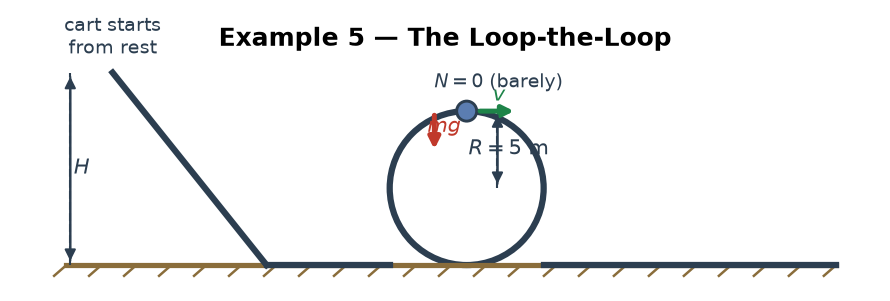
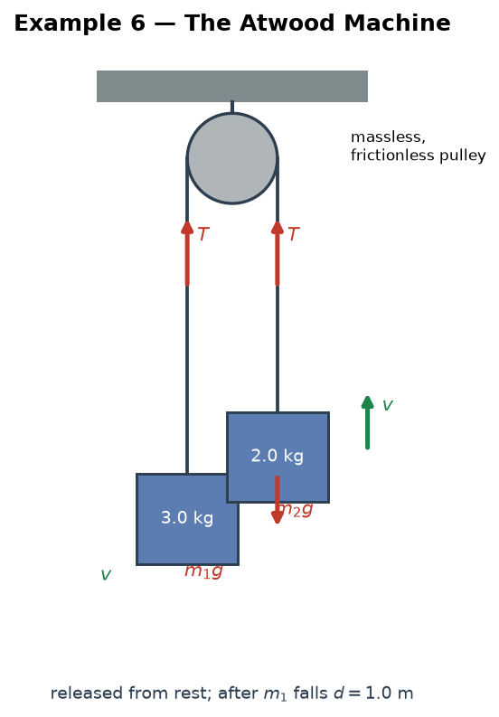
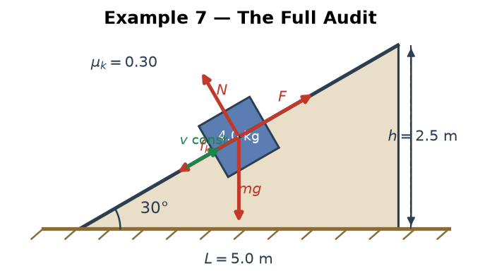

# Mechanics — Special: Energy — The Accounting Model (Worked Examples)

> **The teacher's metaphor, translated:** "When objects form a system, each object's immediately spendable money is its **Cash** (kinetic energy). The money they own *together* is the **Deposit** (potential energy). Internal forces move money from Deposit to Cash — that's an **internal transfer**. The **Current Balance** is always the same. If the Current Balance went up, someone transferred money in — they did **work on** the system; if it went down, the system transferred money out — it did **work on** someone else."

> **Purpose:** Seven fully worked examples — simple to tricky — that train the same accounting model from the **energy** side: watching the Balance stay fixed while Cash and Deposit swap, reading which accounts hold the money at every instant, and auditing every joule in a friction problem until the books balance.
> **Level:** Regular Physics / SAT Physics — **algebraic only, no calculus.** Take $g=10$ m/s² everywhere.
> **How to use:** The full bank reading and computation are written out here. Read §0 once, then cover the solution halves and rebuild each ledger yourself. Examples 1–3 are warm-ups; 4–7 are the ones that show the model earning its keep.
> **Sibling file:** the same model trained from the work side lives in [`work/examples.md`](../work/examples.md) — do that file first if "who did work on whom" still feels fuzzy.
> **Diagrams:** every example's setup figure is drawn by Python — generator at [`../../visual/generate_examples.py`](../../visual/generate_examples.py), images in `../../visual/graphs/`.

---

## 0. The Accounting Model, Refined

The teacher's idea, cleaned up into nine bookkeeping rules:

**Rule 1 — The bank is the system.** Choosing the system = deciding which accounts are inside *your* bank. Everything else is a foreign bank. Every reading below is relative to a boundary — **state it first**.

**Rule 2 — The accounts.**

| Account | Meaning | Physics | Owner |
|---|---|---|---|
| **Cash** | money spendable right now | kinetic energy $K = \tfrac12 mv^2$ | each object, individually |
| **Deposit** | money parked in a joint account | potential energy $U$ ($mgh$, $\tfrac12 kx^2$) | the **system as a whole** — co-owned, never one object |
| **Balance** | Cash + Deposit | mechanical energy $E = K + U$ | the system |
| *(off the books)* | thermal, chemical, fuel accounts | heat, food, fuel | outside the mechanical ledger |

**Rule 3 — Internal transfers never move the Balance.** A transaction between two accounts of the *same bank* — gravity converting Deposit into Cash, a spring paying out its Deposit — is an internal transfer. This file is mostly about these: **Deposit → Cash and Cash → Deposit, in both directions, zero net effect on the Balance.**

**Rule 4 — A wire transfer is work.** A transaction that crosses the boundary is work, and it is the *only* thing that moves the Balance: $\Delta(\text{Balance}) = W_{\text{external}}$. Balance up → outside did work **on** the system; Balance down → the system did work **on** the outside.

**Rule 5 — Friction is a fee.** A one-way, **non-refundable** withdrawal to the thermal account of the surroundings. A gravitational Deposit is refundable; the fee never is. This is the entire difference between "conservative" and "non-conservative."

**Rule 6 — Double-entry bookkeeping.** Every transaction is one debit and one credit. Count *all* accounts — mechanical, thermal, chemical — and the books always balance. "Energy is conserved" is not a slogan; it is the audit that never fails.

**Rule 7 — One transaction, one ledger.** Never book the same transfer twice (gravity's work *and* the Deposit change). Pick the ledger that matches your boundary, and stay in it.

**Rule 8 — A statement is not the Balance.** $\Delta K_{\text{object}} = W_{\text{net}}$ is one object's personal statement; $\Delta(K+U) = W_{\text{ext}}$ is the bank's Balance. Different questions.

**Rule 9 — Open the fuel account.** People, motors, and rockets carry non-mechanical accounts inside the boundary: $\Delta(\text{Balance}) = W_{\text{ext}} + W_{\text{fuel}}$.

**Two energy-only refinements.**

- **The ledger is direction-blind.** The rows for "passing $h=10$ m going up" and "passing $h=10$ m going down" are identical. The ledger stores the *size* of the speed, never its direction — direction lives in the other column of physics, momentum.
- **The payout rule.** When one joint Deposit converts into *several* Cash accounts, the constraint decides the split — momentum conservation (Example 4), a taut string, a shared pulley (Example 6). Not fairness. There is no "each object gets half" law of physics.

### The Four-Step Audit

1. **Boundary** — who is inside the bank?
2. **Accounts at each instant** — the ledger is a sequence of snapshots; build a row for every instant you are asked about.
3. **Transactions between consecutive instants** — internal, wire, or fee?
4. **Check the Balance** — it must be constant unless a wire or a fee crossed the boundary; if it moved, find the transaction that explains the move.

---

## Example 1 — The Toss Ledger: Five Moments, One Balance

> **Trains:** building a complete ledger; direction-blindness. **Difficulty:** ★☆☆☆☆

**Scenario.** A 0.5 kg ball is thrown straight up at 20 m/s from ground level. System = ball + Earth. $g=10$ m/s².

**Question (a).** Build the full ledger — Cash, Deposit, Balance — at five moments: (i) launch, (ii) height 10 m going up, (iii) the top, (iv) height 10 m coming down, (v) back at the hand.

**The computation.** Top height: $h_{\text{top}} = v_0^2/2g = 400/20 = 20$ m. At $h = 10$ m, $v^2 = v_0^2 - 2gh = 400 - 200 = 200$, so $v \approx 14.1$ m/s and Cash $= \tfrac12(0.5)(200) = 50$ J.

| Moment | Cash (KE) | Deposit ($mgh$) | Balance |
|---|---|---|---|
| (i) launch, $h=0$ | $100$ J | $0$ | $100$ J |
| (ii) $h=10$, going up | $50$ J | $50$ J | $100$ J |
| (iii) top, $h=20$ | $0$ | $100$ J | $100$ J |
| (iv) $h=10$, coming down | $50$ J | $50$ J | $100$ J |
| (v) back at hand | $100$ J | $0$ | $100$ J |

**Question (b).** Rows (ii) and (iv) are identical. Does the ledger know whether the ball is going up or down?

No — and that is not a bug. The ledger stores the *size* of the velocity, never its direction; direction lives in **momentum**, the ledger's other column. Energy is direction-blind by design.

**Question (c).** Did anything outside the system do work during the whole flight?

The Balance column never moved ($100$ J from launch to catch) → **no wire crossed the boundary**. Gravity is inside the bank; every Cash↔Deposit swap was an internal transfer. That one column is a complete answer to the "was work done?" question.

> 💡 **The feel:** a tossed ball is the cleanest possible bank story — Cash parked as Deposit on the way up, returned in full on the way down. No wire, no fee, Balance pinned at $100$ J. If a problem ever asks "was work done?" and you know the system, the Balance column alone settles it.

---

## Example 2 — The Pendulum: The String That Never Wires

> **Trains:** a constraint force that does zero work; the moment Cash = Deposit. **Difficulty:** ★★☆☆☆

**Scenario.** A 1.0 kg bob hangs from a 2.0 m string and is released from rest with the string at $60°$ from the vertical. $g=10$ m/s².

**Question (a).** Find the speed at the bottom.

**Ledger reading.** Deposit at release: $mgh = 1(10)(1.0) = 10$ J, Cash $0$. At the bottom the Deposit is empty and the Cash holds everything:

$$10 = \tfrac12(1)v^2 \;\Rightarrow\; v = \sqrt{20} \approx 4.47 \text{ m/s}.$$

**Question (b).** Find the tension at the bottom, as a multiple of $mg$.

At the bottom the string must supply centripetal force on top of weight:

$$T - mg = \frac{mv^2}{L} \;\Rightarrow\; T = 10 + \frac{1(20)}{2} = 20 \text{ N} = 2mg.$$

**Question (c).** At what height is Cash exactly equal to Deposit?

Deposit $= mgh' = 10h'$ J and Cash $= 10 - 10h'$ J tie when $10h' = 10 - 10h'$, i.e. $h' = 0.5$ m — halfway in *height*, where $v = \sqrt{2g(1 - 0.5)} = \sqrt{10} \approx 3.16$ m/s. (Both accounts hold 5 J.)

**Question (d).** Does the string ever do work — does it ever wire money?

No. The tension is perpendicular to the motion at every instant, so $W = Td\cos90° = 0$ always. The string never moves a joule; it only **constrains the address** of the motion (circular). It certifies where the bob may go without ever touching the Balance.

**Question (e).** How high does the bob rise on the other side?

Balance is still $10$ J → all of it becomes Deposit again → $h = 1.0$ m. The ledger predicts the symmetry for free: same Balance, same maximum height.

> 💡 **The feel:** a taut string is the bank's signature guarantee — it enforces the circular shape of the motion but never signs a wire. Distinguish "force that constrains" from "force that transfers": only the latter touches the Balance.

---

## Example 3 — The Spring Launcher: Two Deposits, One Cash

> **Trains:** several Deposit accounts at once; refundable vs. non-refundable. **Difficulty:** ★★★☆☆

**Scenario.** A 0.5 kg ball rests on a vertical spring ($k = 200$ N/m) compressed 0.50 m, then is released. $g=10$ m/s². System = ball + spring + Earth. (Take the gravitational reference level at the compressed position.)

**The spring Deposit at release.**

$$U_s = \tfrac12 kx^2 = \tfrac12(200)(0.5)^2 = 25 \text{ J}.$$

**Question (a) — vertical launch.** Build the ledger at three instants: release, passing the spring's natural length (0.5 m higher), and the top.

| Instant | Spring Deposit | Gravity Deposit | Cash | Balance |
|---|---|---|---|---|
| release (compressed) | $25$ J | $0$ | $0$ | $25$ J |
| natural length | $0$ | $mg(0.5) = 2.5$ J | $22.5$ J | $25$ J |
| top | $0$ | $25$ J | $0$ | $25$ J |

At the natural length: $v = \sqrt{2(22.5)/0.5} = \sqrt{90} \approx 9.49$ m/s. At the top: $mgh = 25$ → $h = 5.0$ m above the compressed position (4.5 m above the natural length).

**Question (b).** The same spring fires the ball horizontally across a table. Find the launch speed.

Now the only Deposit is the spring's: $25 = \tfrac12(0.5)v^2 \Rightarrow v = 10$ m/s — a little faster than the vertical case. Why? Vertically, $2.5$ J had to be paid into the **gravity Deposit** on the way up.

**Question (c).** The gravity Deposit is "money the ball paid to the sky." Is it refundable?

Yes — the ball comes back down and every joule returns. This is the whole distinction between the gravity Deposit and the friction fee: **one is a loan, the other is a charge.** That difference is the definition of conservative vs. non-conservative.

> 💡 **The feel:** a system can run several joint Deposits at once — spring and gravity here — and the Balance simply sums them. Reference levels are arbitrary because only *changes* are bookable: choose the zero wherever the ledger is easiest to read.

---

## Example 4 — Who Owns the Deposit? Two Blocks, One Spring

> **Trains:** joint ownership; the payout rule (momentum decides the split). **Difficulty:** ★★★★☆

**Scenario.** A 2.0 kg block A and a 3.0 kg block B rest on a frictionless table, pressed against a spring ($k = 600$ N/m) compressed 0.50 m. The spring is released and the blocks fly apart.

**Question (a).** How much energy is stored, and whose money is it?

$$U = \tfrac12 kx^2 = \tfrac12(600)(0.5)^2 = 75 \text{ J}.$$

It belongs to the **spring–A–B system jointly**. Not A's Cash, not B's Cash — a Deposit with three co-signers. You cannot point at a single owner.

**Question (b).** Find the speed of each block when the spring has relaxed.

All $75$ J converts to Cash, but it must split between two accounts, and **momentum conservation decides the split**. From rest, equal and opposite impulses:

$$m_A v_A = m_B v_B \;\Rightarrow\; 2v_A = 3v_B \;\Rightarrow\; v_A = 1.5\,v_B.$$

Energy: $\tfrac12(2)v_A^2 + \tfrac12(3)v_B^2 = 75$ → $v_A^2 + 1.5v_B^2 = 75$ → $3.75\,v_B^2 = 75$:

$$v_B = \sqrt{20} \approx 4.47 \text{ m/s}, \qquad v_A = 1.5\sqrt{20} = \sqrt{45} \approx 6.71 \text{ m/s}.$$

**Question (c).** How is the $75$ J split — and why is it not $50/50$?

Cash$_A = \tfrac12(2)(45) = 45$ J, Cash$_B = \tfrac12(3)(20) = 30$ J. The **lighter** block walks away with more Cash. There is no fairness law in physics; there is a momentum law. The general payout from rest with equal-and-opposite impulses:

$$\frac{K_A}{K_B} = \frac{m_A v_A^2}{m_B v_B^2} = \frac{m_B}{m_A} = \frac{3}{2} \quad \text{at every instant of the release}.$$

**Was any wire involved?** During the release the Balance stays $75$ J → no external work. The whole event is one internal transfer, Deposit → Cash, split by the constraint.

> 💡 **The feel:** joint ownership is not a technicality. The spring's $75$ J has no individual owner until the release — and then the two conservation laws together, energy *and* momentum, dictate the payout ratio. "Each block gets 37.5 J" is bookkeeping fiction.

---

## Example 5 — The Loop-the-Loop: The Minimum-Cash Condition

> **Trains:** a constraint disguised as a minimum Cash; the classic $H = 2.5R$. **Difficulty:** ★★★★☆

**Scenario.** A 2.0 kg cart starts from rest at height $H$ on a frictionless track that contains a vertical loop of radius $R = 5$ m. Find the minimum $H$ for the cart to complete the loop. $g=10$ m/s².

**Question (a).** Minimum Cash at the top of the loop.

The track can only push *toward* the center, so at the very top the smallest normal force is $N = 0$ — the cart is about to lose contact. Then gravity alone supplies the centripetal force:

$$\frac{mv^2}{R} = mg \;\Rightarrow\; v_{\min}^2 = gR = 50 \;\Rightarrow\; \text{minimum Cash} = \tfrac12(2)(50) = 50 \text{ J}.$$

Think of it as a **centripetal rent** the loop charges at the top: below this Cash, the account has insufficient funds and the cart falls off.

**Question (b).** Convert the rent into a minimum Balance.

At the top the Deposit is $mg(2R) = 2(10)(10) = 200$ J, so the minimum Balance at the top is $50 + 200 = 250$ J. The starting Balance is all Deposit, $mgH$:

$$mgH = 250 \;\Rightarrow\; H = \frac{250}{20} = 12.5 \text{ m} = 2.5R.$$

The famous result is just the ledger solving itself: *Cash requirement at one instant + Deposit requirement at the same instant = Balance requirement at the start.*

**Question (c).** If $H = 15$ m, find the speed and the normal force at the top.

Balance $= 300$ J. At the top: Deposit $200$ J → Cash $100$ J → $v = \sqrt{2(100)/2} = 10$ m/s. Then

$$N = \frac{mv^2}{R} - mg = \frac{2(100)}{5} - 20 = 20 \text{ N}.$$

**Does the track ever wire money?** No — the normal force is perpendicular to the motion at every instant, so the track constrains but never transfers. It only *enforces the rent*; the Balance pays it.

> 💡 **The feel:** many "hard" energy problems are a minimum-Cash condition in disguise. State the constraint as a Cash floor at one instant, convert to a Balance at the same instant, and conservation carries the answer back to the start. $H = 2.5R$ is not a formula to memorize — it is a ledger you can rebuild in three lines.

---

## Example 6 — The Atwood Machine: Two Cash Accounts, One Joint Deposit

> **Trains:** the joint Deposit with several objects; auditing a wrong ledger. **Difficulty:** ★★★★★

**Scenario.** A 3.0 kg block and a 2.0 kg block hang from a massless, frictionless pulley and are released from rest. Find the speed of the blocks after the 3.0 kg block has fallen 1.0 m. System = blocks + Earth (+ string and pulley, which are massless). $g=10$ m/s².

**The correct ledger.** The Deposit is **one joint account** for the whole system. The 3 kg block's fall tries to withdraw $30$ J from it, but the 2 kg block's rise refunds $20$ J:

$$\Delta U = -m_1g(1) + m_2g(1) = -30 + 20 = -10 \text{ J}.$$

The net $10$ J converts to Cash, split between **two** Cash accounts moving at the same speed $v$ (the constraint is the taut string):

$$\Delta K = \tfrac12(3+2)v^2 = 2.5v^2 = 10 \;\Rightarrow\; v = 2 \text{ m/s}.$$

The split: $K_1 = \tfrac12(3)(4) = 6$ J, $K_2 = \tfrac12(2)(4) = 4$ J. (Equal speeds → Cash proportional to mass — the opposite payout from Example 4, because the *constraint* is different. The constraint, not fairness, decides.)

**The audit — a wrong ledger.** A student writes: "The 3 kg block lost 30 J of PE, so its Cash is 30 J, so $v_1 = \sqrt{20} \approx 4.47$ m/s." Three separate errors, all from ignoring joint ownership:

1. The Deposit is **joint** — the 2 kg block's rise refunded $20$ J into the same account, so the *net* withdrawal is only $10$ J.
2. The $10$ J converts into **two** Cash accounts, not one.
3. The string forces both blocks to share the same speed.

**The personal ledgers (a different boundary).** For each block alone, the tension is an outside wire: $\Delta K_1 = (m_1g - T)d$ and $\Delta K_2 = (T - m_2g)d$. Adding them, the tension cancels — it is an internal Cash↔Cash transfer between the two blocks and never touches the joint Deposit:

$$K_1 + K_2 = (m_1 - m_2)gd = 10 \text{ J} \quad ✓$$

(If you want $T$: from $v=2$ over 1 m, $a = v^2/2d = 2$ m/s², so $T = m_2(g+a) = 24$ N; check: $m_1g - T = 6 = m_1a$ ✓.)

**Did anything outside do work?** The Balance is constant: $+10$ J of Cash exactly offset the $-10$ J Deposit change → **no wire**. Gravity is internal, and the tension is internal to the blocks. The pulley's support does no work (its contact point never moves).

> 💡 **The feel:** the Deposit is ONE account for the whole system. Never book "$m_1$'s PE" and "$m_2$'s PE" separately — book the *net* Deposit change once, then split the Cash by the constraint. This single habit kills the most common Atwood-machine error.

---

## Example 7 — The Full Audit: Every Joule Accounted For

> **Trains:** double-entry bookkeeping with the thermal account; the round-trip audit. **Difficulty:** ★★★★★

**Scenario.** A 4.0 kg crate is pushed at constant speed up a 5.0 m, $30°$ rough ramp ($\mu_k = 0.30$) by a force parallel to the ramp. It is then released at the top and slides back down. $g=10$ m/s². Audit **every** joule.

**The uphill leg.**

- Deposit: $h = 5\sin30° = 2.5$ m → $\Delta U = 4(10)(2.5) = 100$ J.
- Fee: $f_k = 0.3(4)(10)\cos30° = 10.4$ N → fee $= 10.4 \times 5 \approx 52$ J.
- Push: $T = mg\sin30° + f_k = 20 + 10.4 = 30.4$ N → $W_T = 30.4 \times 5 \approx 152$ J.

**The double-entry table (all accounts, including the off-books ones).**

| Transaction | From account | To account | Amount |
|---|---|---|---|
| wire in (muscle) | puller's chemical | system's mechanical | $+152$ J |
| internal transfer | Balance (Cash slot) | joint gravity Deposit | $+100$ J |
| fee | system's mechanical | thermal (crate + ramp + air) | $52$ J |
| Cash | — | — | $0$ (constant speed) |

Audit: $152 = 100 + 52$ ✓ — the books balance to the joule.

**The downhill leg (no pusher).** Deposit $100$ J → Cash $48$ J + fee $52$ J:

$$v = \sqrt{2(48)/4} = \sqrt{24} \approx 4.9 \text{ m/s}.$$

**The round-trip audit.**

- The puller spent $152$ J.
- The thermal account collected $52 + 52 = 104$ J (the fee is charged *per trip*, uphill and downhill alike — that is why real machines hate rough round trips).
- The crate's Cash at the bottom: $48$ J.
- Total: $152 = 104 + 48$ ✓✓.

Every joule is *somewhere*. "Energy was lost to friction" is sloppy bookkeeping; the rigorous version is "the fee was paid to the thermal account." Nothing is lost — the ledger of the universe always balances.

> 💡 **The feel:** this is the model's closing argument. Mechanical Balance fell ($100 \to 48$), yet no law was broken — you just have to include the account you cannot spend. When a problem says "energy is lost," translate it: **a fee was paid**. Then find the thermal account and finish the audit.

---

## One-Card Summary

| Question | Ledger answer |
|---|---|
| Cash = KE | each object's checking account |
| Deposit = PE | the system's joint account |
| Balance = Cash + Deposit | constant: no wire, no fee |
| Internal transfer | Deposit ↔ Cash, both directions |
| Fee (friction) | one-way, paid to the thermal account |
| $\Delta(K+U) = W_{\text{ext}}$ | the wire rule |
| Direction of motion | not in the ledger — it lives in momentum |
| Payout split among objects | decided by the constraint (momentum, string, pulley) |
| "Energy is lost" | = a fee was paid; audit the thermal account |

*Companion file: [`work/examples.md`](../work/examples.md) — the same model from the work side.*
