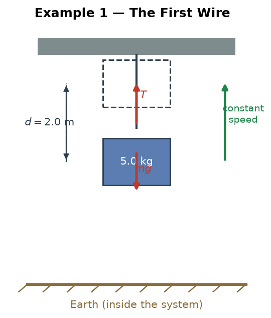
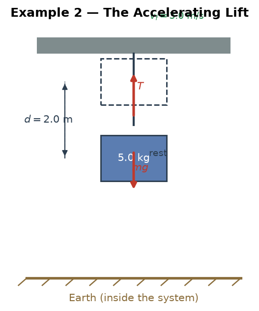
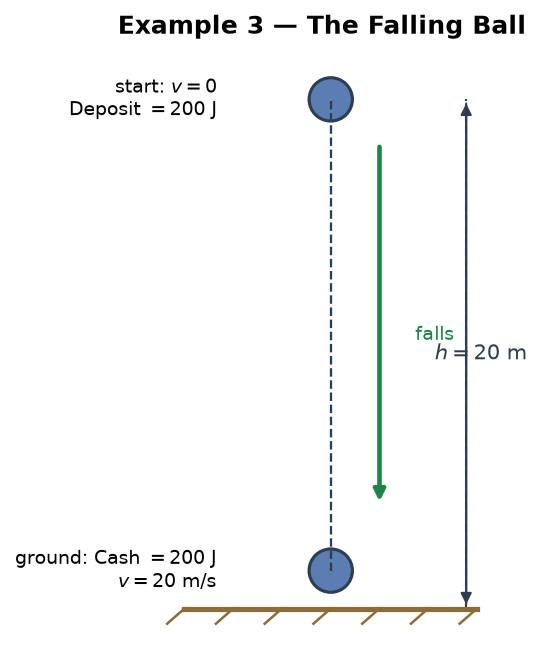
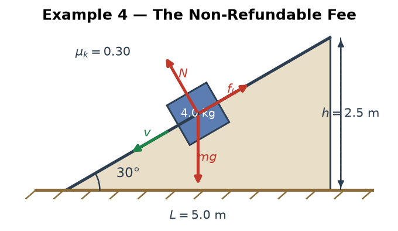
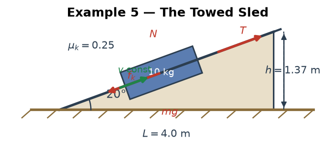
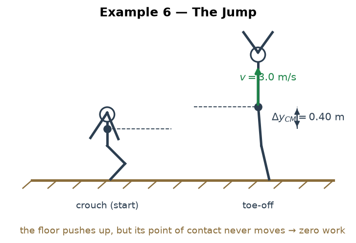
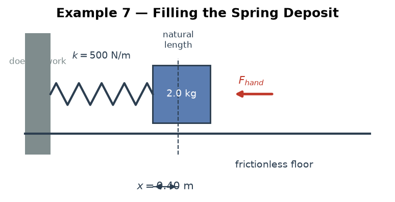

# Mechanics — Special: Work — The Accounting Model (Worked Examples)

> **The teacher's metaphor, translated:** "When objects form a system, each object's immediately spendable money is its **Cash** (kinetic energy). The money they own *together* is the **Deposit** (potential energy). Internal forces move money from Deposit to Cash — that's an **internal transfer**. The **Current Balance** is always the same. If the Current Balance went up, someone transferred money in — they did **work on** the system; if it went down, the system transferred money out — it did **work on** someone else."

> **Purpose:** Seven fully worked examples — simple to tricky — that train this metaphor at the level of **work**: reading a system's ledger and deciding *who did work on whom*. Every reading ends in a number that is cross-checked with $W = Fd\cos\theta$, because the ledger and the formula are the same law.
> **Level:** Regular Physics / SAT Physics — **algebraic only, no calculus.** Take $g=10$ m/s² everywhere.
> **How to use:** Unlike the drill files (`1.md`, `2.md`), the full bank reading and computation are written out here — this file *is* the textbook for the model. Read §0 once, then cover the solution halves with a sheet of paper and rebuild each ledger yourself. Example 1 is deliberately slow; every later example reuses its four steps.
> **Sibling file:** the same model trained from the conservation side lives in [`energy/examples.md`](../energy/examples.md). Do this file first if "who did work on whom" still feels fuzzy.
> **Diagrams:** every example's setup figure is drawn by Python — generator at [`../../visual/generate_examples.py`](../../visual/generate_examples.py), images in `../../visual/graphs/`.

---

## 0. The Accounting Model, Refined

The teacher's idea, cleaned up into nine bookkeeping rules:

**Rule 1 — The bank is the system.** Choosing the system = deciding which accounts are inside *your* bank. Everything else is a foreign bank. Every reading below is relative to a boundary — **state it first**.

**Rule 2 — The accounts.**

| Account | Meaning | Physics | Owner |
|---|---|---|---|
| **Cash** | money spendable right now | kinetic energy $K = \tfrac12 mv^2$ | each object, individually |
| **Deposit** | money parked in a joint account | potential energy $U$ ($mgh$, $\tfrac12 kx^2$) | the **system as a whole** — co-owned, never one object |
| **Balance** | Cash + Deposit | mechanical energy $E = K + U$ | the system |
| *(off the books)* | thermal, chemical, fuel accounts | heat, food, fuel | outside the mechanical ledger |

**Rule 3 — Internal transfers never move the Balance.** A transaction between two accounts of the *same bank* — gravity converting Deposit into Cash, a spring paying out its Deposit — is an internal transfer, like moving money from savings to checking. The Balance does not blink.

**Rule 4 — A wire transfer is work.** A transaction that crosses the boundary is work, and it is the *only* thing that moves the Balance:

$$\Delta(\text{Balance}) = W_{\text{external}}.$$

- Balance went **up** → a foreign bank wired money **in** → something outside did work **on** the system.
- Balance went **down** → this bank wired money **out** → the system did work **on** something outside.

**Rule 5 — Friction is a fee.** Friction is a one-way withdrawal paid to the *thermal account* of the surroundings, and it is **non-refundable**. A gravitational Deposit is refundable (the ball comes back down); the fee never does.

**Rule 6 — Double-entry bookkeeping.** Every transaction is one debit and one credit. Count *all* accounts — mechanical, thermal, chemical — and the books always balance. That is energy conservation, stated as accounting.

**Rule 7 — One transaction, one ledger.** Gravity's work on a ball (booked in the *ball's* personal ledger) and the ball–Earth Deposit change (booked in the *joint* ledger) are the same transfer viewed from two sides. Book it **once**, in the ledger that matches your boundary — never in both. The classic double-count error is exactly a violation of this rule.

**Rule 8 — A statement is not the Balance.** One object's personal statement reads $\Delta K_{\text{object}} = W_{\text{net on that object}}$. The bank's Balance reads $\Delta(K+U) = W_{\text{external}}$. They answer different questions; mixing them is the #1 error.

**Rule 9 — Open the fuel account.** A person, a motor, or a rocket carries a *non-mechanical* account (food, fuel) inside the boundary. Rule 4 must then be extended:

$$\Delta(\text{Balance}) = W_{\text{external}} + W_{\text{fuel}},$$

where $W_{\text{fuel}}$ is money spent from internal non-mechanical accounts (muscles, engine). A jumper's Balance rises with zero external work — the wire came from the food account (Example 6).

### The Four-Step Audit

Before touching a formula, four questions:

1. **Boundary** — who is inside the bank? Write it down.
2. **Accounts** — which Cash accounts? Which joint Deposits?
3. **Transactions** — which are internal (never touch the Balance), which are wires (move it), which are fees (one-way)?
4. **Read the Balance** — $\Delta B = W_{\text{ext}}$, and cross-check at least one wire with $W = Fd\cos\theta$.

---

## Example 1 — The First Wire: Lifting at Constant Speed

> **Trains:** the wire rule in its purest form. **Difficulty:** ★☆☆☆☆

**Scenario.** A 5.0 kg box is lifted straight up 2.0 m by a cable, at constant speed, starting and ending at rest. System = box + Earth. $g=10$ m/s².

**Step 1 — boundary.** Inside: the box (one Cash account) and the box–Earth pair (one joint Deposit). Outside: the cable — a foreign bank.

**Step 2 — transactions.** Gravity is *internal* (Earth is inside): its entire effect lives inside the Deposit column. The cable is the only thing that can wire money across the boundary. Constant speed means Cash opens and closes at the same amount.

**Step 3 — read the Balance.**

| Account | Change |
|---|---|
| Cash (KE) | $0 \to 0$: $\Delta K = 0$ |
| Deposit ($mgh$) | $0 \to 5(10)(2) = +100$ J |
| **Balance** | $\mathbf{+100}$ J |

**Step 4 — the wire rule.** The Balance rose by $+100$ J, so a foreign bank wired $100$ J **in**: the cable did $+100$ J of work *on* the system.

**Cross-check with force × distance.** At constant speed $T = mg = 50$ N, so

$$W_T = T d \cos 0° = 50 \times 2 = 100 \text{ J}. \quad ✓$$

The Balance reading and the $Fd$ computation are the *same law* viewed from two sides.

**The box's personal statement (a different boundary).** For the box alone: $\Delta K_{\text{box}} = (T - mg)\,d = (50-50)\cdot 2 = 0$ J. The cable deposited $+100$ J into the box's checking account while gravity withdrew $-100$ J into the joint Deposit. Net: zero — the box is not "richer"; the *system* is.

> 💡 **The feel:** "who did work on whom" is a boundary question. Same lift, two correct readings: the cable did $+100$ J on the system — or, in the box's personal ledger, the cable's $+100$ J was exactly canceled by gravity's $-100$ J.

---

## Example 2 — Splitting the Wire: The Accelerating Lift

> **Trains:** one wire paying into two accounts. **Difficulty:** ★★☆☆☆

**Scenario.** Same 5.0 kg box, same 2.0 m lift, but it starts from rest and ends moving upward at 3.0 m/s. System = box + Earth.

**The ledger.**

- Deposit: $\Delta U = mg\Delta h = 5(10)(2) = 100$ J (same as before).
- Cash: $\Delta K = \tfrac12 m v^2 = \tfrac12(5)(3)^2 = 22.5$ J.
- Balance: $\Delta B = 100 + 22.5 = 122.5$ J → the cable wired in $122.5$ J.

**The split.** Of the $122.5$ J that crossed the boundary, **$100$ J filled the Deposit and $22.5$ J topped up the Cash**. The wire rule gives the total; the columns show where every joule went. No guesswork.

**Cross-check.** $a = v^2/2d = 9/4 = 2.25$ m/s², so $T = m(g+a) = 5(12.25) = 61.25$ N:

$$W_T = 61.25 \times 2 = 122.5 \text{ J}. \quad ✓$$

Notice the small extra force $11.25$ N over $2$ m — exactly the $22.5$ J of new Cash.

**A note on reading the last instant.** The ledger does not care what the motor does *after* the 2.0 m mark; it only reads the Balance at the two instants you choose. Pick your instants first, then the columns fill themselves.

> 💡 **The feel:** a wire can pay into several accounts at once. The Balance tells you *how much* work crossed the boundary; the columns tell you *how it was spent*.

---

## Example 3 — Moving the Boundary: The Falling Ball and the Double-Count Audit

> **Trains:** boundary dependence + the double-count error (Rule 7). **Difficulty:** ★★★☆☆

**Scenario.** A 1.0 kg ball falls from rest 20 m to the ground. $g=10$ m/s².

**Reading A — System = ball + Earth (joint bank).**

- Top: Deposit $= mgh = 1(10)(20) = 200$ J, Cash $= 0$ → Balance $200$ J.
- Ground: Cash $= \tfrac12(1)(20)^2 = 200$ J, Deposit $= 0$ → Balance $200$ J.

Balance constant → **no wire crossed the boundary**. Gravity is inside the bank; the whole fall is one internal transfer, Deposit → Cash.

**Reading B — System = ball alone (personal bank).**

- The bank holds one account: Cash. It went $0 \to 200$ J, so the Balance rose $200$ J.
- By the wire rule, someone outside wired $200$ J in: the **Earth**, through gravity. Check: $W_g = mgd = 1(10)(20) = 200$ J ✓.

**The audit — double counting.** A student combines both readings:

$$\Delta K = W_g - \Delta U = 200 - (-200) = 400 \text{ J}. \quad ✗$$

$W_g$ and $-\Delta U$ are the *same transfer recorded in two different ledgers*. Book it exactly once, in the ledger that matches your boundary:

$$\text{Joint bank: } \Delta K + \Delta U = 0; \qquad \text{Personal bank: } \Delta K = W_g = 200\text{ J}.$$

> 💡 **The feel:** both readings are true and both describe the same event — but they are *different ledgers*. The teacher's rule "Balance rose → someone did work on the system" only becomes testable once the boundary is written down. Mixing the two ledgers is the single most common error in work–energy.

---

## Example 4 — The Non-Refundable Fee: Sliding Down a Rough Incline

> **Trains:** friction as a withdrawal (Rule 5). **Difficulty:** ★★★☆☆

**Scenario.** A 4.0 kg block slides from rest 5.0 m down a $30°$ incline with $\mu_k = 0.30$. System = block + Earth. $g=10$ m/s².

**Accounts and transactions.** Inside: the block's Cash and the block–Earth Deposit. Outside: the ramp. Gravity is internal. The normal force is perpendicular to the motion, so it never wires anything. Friction acts *at the interface with the outside ramp* — it is the **fee**, a one-way withdrawal.

**The fee.** $f_k = \mu_k mg\cos30° = 0.3(40)(0.866) = 10.4$ N, over 5.0 m:

$$\text{fee} = f_k L = 10.4 \times 5 \approx 52 \text{ J}.$$

**The ledger.**

| Account | Top | Bottom |
|---|---|---|
| Cash | $0$ | $100 - 52 = 48$ J |
| Deposit | $100$ J | $0$ |
| **Balance** | $100$ J | $48$ J |

The Balance fell by $52$ J → the bank wired $52$ J **out** to the thermal account of the block and ramp. Final speed: $v = \sqrt{2(48)/4} = \sqrt{24} \approx 4.9$ m/s.

**Is the fee refundable?** No. Heat does not spontaneously walk back into the ledger. That is exactly why a fee-free ledger keeps a constant Balance and a fee-paying one does not — and why "energy is conserved" stays true only if you count the thermal account too (Rule 6).

**What if the incline were frictionless?** No fee, no wire: the Balance stays $100$ J and $v = \sqrt{2(100)/4} = \sqrt{50} \approx 7.1$ m/s. The normal force still does zero work — the surface "guarantees the path" but never signs a wire.

> 💡 **The feel:** friction is not "a force that slows things down" in this ledger — it is a **fee**, charged by an account outside the bank, and the Balance itself drops by exactly the fee. The missing money is not lost; it sits in the thermal account.

---

## Example 5 — Gross Wire vs. Net Wire: The Towed Sled

> **Trains:** the Balance sees only the *net* external work. **Difficulty:** ★★★★☆

**Scenario.** A 10 kg sled is pulled 4.0 m up a $20°$ incline at constant speed by a rope parallel to the slope; $\mu_k = 0.25$. System = sled + Earth. $g=10$ m/s².

**The three transactions.**

- The puller (outside) wires money **in**: the rope's pull.
- The ramp (outside) charges a **fee**: friction.
- Gravity (inside) moves money between Cash and Deposit: an internal transfer.

**Deposit.** $h = 4\sin20° = 1.37$ m → $\Delta U = 10(10)(1.37) \approx 137$ J.

**Fee.** $f_k = \mu_k mg\cos20° = 0.25(100)(0.94) = 23.5$ N → fee $= 23.5 \times 4 \approx 94$ J.

**Cash.** Constant speed → $\Delta K = 0$.

**Reading the Balance.** $\Delta B = +137$ J. But that is the **net** wire. The puller's **gross** wire is bigger — he must also cover the fee:

$$T = mg\sin20° + f_k = 34.2 + 23.5 = 57.7 \text{ N}, \qquad W_T = 57.7 \times 4 \approx 231 \text{ J}.$$

**The audit.**

$$231 \text{ J in} \;=\; 137 \text{ J into the Deposit} \;+\; 94 \text{ J fee}. \quad ✓$$

And the wire rule sees the net: $W_{\text{ext}} = +231 - 94 = +137$ J $= \Delta B$ ✓. Two outside agents crossed the boundary — the puller (in) and the ramp (out) — and the Balance only records their sum.

> 💡 **The feel:** work at the system level is a *net* number. The puller's effort (231 J) is not the Balance's gain (137 J): the difference is the fee, already spent on heat. For every real machine, input work = Deposit + fees — this ledger with bigger numbers is the entire subject called "efficiency."

---

## Example 6 — The Jump: The Balance Rises, Yet No One Outside Did Work

> **Trains:** Rule 9 — the fuel account; why "normal forces never do work" is false as a blanket statement. **Difficulty:** ★★★★★

**Scenario.** A 70 kg athlete starts from a crouch, pushes off the floor, and leaves the ground at 3.0 m/s. During the push her center of mass rises 0.40 m. System = athlete + Earth. $g=10$ m/s².

**Step 1 — boundary & accounts.** Inside: the athlete's Cash, the athlete–Earth Deposit, and — crucially — the athlete's **chemical account** (food, spent by muscles). Outside: the floor.

**Step 2 — read the ledger during the push.**

- Cash at toe-off: $\tfrac12(70)(3)^2 = 315$ J.
- Deposit gained: $mg \cdot 0.4 = 280$ J.
- Balance rose by $315 + 280 = 595$ J.

**Step 3 — but who wired it?** The only external contact is the floor, and the floor's normal force does **zero** work: the foot does not move while it touches the ground, so the point of application has no displacement. No external mechanical work — yet the Balance rose by $595$ J.

**Step 4 — the fuel account.** The wire came from *inside* the bank: the athlete's chemical account. Rule 9:

$$\Delta B = W_{\text{ext}} + W_{\text{fuel}} = 0 + 595 \text{ J}.$$

The muscles are an internal "engine" that converts food into mechanical Cash + Deposit.

**After toe-off**, the story returns to the familiar one: a pure internal transfer. Max height above toe-off: $h = v^2/2g = 9/20 = 0.45$ m — Cash $315 \to 0$, Deposit $0 \to 315$, Balance pinned at $315$ J. Total rise from the crouch: $0.40 + 0.45 = 0.85$ m.

**Contrast with the elevator floor.** In an elevator, the floor *moves* while pushing, so it does work. In the jump, the floor *does not move*, so it does not. The difference is the displacement of the point of application — not the word "normal".

> 💡 **The feel:** the wire rule $\Delta B = W_{\text{ext}}$ assumes every account in the bank is mechanical. A person, motor, or rocket breaks that assumption — open the fuel account and the ledger balances again. When a book says "the floor does no work on a jumper," this is the bookkeeping behind that sentence.

---

## Example 7 — Filling the Spring Deposit: Compress, Release, Return

> **Trains:** the spring as a refundable parking spot for Cash; why the factor $\tfrac12$ in $\tfrac12kx^2$. **Difficulty:** ★★★★☆

**Scenario.** A 2.0 kg block rests on a frictionless floor against a spring, $k = 500$ N/m. A hand slowly pushes the block, compressing the spring 0.40 m, then releases it. (The wall is outside the system.)

**Phase 1 — the hand fills the Deposit.** The spring's pull-back grows with compression, $F = kx$, from $0$ up to $F_{\max} = 500(0.4) = 200$ N. The hand's wire is the **area under the $F$–$x$ graph** — a triangle:

$$W_{\text{hand}} = \tfrac12 (\text{base})(\text{height}) = \tfrac12 (0.4)(200) = 40 \text{ J}.$$

This is why the formula is $\tfrac12kx^2$ and not $kx^2$: the exchange rate rises as the Deposit fills, so you pay the *average* force, not the final one.

Ledger after compression: Deposit $40$ J, Cash $0$ → Balance $+40$ J → the hand wired $40$ J in. (The wall does zero work — its contact point never moves.)

**Phase 2 — release (hand gone).** Now the only forces are internal: the spring pays its Deposit to the block's Cash. At the natural length:

$$\text{Cash} = 40 \text{ J} \quad\Rightarrow\quad v = \sqrt{2(40)/2} = \sqrt{40} \approx 6.3 \text{ m/s}.$$

Balance constant ($40$ J) → **no wire crossed the boundary**. The wall is outside but does no work (it never moves); the floor's normal force is perpendicular to the motion.

**Phase 3 — the return trip (Cash → Deposit).** The same block now slides *into* the spring at 6.0 m/s: Cash $= \tfrac12(2)(36) = 36$ J. At maximum compression the block is momentarily broke:

$$36 = \tfrac12(500)x^2 \;\Rightarrow\; x = \sqrt{0.144} \approx 0.38 \text{ m}.$$

The spring "holds" the Cash as Deposit. Nothing outside received a single joule.

> 💡 **The feel:** a spring is a **refundable parking spot** for Cash. Hand → Deposit (a wire, $+40$ J), Deposit → Cash (an internal transfer), Cash → Deposit (another internal transfer) — and the wall, though it touches the whole apparatus, never signs a wire because its point of application never moves. The spring returns 100%; the friction fee returns 0%.

---

## One-Card Summary

| Question | Ledger answer |
|---|---|
| Who owns **Cash**? | each object, individually ($\tfrac12mv^2$) |
| Who owns the **Deposit**? | the system, jointly ($mgh$, $\tfrac12kx^2$) |
| What is the **Balance**? | Cash + Deposit ($K + U$) |
| Internal transfer (gravity, spring)? | Balance unchanged |
| Balance went **up**? | outside did $+$work **on** the system |
| Balance went **down**? | the system did $+$work **on** the outside |
| Friction? | non-refundable **fee** to the thermal account |
| $\Delta K = W_{\text{net}}$? | one object's personal statement |
| $\Delta(K+U) = W_{\text{ext}}$? | the bank's Balance (the wire rule) |
| Person / motor inside? | open the **fuel account** |

*Companion file: [`energy/examples.md`](../energy/examples.md) — the same model from the conservation side.*
